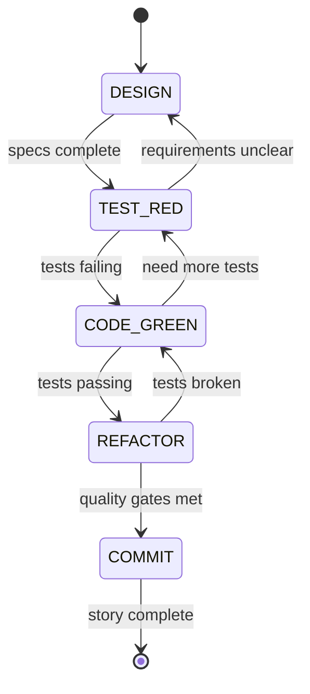

# TDD Workflow Guide

The AI Agent TDD-Scrum system implements a comprehensive Test-Driven Development workflow that runs in parallel with the main Scrum state machine. This guide explains how to use TDD commands and understand the RED-GREEN-REFACTOR cycle.

## TDD State Machine Overview

Each story in an active sprint follows a strict TDD methodology through a dedicated state machine:



## TDD Command Reference

### Story-Level TDD Commands

**`/tdd start <STORY_ID>`**
Manually start TDD cycle for a specific story (normally automatic).

**`/tdd status [STORY_ID]`**
Get current TDD phase and progress for one or all active stories.

**`/tdd pause <STORY_ID>`**
Temporarily halt TDD cycle for a story.

**`/tdd resume <STORY_ID>`**
Resume paused TDD cycle.

**`/tdd skip_phase <STORY_ID>`**
Skip current TDD phase (requires approval).

### Phase-Specific Commands

**`/tdd design_complete <STORY_ID>`**
Mark design phase complete and advance to TEST_RED.

**`/tdd tests_ready <STORY_ID>`**
Confirm tests are written and failing properly.

**`/tdd code_green <STORY_ID>`**
Confirm all tests are now passing.

**`/tdd refactor_done <STORY_ID>`**
Complete refactoring and proceed to commit.

**`/tdd review_cycle <STORY_ID>`**
Request human review of current TDD cycle.

### Global TDD Commands

**`/tdd overview`**
Show status of all active TDD cycles with visual progress.

**`/tdd metrics`**
Display TDD metrics: cycle time, test coverage, refactor frequency.

**`/tdd halt_all`**
Emergency stop all TDD cycles (requires confirmation).

## Complete TDD Cycle Walkthrough

### Phase 1: DESIGN
The Design Agent creates technical specifications for the story.

**What happens automatically:**
- Analyzes story requirements and acceptance criteria
- Creates technical design document with interfaces and data structures
- Defines implementation approach and architecture decisions
- Generates design artifacts in `.orch-state/designs/`

**Human interaction:**
```bash
/tdd status AUTH-1
# Shows: "AUTH-1 in DESIGN phase - creating login API specification"

/tdd review_cycle AUTH-1
# Request to review design before proceeding
```

**Artifacts created:**
- Technical specification document
- Interface definitions
- Data model schemas
- Acceptance criteria details

### Phase 2: TEST_RED
The QA Agent writes comprehensive failing tests.

**What happens automatically:**
- Implements unit tests based on design specifications
- Creates integration tests for external dependencies
- Writes acceptance tests matching story criteria
- Ensures all tests fail appropriately (RED state)

**Human interaction:**
```bash
/tdd status AUTH-1
# Shows: "AUTH-1 in TEST_RED phase - 15 tests written, all failing"

/tdd tests_ready AUTH-1
# Manually advance if automatic transition doesn't occur
```

**Artifacts created:**
- Unit test files (`test_*.py`)
- Integration test suite
- Test data and fixtures
- Coverage baseline reports

### Phase 3: CODE_GREEN
The Code Agent implements minimal code to make tests pass.

**What happens automatically:**
- Writes minimal implementation to pass failing tests
- Focuses on making tests green without over-engineering
- Implements only what's needed for current test suite
- Runs continuous test validation

**Human interaction:**
```bash
/tdd status AUTH-1
# Shows: "AUTH-1 in CODE_GREEN phase - 12/15 tests passing"

/tdd code_green AUTH-1
# Confirm when all tests are green and ready for refactor
```

**Artifacts created:**
- Implementation code
- Configuration files
- Database migrations
- API endpoints

### Phase 4: REFACTOR
The Code Agent improves code quality while maintaining green tests.

**What happens automatically:**
- Applies design patterns and best practices
- Removes code duplication and improves readability
- Optimizes performance while maintaining functionality
- Ensures all tests remain green throughout refactoring

**Human interaction:**
```bash
/tdd status AUTH-1
# Shows: "AUTH-1 in REFACTOR phase - applying clean architecture patterns"

/tdd refactor_done AUTH-1
# Mark refactoring complete when satisfied with quality
```

**Quality gates:**
- Code coverage threshold maintained
- Complexity metrics within bounds
- Performance benchmarks met
- Style and formatting standards applied

### Phase 5: COMMIT
The Code Agent commits changes and completes the story.

**What happens automatically:**
- Commits all changes with descriptive message
- Updates documentation and changelog
- Triggers CI/CD pipeline for validation
- Marks story as complete in sprint backlog

**Human interaction:**
```bash
/tdd status AUTH-1
# Shows: "AUTH-1 in COMMIT phase - preparing final commit"

# Story automatically marked complete when commit succeeds
```

**Artifacts created:**
- Git commit with complete feature
- Updated documentation
- Changelog entries
- Deployment artifacts

## Parallel TDD Execution

Multiple stories can run TDD cycles simultaneously:

```bash
# Start sprint with multiple stories
/sprint start
# Automatically creates TDD cycles for AUTH-1, AUTH-2, AUTH-3

# Check status of all TDD cycles
/tdd overview
```

**Example output:**
```
TDD Cycle Status - Sprint: Authentication System

┌─────────┬─────────────┬──────────────┬─────────────┐
│ Story   │ Phase       │ Progress     │ Agent       │
├─────────┼─────────────┼──────────────┼─────────────┤
│ AUTH-1  │ CODE_GREEN  │ 14/15 tests  │ Code Agent  │
│ AUTH-2  │ REFACTOR    │ Quality OK   │ Code Agent  │ 
│ AUTH-3  │ TEST_RED    │ 8 tests      │ QA Agent    │
└─────────┴─────────────┴──────────────┴─────────────┘

Use /tdd status <STORY_ID> for detailed information.
```

## TDD Workflow Integration

### Sprint Planning with TDD
```bash
# Epic and story creation
/epic "Build authentication system"
/approve AUTH-1 AUTH-2 AUTH-3

# Sprint planning includes TDD estimates
/sprint plan AUTH-1 AUTH-2
# Orchestrator estimates TDD cycle time for each story

# Start sprint activates TDD cycles
/sprint start
# Creates parallel TDD state machines for each story
```

### TDD Error Handling
```bash
# If TDD cycle gets stuck
/tdd status AUTH-1
# Shows: "AUTH-1 in CODE_GREEN phase - 3 failed CI attempts"

# Provide guidance to code agent
/suggest_fix "The database connection string is incorrect in config.py"

# Or skip problematic story
/tdd skip_phase AUTH-1
# Moves to next phase with manual intervention flag
```

### Human Approval Gates
```bash
# Request human review at any phase
/tdd review_cycle AUTH-1

# Approve or request changes
/approve AUTH-1
/request_changes "Need additional error handling for edge cases"
```

## TDD Metrics and Analytics

### Cycle Time Metrics
```bash
/tdd metrics
```

**Example output:**
```
TDD Metrics - Last 30 Days

Cycle Times (Average):
┌─────────────┬──────────┬─────────────┐
│ Phase       │ Time     │ Success Rate│
├─────────────┼──────────┼─────────────┤
│ DESIGN      │ 12 min   │ 95%         │
│ TEST_RED    │ 18 min   │ 88%         │
│ CODE_GREEN  │ 25 min   │ 82%         │
│ REFACTOR    │ 15 min   │ 91%         │
│ COMMIT      │ 8 min    │ 97%         │
└─────────────┴──────────┴─────────────┘

Quality Metrics:
- Test Coverage: 94% (target: 90%)
- Code Complexity: 6.2 (target: <10)
- Refactor Frequency: 1.2x per story
- CI Success Rate: 89%
```

### Story Completion Tracking
```bash
/tdd overview --history
```

Shows completed TDD cycles with timing and quality metrics.

## Advanced TDD Features

### Custom TDD Profiles
```bash
# Configure TDD parameters for specific story types
/tdd configure AUTH-1 --coverage-threshold 95 --complexity-limit 8

# Apply profile to story type
/tdd profile "API development" --design-time 15min --test-coverage 90%
```

### TDD Dependencies
```bash
# Define story dependencies in TDD cycles
/tdd depends AUTH-2 AUTH-1
# AUTH-2 waits for AUTH-1 to complete COMMIT phase

# Check dependency status
/tdd dependencies
```

### Integration with External Tools
```bash
# Trigger external quality gates
/tdd gate AUTH-1 --sonarqube --security-scan

# Manual quality gate override
/tdd override_gate AUTH-1 --justification "Security scan false positive"
```

## Troubleshooting TDD Workflows

### Common Issues

**TDD cycle stuck in CODE_GREEN:**
- Check test failures in CI logs
- Use `/suggest_fix` to provide guidance
- Consider `/tdd skip_phase` if blocked

**Tests failing after refactor:**
- Automatic rollback to last green state
- Manual intervention with `/tdd review_cycle`
- Adjust refactor scope and retry

**Design phase taking too long:**
- Check story complexity and clarity
- Use `/tdd design_complete` to manually advance
- Consider story splitting if too complex

### Best Practices

1. **Monitor TDD Overview**: Regularly check `/tdd overview` for stuck cycles
2. **Human Review Gates**: Use `/tdd review_cycle` for complex stories
3. **Metrics Tracking**: Monitor cycle times and success rates
4. **Early Intervention**: Address stuck phases quickly to maintain momentum
5. **Quality Gates**: Don't skip refactor phase for time pressure

The TDD workflow ensures high-quality code delivery while maintaining development velocity through automated RED-GREEN-REFACTOR cycles and human oversight where needed.