# Troubleshooting Guide - Fix Common Issues

> **Complete problem-solving guide for AI agent setup, Discord bot issues, installation errors, and workflow problems. Includes error codes, step-by-step fixes, and diagnostic commands.**

**Common Issues**: installation failed, Discord bot offline, commands not working, permission denied, environment variables, API errors, Python dependencies, configuration problems

## 🧙‍♂️ Interactive Diagnostic Wizard

### System Health Check | Error Diagnosis | Step-by-Step Solutions | Quick Fixes

**Start Here**: Follow this interactive wizard to diagnose and fix issues quickly.

### Step 1: Quick System Health Check

#### System Diagnostics | Environment Validation | Dependency Check | Connection Test

Run this diagnostic command to get an instant health report:

```bash
# One-command system check
curl -s https://raw.githubusercontent.com/your-org/agent-workflow/main/scripts/quick_check.sh | bash
```

Or manually run the Quick Diagnostic Checklist:

```bash
# 1. Check Python version (requires 3.8+)
python --version

# 2. Verify environment variables
echo $DISCORD_BOT_TOKEN

# 3. Test Claude Code integration
claude --version 2>/dev/null || echo "Claude Code not installed"

# 4. Check dependencies
pip list | grep -E "(discord|PyGithub|PyYAML|pytest)"

# 5. Verify project structure
ls -la .orch-state/ 2>/dev/null || echo "No .orch-state directory"

# 6. Test Discord connection
python -c "import discord; print(f'Discord.py version: {discord.__version__}')"
```

### Step 2: Common Issue Categories

#### Problem Classification | Error Types | Quick Solutions | Troubleshooting Steps

<details>
<summary>🤖 <strong>Discord Bot Issues</strong> - Bot offline, commands not working</summary>

**Symptoms:**
- Bot shows offline in Discord
- Slash commands not appearing
- "This interaction failed" messages
- Commands timeout or hang

**Quick Fixes:**
1. **Check bot status**: Look for red/green indicator in Discord
2. **Verify token**: `echo $DISCORD_BOT_TOKEN | wc -c` (should be ~72 characters)
3. **Test connection**: Use Discord bot connection test
4. **Restart bot**: `pkill -f discord_bot.py && python lib/discord_bot.py`

**Deep Dive**: [Discord Connection Problems](#discord-connection-problems)
</details>

<details>
<summary>🔧 <strong>Installation Problems</strong> - Setup and dependency issues</summary>

**Symptoms:**
- Import errors (ModuleNotFoundError)
- Permission denied errors
- Version conflicts
- Virtual environment issues

**Quick Fixes:**
1. **Clean install**: `pip uninstall -y discord.py PyGithub PyYAML && pip install -r requirements.txt`
2. **Virtual environment**: `python -m venv venv && source venv/bin/activate`
3. **System packages**: `sudo apt-get install python3-dev build-essential` (Linux)
4. **Permissions**: `chmod -R u+rw .`

**Deep Dive**: [Installation Problems](#1-installation-problems)
</details>

<details>
<summary>⚙️ <strong>Configuration Errors</strong> - Environment and setup issues</summary>

**Symptoms:**
- Environment variables not found
- YAML parsing errors
- Invalid configuration files
- Path-related issues

**Quick Fixes:**
1. **Environment setup**: Copy `.env.example` to `.env` and fill in values
2. **YAML validation**: `python -c "import yaml; yaml.safe_load(open('config.yml'))"`
3. **Path check**: `ls -la $(pwd)` and verify you're in the right directory
4. **Config test**: Validate configuration manually

**Deep Dive**: [Configuration Errors](#2-configuration-errors)
</details>

<details>
<summary>🌐 <strong>Network Issues</strong> - Connection and API problems</summary>

**Symptoms:**
- Timeout errors
- Connection refused
- API rate limiting
- SSL certificate errors

**Quick Fixes:**
1. **Network test**: `ping discord.com && ping api.github.com`
2. **Firewall check**: `curl -I https://discord.com/api/v10`
3. **Rate limit**: Wait 60 seconds and try again
4. **Proxy setup**: Check `HTTP_PROXY` and `HTTPS_PROXY` variables

**Deep Dive**: [Network Issues](#3-network-and-connectivity-issues)
</details>

<details>
<summary>🔐 <strong>Permission Problems</strong> - File system and access issues</summary>

**Symptoms:**
- Permission denied errors
- Cannot create/modify files
- Access forbidden messages
- Docker permission issues

**Quick Fixes:**
1. **File permissions**: `chmod -R 755 . && chmod -R 700 .orch-state`
2. **Ownership**: `sudo chown -R $(whoami):$(whoami) .`
3. **Docker group**: `sudo usermod -aG docker $USER && newgrp docker`
4. **SELinux**: `setsebool -P container_manage_cgroup on` (if applicable)

**Deep Dive**: [Permission Problems](#4-permission-problems)
</details>

<details>
<summary>🔄 <strong>State Machine Issues</strong> - Workflow and command problems</summary>

**Symptoms:**
- "Command not allowed in current state"
- Stuck in one state
- State transitions not working
- Invalid workflow sequence

**Quick Fixes:**
1. **Check state**: `/state` command in Discord
2. **Reset state**: `rm .orch-state/status.json` (BE CAREFUL - loses progress)
3. **Valid transitions**: Follow the state diagram in documentation
4. **Force transition**: Use admin commands if available

**Deep Dive**: [State Machine Issues](#state-machine-issues)
</details>

<details>
<summary>🤖 <strong>AI Agent Problems</strong> - Claude and agent-specific issues</summary>

**Symptoms:**
- Agents not responding
- Claude API errors
- Agent permission denied
- Task execution failures

**Quick Fixes:**
1. **Claude CLI**: `claude --version` and reinstall if needed
2. **API key**: Check `CLAUDE_API_KEY` environment variable
3. **Agent permissions**: Review `lib/agent_tool_config.py`
4. **Task retry**: Use `/retry` command or restart task

**Deep Dive**: [Agent Issues](#agent-issues)
</details>

### Step 3: Error Decoder

**Paste your error message here and get instant solutions:**

```bash
# Use manual error diagnosis for now
# Check the error database below for common solutions
```

### Step 4: Run Health Check

For comprehensive diagnosis:

```bash
# Run manual health checks:
# 1. Check Python version: python --version
# 2. Check dependencies: pip list
# 3. Check Discord connection: echo $DISCORD_BOT_TOKEN
# 4. Check project structure: ls -la .orch-state/
```

## 🔍 Error Database - Quick Solutions

### Common Errors | Stack Overflow Style | Copy-Paste Fixes | Error Codes

### Error Lookup Table

#### Find Your Error | Instant Solutions | Command Fixes | Environment Issues

| Error Pattern | Category | Quick Fix | Stack Overflow Style |
|---------------|----------|-----------|---------------------|
| `DISCORD_BOT_TOKEN not set` | Environment | `export DISCORD_BOT_TOKEN="your_token"` | [🔗 See Solution](#discord-token-missing) |
| `ModuleNotFoundError: discord` | Dependencies | `pip install discord.py>=2.3.0` | [🔗 See Solution](#discord-module-missing) |
| `401 Unauthorized (Discord)` | Authentication | Regenerate bot token | [🔗 See Solution](#discord-auth-failed) |
| `Command not allowed in current state` | State Machine | Check `/state` and follow workflow | [🔗 See Solution](#invalid-state-command) |
| `Permission denied: .orch-state` | Permissions | `chmod 700 .orch-state` | [🔗 See Solution](#permission-denied-state) |
| `Rate limited (429)` | API Limits | Wait and implement backoff | [🔗 See Solution](#rate-limited) |
| `Claude command not found` | Integration | Install from claude.ai/code | [🔗 See Solution](#claude-not-found) |
| `YAML parsing error` | Configuration | Use spaces, not tabs | [🔗 See Solution](#yaml-syntax-error) |
| `Connection timeout` | Network | Check firewall/proxy | [🔗 See Solution](#connection-timeout) |
| `TDD cycle not found` | Workflow | Add story to sprint first | [🔗 See Solution](#tdd-cycle-missing) |
| `Git repository not initialized` | Version Control | `git init` in project directory | [🔗 See Solution](#git-not-initialized) |
| `Agent permission denied` | Security | Review agent tool restrictions | [🔗 See Solution](#agent-permission-denied) |
| `This interaction failed` | Discord API | Defer interaction, use followup | [🔗 See Solution](#interaction-failed) |
| `Memory error / Out of memory` | Resources | Increase RAM or optimize | [🔗 See Solution](#memory-error) |
| `Port already in use` | Network | Change port or kill process | [🔗 See Solution](#port-in-use) |

### Error Decoder Tool

Create this powerful error matching tool:

```python
# scripts/error_decoder.py
#!/usr/bin/env python3
"""
Advanced error decoder with Stack Overflow style solutions
"""

import re
import sys
import json
from typing import Dict, List, Tuple, Optional
from dataclasses import dataclass

@dataclass
class Solution:
    """Structure for error solutions"""
    title: str
    problem: str
    solution: str
    code_example: str
    additional_resources: List[str]
    difficulty: str  # "Easy", "Medium", "Hard"
    success_rate: str  # "95%", "80%", etc.

class ErrorDecoder:
    """Advanced error pattern matching and solution provider"""
    
    def __init__(self):
        self.solutions = {
            # Discord Bot Token Issues
            "discord_token_missing": Solution(
                title="Discord Bot Token Not Set",
                problem="The DISCORD_BOT_TOKEN environment variable is not configured.",
                solution="""
1. Create a Discord application at https://discord.com/developers/applications
2. Go to the "Bot" section and copy the token
3. Set the environment variable:
                """,
                code_example="""
# Option 1: .env file (recommended)
echo "DISCORD_BOT_TOKEN=your_bot_token_here" >> .env

# Option 2: Shell profile
echo 'export DISCORD_BOT_TOKEN="your_token"' >> ~/.bashrc
source ~/.bashrc

# Option 3: One-time use
export DISCORD_BOT_TOKEN="your_token"
                """,
                additional_resources=[
                    "https://discord.com/developers/docs/getting-started",
                    "docs/getting-started/configuration.md"
                ],
                difficulty="Easy",
                success_rate="99%"
            ),
            
            # Discord Module Missing
            "discord_module_missing": Solution(
                title="Discord.py Module Not Found",
                problem="The discord.py library is not installed or not found in the Python path.",
                solution="""
1. Ensure you're in the correct virtual environment
2. Install discord.py with correct version
3. Verify installation
                """,
                code_example="""
# Step 1: Activate virtual environment
source venv/bin/activate  # Linux/Mac
# or
venv\\Scripts\\activate  # Windows

# Step 2: Install discord.py
pip install discord.py>=2.3.0

# Step 3: Verify installation
python -c "import discord; print(f'Discord.py version: {discord.__version__}')"

# If still failing, try clean install:
pip uninstall discord.py
pip install --no-cache-dir discord.py
                """,
                additional_resources=[
                    "https://pypi.org/project/discord.py/",
                    "docs/getting-started/installation.md"
                ],
                difficulty="Easy",
                success_rate="98%"
            ),
            
            # Discord Authentication Failed
            "discord_auth_failed": Solution(
                title="Discord Bot Authentication Failed (401)",
                problem="The bot token is invalid or the bot lacks required permissions.",
                solution="""
1. Verify the token is correct and not expired
2. Check bot permissions in Discord server
3. Ensure bot is properly invited to server
                """,
                code_example="""
# Step 1: Test token validity
python -c "
import discord
import asyncio
import os

async def test_token():
    client = discord.Client(intents=discord.Intents.default())
    try:
        await client.login(os.getenv('DISCORD_BOT_TOKEN'))
        print('✅ Token is valid')
        await client.close()
    except discord.LoginFailure:
        print('❌ Token is invalid')
    except Exception as e:
        print(f'❌ Error: {e}')

asyncio.run(test_token())
"

# Step 2: Re-invite bot with proper permissions
# Use this URL (replace CLIENT_ID):
# https://discord.com/api/oauth2/authorize?client_id=CLIENT_ID&permissions=2147483647&scope=bot%20applications.commands
                """,
                additional_resources=[
                    "https://discord.com/developers/docs/topics/oauth2#bot-authorization-flow",
                    "docs/deployment/discord-setup.md"
                ],
                difficulty="Medium",
                success_rate="92%"
            ),
            
            # State Machine Issues
            "invalid_state_command": Solution(
                title="Command Not Allowed in Current State",
                problem="The command cannot be executed in the current workflow state.",
                solution="""
1. Check current state with /state command
2. Follow the proper workflow sequence
3. Use allowed commands for current state
                """,
                code_example="""
# Check current state
/state

# Common state transitions:
# IDLE → BACKLOG_READY: /epic "description"
# BACKLOG_READY → SPRINT_PLANNED: /sprint plan
# SPRINT_PLANNED → SPRINT_ACTIVE: /sprint start
# SPRINT_ACTIVE → SPRINT_REVIEW: /sprint complete

# If stuck, check state diagram:
# docs/user-guide/state-machine.md

# Emergency reset (loses progress):
rm .orch-state/status.json
                """,
                additional_resources=[
                    "docs/user-guide/state-machine.md",
                    "docs/user-guide/hitl-commands.md"
                ],
                difficulty="Easy",
                success_rate="95%"
            ),
        }
        
        # Pattern matching for error recognition
        self.patterns = {
            r"DISCORD_BOT_TOKEN.*not.*set|discord.*token.*missing": "discord_token_missing",
            r"ModuleNotFoundError.*discord|ImportError.*discord": "discord_module_missing", 
            r"401.*unauthorized.*discord|discord.*authentication.*failed": "discord_auth_failed",
            r"command.*not.*allowed.*state|invalid.*state.*transition": "invalid_state_command",
            r"permission.*denied.*orch-state": "permission_denied_state",
            r"rate.*limit.*429|too.*many.*requests": "rate_limited",
            r"claude.*command.*not.*found|claude.*not.*installed": "claude_not_found",
            r"yaml.*parsing.*error|yaml.*scanner.*error": "yaml_syntax_error",
            r"connection.*timeout|timed.*out|timeout.*error": "connection_timeout",
            r"TDD.*cycle.*not.*found|story.*not.*in.*sprint": "tdd_cycle_missing"
        }
    
    def match_error(self, error_text: str) -> Optional[str]:
        """Match error text to solution key"""
        error_lower = error_text.lower()
        
        for pattern, solution_key in self.patterns.items():
            if re.search(pattern, error_lower):
                return solution_key
        
        return None
    
    def format_solution(self, solution: Solution) -> str:
        """Format solution in Stack Overflow style"""
        return f"""
{'='*80}
🔧 {solution.title}
{'='*80}

📋 PROBLEM:
{solution.problem}

💡 SOLUTION:
{solution.solution}

💻 CODE EXAMPLE:
```bash{solution.code_example}
```

📚 ADDITIONAL RESOURCES:
{chr(10).join(f"• {resource}" for resource in solution.additional_resources)}

📊 DIFFICULTY: {solution.difficulty} | SUCCESS RATE: {solution.success_rate}
{'='*80}
        """
    
    def decode(self, error_text: str) -> str:
        """Decode error and provide solution"""
        solution_key = self.match_error(error_text)
        
        if solution_key and solution_key in self.solutions:
            solution = self.solutions[solution_key]
            return self.format_solution(solution)
        else:
            return self.get_generic_troubleshooting(error_text)
    
    def get_generic_troubleshooting(self, error_text: str) -> str:
        """Generic troubleshooting for unrecognized errors"""
        return f"""
{'='*80}
🔍 UNKNOWN ERROR PATTERN
{'='*80}

Your error: {error_text}

📋 GENERIC TROUBLESHOOTING STEPS:

1. 🏥 Run system health check:
   python scripts/health_check.py

2. 📊 Analyze logs:
   python scripts/analyze_logs.py

3. 🐛 Enable debug mode:
   python scripts/debug_orchestrator.py --debug-level DEBUG

4. 🌐 Check network connectivity:
   python scripts/diagnose_network.py

5. 🔄 Try basic fixes:
   - Restart the application
   - Check file permissions
   - Verify environment variables
   - Update dependencies

6. 💬 Get community help:
   - Discord: https://discord.gg/agent-workflow
   - GitHub Issues: https://github.com/your-org/agent-workflow/issues
   - Include: error message, environment info, steps to reproduce

📊 DIFFICULTY: Medium | SUCCESS RATE: 75%
{'='*80}
        """

def main():
    if len(sys.argv) < 2:
        print("Usage: python error_decoder.py \"error message\"")
        print("\nExamples:")
        print('  python error_decoder.py "DISCORD_BOT_TOKEN not set"')
        print('  python error_decoder.py "ModuleNotFoundError: discord"')
        print('  python error_decoder.py "Command not allowed in current state"')
        sys.exit(1)
    
    error_text = " ".join(sys.argv[1:])
    decoder = ErrorDecoder()
    solution = decoder.decode(error_text)
    print(solution)

if __name__ == "__main__":
    main()
```

### Platform-Specific Quick Fixes

<details>
<summary>🐧 <strong>Linux/Ubuntu Issues</strong></summary>

**Common Issues:**
- Package manager conflicts
- Python version conflicts
- Permission issues with systemd
- Missing development headers

**Quick Fixes:**
```bash
# Update package manager
sudo apt update && sudo apt upgrade

# Install Python development tools
sudo apt install python3-dev python3-pip python3-venv build-essential

# Fix Python alternatives
sudo update-alternatives --install /usr/bin/python python /usr/bin/python3 1

# Fix pip permissions
python3 -m pip install --user --upgrade pip

# Systemd service issues
sudo systemctl daemon-reload
sudo systemctl restart agent-workflow
```

**Specific Error Patterns:**
- `E: Unable to locate package`: Update package lists
- `Permission denied` with sudo: Check sudoers file
- `Python.h: No such file`: Install python3-dev
- `command not found`: Check PATH variable
</details>

<details>
<summary>🍎 <strong>macOS Issues</strong></summary>

**Common Issues:**
- Homebrew Python conflicts
- Xcode command line tools missing
- SSL certificate problems
- M1/M2 architecture issues

**Quick Fixes:**
```bash
# Install Xcode command line tools
xcode-select --install

# Fix Homebrew Python
brew install python@3.11
brew link python@3.11

# Update PATH
echo 'export PATH="/opt/homebrew/bin:$PATH"' >> ~/.zshrc
source ~/.zshrc

# Fix SSL certificates
/Applications/Python\ 3.11/Install\ Certificates.command

# M1/M2 specific
arch -x86_64 pip install discord.py  # If needed
```

**Specific Error Patterns:**
- `SSL: CERTIFICATE_VERIFY_FAILED`: Run certificate installer
- `Architecture mismatch`: Use arch command
- `xcrun: error`: Install Xcode command line tools
- `Permission denied` in `/usr/local`: Fix Homebrew permissions
</details>

<details>
<summary>🪟 <strong>Windows Issues</strong></summary>

**Common Issues:**
- PowerShell execution policy
- Path length limitations
- Windows Defender interference
- WSL vs native conflicts

**Quick Fixes:**
```powershell
# Fix execution policy
Set-ExecutionPolicy -ExecutionPolicy RemoteSigned -Scope CurrentUser

# Enable long paths
New-ItemProperty -Path "HKLM:\SYSTEM\CurrentControlSet\Control\FileSystem" -Name "LongPathsEnabled" -Value 1 -PropertyType DWORD -Force

# Windows Defender exclusion
Add-MpPreference -ExclusionPath "C:\Users\$env:USERNAME\Documents\agent-workflow"

# PATH issues
$env:PATH += ";C:\Users\$env:USERNAME\AppData\Local\Programs\Python\Python311\Scripts"
```

**WSL Specific:**
```bash
# Use Linux file system, not Windows mount
cd ~/agent-workflow  # Good
# Avoid: cd /mnt/c/Users/...  # Can cause issues

# Fix line endings
find . -type f -name "*.py" -exec dos2unix {} \;

# Install WSL-specific packages
sudo apt install python3-distutils
```
</details>

## Common Issues and Solutions

### 1. Installation Problems

#### Platform-Specific Installation Issues

<details>
<summary><b>🐧 Linux/Ubuntu</b></summary>

**Missing system dependencies:**
```bash
# Install Python development headers
sudo apt-get update
sudo apt-get install python3-dev python3-pip python3-venv

# Install build essentials
sudo apt-get install build-essential libssl-dev libffi-dev
```

**Permission errors during pip install:**
```bash
# Use virtual environment (recommended)
python3 -m venv venv
source venv/bin/activate
pip install -r requirements.txt

# Alternative: User install (not recommended)
pip install --user -r requirements.txt
```
</details>

<details>
<summary><b>🍎 macOS</b></summary>

**Homebrew Python conflicts:**
```bash
# Check Python installation
which python3
brew list | grep python

# Fix path issues
echo 'export PATH="/usr/local/opt/python@3.11/bin:$PATH"' >> ~/.zshrc
source ~/.zshrc

# Reinstall if needed
brew reinstall python@3.11
```

**SSL Certificate errors:**
```bash
# Update certificates
brew install ca-certificates
# For pip SSL issues
pip install --upgrade certifi
```
</details>

<details>
<summary><b>🪟 Windows</b></summary>

**PowerShell execution policy:**
```powershell
# Check current policy
Get-ExecutionPolicy

# Allow script execution
Set-ExecutionPolicy -ExecutionPolicy RemoteSigned -Scope CurrentUser

# Activate virtual environment
.\venv\Scripts\Activate.ps1
```

**Path length limitations:**
```powershell
# Enable long path support (requires admin)
New-ItemProperty -Path "HKLM:\SYSTEM\CurrentControlSet\Control\FileSystem" `
    -Name "LongPathsEnabled" -Value 1 -PropertyType DWORD -Force
```

**WSL Issues:**
```bash
# If using WSL, ensure you're in Linux filesystem
cd ~/workspace/agent-workflow  # Good
# Avoid: cd /mnt/c/Users/...   # Can cause permission issues
```
</details>

#### Dependency Resolution Issues

**Version conflicts:**
```bash
# Create clean environment
python -m venv venv_clean
source venv_clean/bin/activate  # or venv_clean\Scripts\activate on Windows

# Install with exact versions
pip install --no-cache-dir -r requirements.txt

# If conflicts persist, install one by one
pip install discord.py==2.3.0
pip install PyGithub==1.59.0
pip install PyYAML==6.0
```

**Network/Proxy issues:**
```bash
# Behind corporate proxy
export HTTP_PROXY=http://proxy.company.com:8080
export HTTPS_PROXY=http://proxy.company.com:8080
pip install --proxy http://proxy.company.com:8080 -r requirements.txt

# Timeout issues
pip install --timeout 120 -r requirements.txt

# Use different index
pip install -i https://pypi.org/simple/ -r requirements.txt
```

### 2. Configuration Errors

#### Environment Variable Issues

**Discord Token Not Found:**
```bash
# Diagnostic flowchart:
# 1. Check if set in current shell
echo $DISCORD_BOT_TOKEN
# └─ Empty? Continue to step 2
#
# 2. Check shell profile
grep DISCORD_BOT_TOKEN ~/.bashrc ~/.zshrc ~/.profile 2>/dev/null
# └─ Not found? Continue to step 3
#
# 3. Check .env file
cat .env | grep DISCORD_BOT_TOKEN
# └─ Not found? Set it up properly
```

**Proper setup methods (in order of preference):**

1. **Using .env file (recommended for development):**
```bash
# Create .env file
cat > .env << EOF
DISCORD_BOT_TOKEN=your_bot_token_here
GITHUB_TOKEN=your_github_token_here
CLAUDE_API_KEY=your_claude_key_here
EOF

# Ensure .env is in .gitignore
echo ".env" >> .gitignore
```

2. **Shell profile (for persistent setup):**
```bash
# For bash
echo 'export DISCORD_BOT_TOKEN="your_token"' >> ~/.bashrc
source ~/.bashrc

# For zsh (macOS default)
echo 'export DISCORD_BOT_TOKEN="your_token"' >> ~/.zshrc
source ~/.zshrc

# For fish
set -Ux DISCORD_BOT_TOKEN "your_token"
```

3. **System environment (for production):**
```bash
# Linux systemd service
sudo systemctl edit agent-workflow
# Add:
# [Service]
# Environment="DISCORD_BOT_TOKEN=your_token"

# Docker
docker run -e DISCORD_BOT_TOKEN=your_token agent-workflow
```

#### Project Configuration Errors

**Invalid YAML syntax:**
```yaml
# Common mistakes and fixes:

# ❌ Wrong: Tabs instead of spaces
projects:
	- name: project1
	  path: /path/to/project1

# ✅ Correct: Use spaces (2 or 4)
projects:
  - name: project1
    path: /path/to/project1

# ❌ Wrong: Unquoted special characters
project_name: my-project:dev

# ✅ Correct: Quote special characters
project_name: "my-project:dev"

# ❌ Wrong: Windows paths
path: C:\Users\name\project

# ✅ Correct: Use forward slashes or quote
path: "C:/Users/name/project"
# or
path: "C:\\Users\\name\\project"
```

**Validate YAML configuration:**
```python
# validation_script.py
import yaml
import sys

try:
    with open(sys.argv[1], 'r') as f:
        config = yaml.safe_load(f)
    print("✅ Valid YAML")
    print(f"Projects found: {len(config.get('projects', []))}")
except Exception as e:
    print(f"❌ Invalid YAML: {e}")
    sys.exit(1)
```

### 3. Network and Connectivity Issues

#### Discord Connection Problems

**Bot appears offline:**
```python
# test_discord_connection.py
import discord
import asyncio
import os

async def test_connection():
    token = os.getenv('DISCORD_BOT_TOKEN')
    if not token:
        print("❌ DISCORD_BOT_TOKEN not set")
        return
    
    intents = discord.Intents.default()
    intents.message_content = True
    client = discord.Client(intents=intents)
    
    @client.event
    async def on_ready():
        print(f"✅ Connected as {client.user}")
        await client.close()
    
    try:
        await client.start(token)
    except discord.LoginFailure:
        print("❌ Invalid token")
    except Exception as e:
        print(f"❌ Connection failed: {e}")

asyncio.run(test_connection())
```

**Rate limiting issues:**
```python
# Add rate limit handling
import time
from functools import wraps

def rate_limit_handler(max_retries=3):
    def decorator(func):
        @wraps(func)
        async def wrapper(*args, **kwargs):
            for attempt in range(max_retries):
                try:
                    return await func(*args, **kwargs)
                except discord.HTTPException as e:
                    if e.status == 429:  # Rate limited
                        retry_after = e.retry_after
                        print(f"Rate limited. Waiting {retry_after}s...")
                        await asyncio.sleep(retry_after)
                    else:
                        raise
            raise Exception("Max retries exceeded")
        return wrapper
    return decorator
```

#### Network Diagnostic Tools

**Built-in network diagnostics:**
```bash
# Create network diagnostic script
cat > diagnose_network.py << 'EOF'
#!/usr/bin/env python3
import socket
import requests
import time
from urllib.parse import urlparse

def check_connectivity():
    """Comprehensive network connectivity check"""
    
    results = {
        "dns": False,
        "internet": False,
        "discord_api": False,
        "github_api": False,
        "claude_api": False
    }
    
    # DNS Resolution
    try:
        socket.gethostbyname("discord.com")
        results["dns"] = True
        print("✅ DNS resolution working")
    except:
        print("❌ DNS resolution failed")
        return results
    
    # Internet connectivity
    try:
        response = requests.get("https://www.google.com", timeout=5)
        results["internet"] = True
        print("✅ Internet connectivity working")
    except:
        print("❌ No internet connection")
        return results
    
    # Discord API
    try:
        response = requests.get("https://discord.com/api/v10", timeout=5)
        results["discord_api"] = True
        print("✅ Discord API accessible")
    except:
        print("❌ Discord API not accessible")
    
    # GitHub API
    try:
        response = requests.get("https://api.github.com", timeout=5)
        results["github_api"] = True
        print("✅ GitHub API accessible")
    except:
        print("❌ GitHub API not accessible")
    
    # Claude/Anthropic API
    try:
        response = requests.get("https://api.anthropic.com", timeout=5)
        results["claude_api"] = response.status_code < 500
        print("✅ Claude API endpoint accessible")
    except:
        print("❌ Claude API not accessible")
    
    return results

if __name__ == "__main__":
    print("🔍 Running network diagnostics...\n")
    results = check_connectivity()
    
    print("\n📊 Summary:")
    working = sum(1 for v in results.values() if v)
    total = len(results)
    print(f"   {working}/{total} services accessible")
    
    if working < total:
        print("\n💡 Troubleshooting tips:")
        if not results["dns"]:
            print("   - Check DNS settings (try 8.8.8.8 or 1.1.1.1)")
        if not results["internet"]:
            print("   - Check firewall/proxy settings")
        if not results["discord_api"]:
            print("   - Discord may be blocked by firewall")
        if not results["github_api"]:
            print("   - GitHub may require authentication")
EOF

chmod +x diagnose_network.py
```

### 4. Permission Problems

#### File System Permissions

**Common permission errors and fixes:**

```bash
# Diagnostic script for permission issues
cat > check_permissions.sh << 'EOF'
#!/bin/bash

echo "🔍 Checking file permissions..."

# Check current user
echo -e "\n👤 Current user: $(whoami)"
echo "   Groups: $(groups)"

# Check project directory
echo -e "\n📁 Project directory permissions:"
ls -la . | head -5

# Check critical directories
for dir in ".orch-state" "tests" "lib" "scripts"; do
    if [ -d "$dir" ]; then
        echo -e "\n📂 $dir/:"
        ls -la "$dir" | head -3
        
        # Check write permission
        if [ -w "$dir" ]; then
            echo "   ✅ Write permission: YES"
        else
            echo "   ❌ Write permission: NO"
            echo "   Fix: chmod u+w $dir"
        fi
    else
        echo -e "\n📂 $dir/: ❌ NOT FOUND"
    fi
done

# Check Python cache
echo -e "\n🐍 Python cache directories:"
find . -type d -name "__pycache__" | head -5
echo "   Clean with: find . -type d -name '__pycache__' -exec rm -rf {} +"

# Check Git permissions
if [ -d ".git" ]; then
    echo -e "\n🔧 Git repository:"
    git config --get user.name || echo "   ⚠️  Git user not configured"
    git config --get user.email || echo "   ⚠️  Git email not configured"
fi
EOF

chmod +x check_permissions.sh
```

**Fix permission issues:**
```bash
# Fix directory permissions
find . -type d -exec chmod 755 {} \;

# Fix file permissions
find . -type f -name "*.py" -exec chmod 644 {} \;
find . -type f -name "*.sh" -exec chmod 755 {} \;

# Fix ownership (if needed)
sudo chown -R $(whoami):$(whoami) .

# Special case: .orch-state directory
mkdir -p .orch-state
chmod 700 .orch-state  # Restrict to owner only
```

#### Docker Permission Issues

```bash
# Add user to docker group
sudo usermod -aG docker $USER
newgrp docker

# Test without sudo
docker run hello-world

# If using rootless Docker
systemctl --user start docker
export DOCKER_HOST=unix://$XDG_RUNTIME_DIR/docker.sock
```

## Diagnostic Tools

### 1. Built-in Health Check System

Create a comprehensive health check tool:

```python
# scripts/health_check.py
#!/usr/bin/env python3
"""
Comprehensive health check for AI Agent TDD-Scrum Workflow
"""

import os
import sys
import json
import asyncio
import logging
from pathlib import Path
from datetime import datetime
from typing import Dict, List, Tuple, Optional

# Add parent directory to path
sys.path.insert(0, str(Path(__file__).parent.parent))

from lib.state_machine import StateMachine
from lib.project_storage import ProjectStorage
from lib.agent_tool_config import AgentToolConfig

class HealthChecker:
    """System health checker with comprehensive diagnostics"""
    
    def __init__(self):
        self.checks_passed = 0
        self.checks_failed = 0
        self.warnings = []
        self.errors = []
        
    def print_header(self, title: str):
        """Print section header"""
        print(f"\n{'='*60}")
        print(f" {title}")
        print(f"{'='*60}")
    
    def check_result(self, name: str, passed: bool, message: str = ""):
        """Record and display check result"""
        if passed:
            self.checks_passed += 1
            status = "✅ PASS"
            color = "\033[92m"  # Green
        else:
            self.checks_failed += 1
            status = "❌ FAIL"
            color = "\033[91m"  # Red
            
        reset = "\033[0m"
        print(f"{color}{status}{reset} {name}")
        if message:
            print(f"     → {message}")
    
    def check_python_version(self) -> bool:
        """Check Python version compatibility"""
        version = sys.version_info
        min_version = (3, 8)
        passed = version >= min_version
        
        self.check_result(
            "Python Version",
            passed,
            f"Current: {version.major}.{version.minor}.{version.micro} "
            f"(Required: >={min_version[0]}.{min_version[1]})"
        )
        return passed
    
    def check_environment_variables(self) -> Dict[str, bool]:
        """Check required environment variables"""
        required_vars = {
            "DISCORD_BOT_TOKEN": "Discord bot authentication",
            "GITHUB_TOKEN": "GitHub API access (optional)",
            "CLAUDE_API_KEY": "Claude AI integration (optional)"
        }
        
        results = {}
        for var, description in required_vars.items():
            value = os.getenv(var)
            is_set = value is not None and value != ""
            
            # Only DISCORD_BOT_TOKEN is truly required
            is_required = var == "DISCORD_BOT_TOKEN"
            
            if is_set:
                # Mask the value for security
                masked = value[:4] + "*" * (len(value) - 8) + value[-4:] if len(value) > 8 else "*" * len(value)
                message = f"{description} - Set ({masked})"
            else:
                message = f"{description} - {'Not set (REQUIRED)' if is_required else 'Not set (optional)'}"
            
            self.check_result(
                f"Environment: {var}",
                is_set or not is_required,
                message
            )
            results[var] = is_set
            
        return results
    
    def check_dependencies(self) -> bool:
        """Check Python package dependencies"""
        try:
            import pkg_resources
            
            requirements_file = Path(__file__).parent.parent / "requirements.txt"
            if not requirements_file.exists():
                self.check_result("Dependencies", False, "requirements.txt not found")
                return False
            
            # Parse requirements
            with open(requirements_file) as f:
                requirements = []
                for line in f:
                    line = line.strip()
                    if line and not line.startswith("#"):
                        # Handle version specifiers
                        for op in [">=", "<=", "==", ">", "<", "~="]:
                            if op in line:
                                pkg_name = line.split(op)[0].strip()
                                requirements.append(pkg_name)
                                break
                        else:
                            requirements.append(line)
            
            missing = []
            installed = []
            
            for req in requirements:
                try:
                    pkg_resources.get_distribution(req)
                    installed.append(req)
                except pkg_resources.DistributionNotFound:
                    missing.append(req)
            
            all_installed = len(missing) == 0
            self.check_result(
                "Python Dependencies",
                all_installed,
                f"Installed: {len(installed)}, Missing: {len(missing)}"
            )
            
            if missing:
                print(f"     Missing packages: {', '.join(missing)}")
                print(f"     Run: pip install -r requirements.txt")
                
            return all_installed
            
        except Exception as e:
            self.check_result("Dependencies", False, f"Error checking: {e}")
            return False
    
    def check_file_structure(self) -> bool:
        """Check required directories and files exist"""
        required_structure = {
            "directories": [
                "lib",
                "lib/agents",
                "scripts",
                "tests",
                "tests/unit",
                "tests/integration",
                "docs_src"
            ],
            "files": [
                "lib/state_machine.py",
                "lib/discord_bot.py",
                "lib/agents/base_agent.py",
                "scripts/orchestrator.py",
                "requirements.txt"
            ]
        }
        
        all_exist = True
        
        # Check directories
        for dir_path in required_structure["directories"]:
            exists = Path(dir_path).is_dir()
            if not exists:
                all_exist = False
            self.check_result(f"Directory: {dir_path}", exists)
        
        # Check files
        for file_path in required_structure["files"]:
            exists = Path(file_path).is_file()
            if not exists:
                all_exist = False
            self.check_result(f"File: {file_path}", exists)
            
        return all_exist
    
    def check_permissions(self) -> bool:
        """Check file system permissions"""
        test_dir = Path(".orch-state-test")
        
        try:
            # Test write permission
            test_dir.mkdir(exist_ok=True)
            test_file = test_dir / "test.txt"
            test_file.write_text("test")
            
            # Test read permission
            content = test_file.read_text()
            
            # Cleanup
            test_file.unlink()
            test_dir.rmdir()
            
            self.check_result("File Permissions", True, "Read/write permissions OK")
            return True
            
        except Exception as e:
            self.check_result("File Permissions", False, f"Permission error: {e}")
            return False
    
    def check_claude_integration(self) -> bool:
        """Check Claude Code CLI integration"""
        try:
            import subprocess
            result = subprocess.run(
                ["claude", "--version"],
                capture_output=True,
                text=True,
                timeout=5
            )
            
            if result.returncode == 0:
                version = result.stdout.strip()
                self.check_result("Claude Code CLI", True, f"Installed: {version}")
                return True
            else:
                self.check_result("Claude Code CLI", False, "Not installed or not in PATH")
                return False
                
        except FileNotFoundError:
            self.check_result("Claude Code CLI", False, "Not installed")
            print("     Install from: https://claude.ai/code")
            return False
        except Exception as e:
            self.check_result("Claude Code CLI", False, f"Error checking: {e}")
            return False
    
    def check_network_connectivity(self) -> Dict[str, bool]:
        """Check network connectivity to required services"""
        import socket
        import ssl
        
        services = {
            "discord.com": 443,
            "api.github.com": 443,
            "api.anthropic.com": 443
        }
        
        results = {}
        
        for host, port in services.items():
            try:
                # Create socket with timeout
                sock = socket.socket(socket.AF_INET, socket.SOCK_STREAM)
                sock.settimeout(5)
                
                # Wrap with SSL
                context = ssl.create_default_context()
                ssock = context.wrap_socket(sock, server_hostname=host)
                
                # Try to connect
                ssock.connect((host, port))
                ssock.close()
                
                results[host] = True
                self.check_result(f"Network: {host}", True, "Accessible")
                
            except Exception as e:
                results[host] = False
                self.check_result(f"Network: {host}", False, f"Not accessible: {type(e).__name__}")
                
        return results
    
    def check_state_machine(self) -> bool:
        """Test state machine functionality"""
        try:
            from lib.state_machine import StateMachine, WorkflowState
            
            # Create test instance
            sm = StateMachine()
            
            # Test initial state
            if sm.current_state != WorkflowState.IDLE:
                self.check_result("State Machine", False, "Invalid initial state")
                return False
            
            # Test transition
            sm.transition_to(WorkflowState.BACKLOG_READY)
            if sm.current_state != WorkflowState.BACKLOG_READY:
                self.check_result("State Machine", False, "Transition failed")
                return False
            
            self.check_result("State Machine", True, "Basic functionality OK")
            return True
            
        except Exception as e:
            self.check_result("State Machine", False, f"Error: {e}")
            return False
    
    def check_agent_security(self) -> bool:
        """Test agent security configuration"""
        try:
            from lib.agent_tool_config import AgentToolConfig
            
            # Test each agent type
            agent_types = ["orchestrator", "code", "design", "qa", "data"]
            all_valid = True
            
            for agent_type in agent_types:
                config = AgentToolConfig.get_config(agent_type)
                if not config:
                    all_valid = False
                    self.check_result(f"Agent Security: {agent_type}", False, "No config found")
                else:
                    # Check that config has required keys
                    has_allowed = "allowed_tools" in config or "allowed_tool_categories" in config
                    has_disallowed = "disallowed_tools" in config
                    
                    if has_allowed or has_disallowed:
                        self.check_result(f"Agent Security: {agent_type}", True, "Config valid")
                    else:
                        all_valid = False
                        self.check_result(f"Agent Security: {agent_type}", False, "Invalid config")
                        
            return all_valid
            
        except Exception as e:
            self.check_result("Agent Security", False, f"Error: {e}")
            return False
    
    def generate_report(self) -> Dict[str, any]:
        """Generate health check report"""
        report = {
            "timestamp": datetime.now().isoformat(),
            "summary": {
                "total_checks": self.checks_passed + self.checks_failed,
                "passed": self.checks_passed,
                "failed": self.checks_failed,
                "health_score": (self.checks_passed / (self.checks_passed + self.checks_failed)) * 100
                              if (self.checks_passed + self.checks_failed) > 0 else 0
            },
            "warnings": self.warnings,
            "errors": self.errors
        }
        
        return report
    
    async def run_full_check(self):
        """Run all health checks"""
        print("\n🏥 AI Agent TDD-Scrum Workflow Health Check")
        print(f"   Started at: {datetime.now().strftime('%Y-%m-%d %H:%M:%S')}")
        
        # System checks
        self.print_header("System Requirements")
        self.check_python_version()
        self.check_dependencies()
        
        # Environment checks
        self.print_header("Environment Configuration")
        env_results = self.check_environment_variables()
        
        # File system checks
        self.print_header("File System")
        self.check_file_structure()
        self.check_permissions()
        
        # Integration checks
        self.print_header("External Integrations")
        self.check_claude_integration()
        network_results = self.check_network_connectivity()
        
        # Component checks
        self.print_header("Core Components")
        self.check_state_machine()
        self.check_agent_security()
        
        # Generate report
        report = self.generate_report()
        
        # Summary
        self.print_header("Health Check Summary")
        print(f"\n📊 Results:")
        print(f"   Total Checks: {report['summary']['total_checks']}")
        print(f"   ✅ Passed: {report['summary']['passed']}")
        print(f"   ❌ Failed: {report['summary']['failed']}")
        print(f"   📈 Health Score: {report['summary']['health_score']:.1f}%")
        
        # Recommendations
        if report['summary']['failed'] > 0:
            print(f"\n💡 Recommendations:")
            
            if not env_results.get("DISCORD_BOT_TOKEN"):
                print("   1. Set DISCORD_BOT_TOKEN environment variable")
                print("      See: docs_src/getting-started/configuration.md")
                
            if report['summary']['health_score'] < 50:
                print("   2. Run: pip install -r requirements.txt")
                print("   3. Check file permissions: chmod -R u+rw .")
                
            if not network_results.get("discord.com", True):
                print("   4. Check firewall settings for Discord access")
                
        else:
            print(f"\n✨ All checks passed! System is healthy.")
            
        # Save report
        report_file = Path("health_check_report.json")
        with open(report_file, "w") as f:
            json.dump(report, f, indent=2)
        print(f"\n📄 Full report saved to: {report_file}")

if __name__ == "__main__":
    checker = HealthChecker()
    asyncio.run(checker.run_full_check())
```

### 2. Log Analysis Tools

Create a log analyzer utility:

```python
# scripts/analyze_logs.py
#!/usr/bin/env python3
"""
Log analysis tool for troubleshooting
"""

import re
import sys
import json
from pathlib import Path
from datetime import datetime
from collections import Counter, defaultdict
from typing import List, Dict, Tuple

class LogAnalyzer:
    """Analyze logs for common issues and patterns"""
    
    def __init__(self, log_file: str = None):
        self.log_file = log_file or "orchestrator.log"
        self.error_patterns = {
            "discord_auth": r"(401|403).*discord",
            "rate_limit": r"rate.*limit|429",
            "timeout": r"timeout|timed out",
            "permission": r"permission.*denied|access.*denied",
            "import_error": r"ModuleNotFoundError|ImportError",
            "state_error": r"invalid.*state|state.*error",
            "network": r"connection.*refused|network.*error",
            "memory": r"memory.*error|out of memory"
        }
        
    def parse_log_line(self, line: str) -> Dict:
        """Parse a single log line"""
        # Common log format: [timestamp] [level] [module] message
        pattern = r'\[([\d\-\s:,]+)\]\s*\[(\w+)\]\s*\[([^\]]+)\]\s*(.*)'
        match = re.match(pattern, line)
        
        if match:
            return {
                "timestamp": match.group(1),
                "level": match.group(2),
                "module": match.group(3),
                "message": match.group(4)
            }
        else:
            # Fallback for non-standard format
            return {
                "timestamp": None,
                "level": "UNKNOWN",
                "module": "UNKNOWN",
                "message": line.strip()
            }
    
    def categorize_error(self, message: str) -> str:
        """Categorize error based on patterns"""
        message_lower = message.lower()
        
        for category, pattern in self.error_patterns.items():
            if re.search(pattern, message_lower):
                return category
                
        return "unknown"
    
    def analyze_file(self, last_n_lines: int = 1000) -> Dict:
        """Analyze log file for issues"""
        if not Path(self.log_file).exists():
            return {"error": f"Log file {self.log_file} not found"}
            
        errors = []
        warnings = []
        error_categories = Counter()
        module_errors = defaultdict(int)
        timeline = []
        
        with open(self.log_file, 'r') as f:
            # Read last N lines
            lines = f.readlines()[-last_n_lines:]
            
            for line in lines:
                parsed = self.parse_log_line(line)
                
                if parsed["level"] == "ERROR":
                    errors.append(parsed)
                    category = self.categorize_error(parsed["message"])
                    error_categories[category] += 1
                    module_errors[parsed["module"]] += 1
                    
                elif parsed["level"] == "WARNING":
                    warnings.append(parsed)
                    
                if parsed["timestamp"]:
                    timeline.append({
                        "time": parsed["timestamp"],
                        "level": parsed["level"],
                        "event": parsed["message"][:100]  # Truncate for timeline
                    })
        
        return {
            "summary": {
                "total_lines": len(lines),
                "errors": len(errors),
                "warnings": len(warnings),
                "error_rate": (len(errors) / len(lines) * 100) if lines else 0
            },
            "error_categories": dict(error_categories),
            "module_errors": dict(module_errors),
            "recent_errors": errors[-10:],  # Last 10 errors
            "timeline": timeline[-20:]  # Last 20 events
        }
    
    def suggest_fixes(self, analysis: Dict) -> List[str]:
        """Suggest fixes based on analysis"""
        suggestions = []
        
        if not analysis.get("error"):
            categories = analysis.get("error_categories", {})
            
            if categories.get("discord_auth", 0) > 0:
                suggestions.append(
                    "Discord authentication errors detected:\n"
                    "  - Verify DISCORD_BOT_TOKEN is correct\n"
                    "  - Check bot permissions in Discord server\n"
                    "  - Ensure bot is invited with proper scopes"
                )
                
            if categories.get("rate_limit", 0) > 0:
                suggestions.append(
                    "Rate limiting issues detected:\n"
                    "  - Implement exponential backoff\n"
                    "  - Reduce API request frequency\n"
                    "  - Check for loops making excessive requests"
                )
                
            if categories.get("timeout", 0) > 0:
                suggestions.append(
                    "Timeout errors detected:\n"
                    "  - Check network connectivity\n"
                    "  - Increase timeout values in configuration\n"
                    "  - Verify external services are accessible"
                )
                
            if categories.get("permission", 0) > 0:
                suggestions.append(
                    "Permission errors detected:\n"
                    "  - Run: chmod -R u+rw .\n"
                    "  - Check file ownership\n"
                    "  - Verify .orch-state directory permissions"
                )
                
            if categories.get("import_error", 0) > 0:
                suggestions.append(
                    "Import errors detected:\n"
                    "  - Run: pip install -r requirements.txt\n"
                    "  - Check Python path configuration\n"
                    "  - Verify virtual environment is activated"
                )
                
        return suggestions
    
    def generate_report(self):
        """Generate comprehensive log analysis report"""
        print("📊 Log Analysis Report")
        print(f"   File: {self.log_file}")
        print(f"   Generated: {datetime.now().strftime('%Y-%m-%d %H:%M:%S')}")
        print("="*60)
        
        analysis = self.analyze_file()
        
        if analysis.get("error"):
            print(f"\n❌ Error: {analysis['error']}")
            return
            
        # Summary
        summary = analysis["summary"]
        print(f"\n📈 Summary:")
        print(f"   Total lines analyzed: {summary['total_lines']}")
        print(f"   Errors found: {summary['errors']}")
        print(f"   Warnings found: {summary['warnings']}")
        print(f"   Error rate: {summary['error_rate']:.2f}%")
        
        # Error categories
        if analysis["error_categories"]:
            print(f"\n🏷️  Error Categories:")
            for category, count in sorted(
                analysis["error_categories"].items(),
                key=lambda x: x[1],
                reverse=True
            ):
                print(f"   {category}: {count}")
                
        # Module errors
        if analysis["module_errors"]:
            print(f"\n📦 Errors by Module:")
            for module, count in sorted(
                analysis["module_errors"].items(),
                key=lambda x: x[1],
                reverse=True
            )[:5]:  # Top 5
                print(f"   {module}: {count}")
                
        # Recent errors
        if analysis["recent_errors"]:
            print(f"\n🚨 Recent Errors:")
            for error in analysis["recent_errors"][-5:]:  # Last 5
                print(f"   [{error['timestamp']}] {error['module']}")
                print(f"   → {error['message'][:100]}...")
                
        # Suggestions
        suggestions = self.suggest_fixes(analysis)
        if suggestions:
            print(f"\n💡 Suggested Fixes:")
            for i, suggestion in enumerate(suggestions, 1):
                print(f"\n{i}. {suggestion}")
                
        # Save detailed report
        report_file = "log_analysis_report.json"
        with open(report_file, "w") as f:
            json.dump(analysis, f, indent=2)
        print(f"\n📄 Detailed report saved to: {report_file}")

if __name__ == "__main__":
    log_file = sys.argv[1] if len(sys.argv) > 1 else None
    analyzer = LogAnalyzer(log_file)
    analyzer.generate_report()
```

### 3. Debug Mode and Performance Profiling

Create a debug wrapper for the orchestrator:

```python
# scripts/debug_orchestrator.py
#!/usr/bin/env python3
"""
Debug mode wrapper for orchestrator with enhanced logging and profiling
"""

import os
import sys
import time
import json
import logging
import cProfile
import pstats
import tracemalloc
from pathlib import Path
from datetime import datetime
from functools import wraps
from typing import Dict, Any, Callable

# Setup paths
sys.path.insert(0, str(Path(__file__).parent.parent))
from scripts.orchestrator import Orchestrator

class DebugOrchestrator:
    """Orchestrator wrapper with debug capabilities"""
    
    def __init__(self, debug_level: str = "INFO", profile: bool = False):
        self.debug_level = getattr(logging, debug_level.upper())
        self.profile = profile
        self.performance_stats = {}
        self.memory_snapshots = []
        
        # Setup enhanced logging
        self.setup_logging()
        
        # Start memory tracking if profiling
        if self.profile:
            tracemalloc.start()
            
    def setup_logging(self):
        """Configure enhanced logging"""
        # Create logs directory
        log_dir = Path("logs")
        log_dir.mkdir(exist_ok=True)
        
        # Configure root logger
        logging.basicConfig(
            level=self.debug_level,
            format='[%(asctime)s] [%(levelname)s] [%(name)s:%(lineno)d] %(message)s',
            handlers=[
                # Console handler with color
                logging.StreamHandler(sys.stdout),
                # File handler with rotation
                logging.handlers.RotatingFileHandler(
                    'logs/orchestrator_debug.log',
                    maxBytes=10485760,  # 10MB
                    backupCount=5
                ),
                # Separate error log
                logging.handlers.RotatingFileHandler(
                    'logs/orchestrator_errors.log',
                    maxBytes=10485760,
                    backupCount=5,
                    level=logging.ERROR
                )
            ]
        )
        
        # Add custom formatter for console with colors
        console_handler = logging.getLogger().handlers[0]
        console_handler.setFormatter(ColoredFormatter())
        
    def performance_monitor(self, func: Callable) -> Callable:
        """Decorator to monitor function performance"""
        @wraps(func)
        async def wrapper(*args, **kwargs):
            start_time = time.time()
            start_memory = tracemalloc.get_traced_memory()[0] if self.profile else 0
            
            try:
                result = await func(*args, **kwargs)
                
                # Record performance
                duration = time.time() - start_time
                memory_used = (tracemalloc.get_traced_memory()[0] - start_memory) if self.profile else 0
                
                func_name = f"{func.__module__}.{func.__name__}"
                if func_name not in self.performance_stats:
                    self.performance_stats[func_name] = {
                        "calls": 0,
                        "total_time": 0,
                        "max_time": 0,
                        "avg_time": 0,
                        "total_memory": 0
                    }
                
                stats = self.performance_stats[func_name]
                stats["calls"] += 1
                stats["total_time"] += duration
                stats["max_time"] = max(stats["max_time"], duration)
                stats["avg_time"] = stats["total_time"] / stats["calls"]
                stats["total_memory"] += memory_used
                
                # Log slow operations
                if duration > 1.0:  # Operations taking more than 1 second
                    logging.warning(
                        f"Slow operation detected: {func_name} took {duration:.2f}s"
                    )
                    
                return result
                
            except Exception as e:
                logging.error(
                    f"Error in {func.__name__}: {str(e)}\n"
                    f"Traceback:\n{traceback.format_exc()}"
                )
                raise
                
        return wrapper
    
    def memory_checkpoint(self, label: str):
        """Take memory snapshot"""
        if self.profile:
            snapshot = tracemalloc.take_snapshot()
            self.memory_snapshots.append({
                "label": label,
                "timestamp": datetime.now().isoformat(),
                "memory_mb": tracemalloc.get_traced_memory()[0] / 1024 / 1024,
                "snapshot": snapshot
            })
            
    def analyze_memory(self):
        """Analyze memory usage between snapshots"""
        if not self.memory_snapshots or len(self.memory_snapshots) < 2:
            return
            
        print("\n📊 Memory Analysis:")
        
        # Compare snapshots
        for i in range(1, len(self.memory_snapshots)):
            prev = self.memory_snapshots[i-1]
            curr = self.memory_snapshots[i]
            
            print(f"\n{prev['label']} → {curr['label']}:")
            print(f"  Memory change: {curr['memory_mb'] - prev['memory_mb']:.2f} MB")
            
            # Top memory allocations
            top_stats = curr["snapshot"].compare_to(prev["snapshot"], 'lineno')
            print("  Top allocations:")
            for stat in top_stats[:5]:
                print(f"    {stat}")
                
    def generate_performance_report(self):
        """Generate performance analysis report"""
        report = {
            "timestamp": datetime.now().isoformat(),
            "debug_level": logging.getLevelName(self.debug_level),
            "profiling_enabled": self.profile,
            "performance_stats": self.performance_stats,
            "memory_snapshots": [
                {
                    "label": snap["label"],
                    "timestamp": snap["timestamp"],
                    "memory_mb": snap["memory_mb"]
                }
                for snap in self.memory_snapshots
            ]
        }
        
        # Save report
        report_file = f"logs/performance_report_{datetime.now().strftime('%Y%m%d_%H%M%S')}.json"
        with open(report_file, "w") as f:
            json.dump(report, f, indent=2)
            
        print(f"\n📈 Performance Report:")
        print(f"   Saved to: {report_file}")
        
        # Print summary
        print("\n🏃 Function Performance:")
        for func_name, stats in sorted(
            self.performance_stats.items(),
            key=lambda x: x[1]["total_time"],
            reverse=True
        )[:10]:  # Top 10
            print(f"\n   {func_name}:")
            print(f"     Calls: {stats['calls']}")
            print(f"     Total time: {stats['total_time']:.2f}s")
            print(f"     Avg time: {stats['avg_time']:.3f}s")
            print(f"     Max time: {stats['max_time']:.3f}s")
            
    async def run_with_debugging(self):
        """Run orchestrator with debugging enabled"""
        print(f"🐛 Starting Orchestrator in Debug Mode")
        print(f"   Debug Level: {logging.getLevelName(self.debug_level)}")
        print(f"   Profiling: {'Enabled' if self.profile else 'Disabled'}")
        print(f"   Logs: logs/orchestrator_debug.log")
        print("="*60)
        
        # Take initial memory snapshot
        self.memory_checkpoint("startup")
        
        # Create orchestrator with monitoring
        orchestrator = Orchestrator()
        
        # Wrap key methods with performance monitoring
        orchestrator.handle_command = self.performance_monitor(orchestrator.handle_command)
        orchestrator.execute_sprint = self.performance_monitor(orchestrator.execute_sprint)
        
        try:
            # Run orchestrator
            if self.profile:
                profiler = cProfile.Profile()
                profiler.enable()
                
            await orchestrator.run()
            
            if self.profile:
                profiler.disable()
                
                # Save profiling data
                stats_file = f"logs/profile_{datetime.now().strftime('%Y%m%d_%H%M%S')}.stats"
                profiler.dump_stats(stats_file)
                print(f"\n📊 Profiling data saved to: {stats_file}")
                
                # Print top functions
                stats = pstats.Stats(profiler)
                print("\n🔥 Top 20 functions by cumulative time:")
                stats.sort_stats('cumulative').print_stats(20)
                
        except KeyboardInterrupt:
            print("\n⏹️  Orchestrator stopped by user")
        except Exception as e:
            logging.error(f"Fatal error: {e}\n{traceback.format_exc()}")
            raise
        finally:
            # Final memory snapshot
            self.memory_checkpoint("shutdown")
            
            # Generate reports
            self.generate_performance_report()
            self.analyze_memory()
            
class ColoredFormatter(logging.Formatter):
    """Custom formatter with colors for console output"""
    
    COLORS = {
        'DEBUG': '\033[36m',     # Cyan
        'INFO': '\033[32m',      # Green
        'WARNING': '\033[33m',   # Yellow
        'ERROR': '\033[31m',     # Red
        'CRITICAL': '\033[35m'   # Magenta
    }
    RESET = '\033[0m'
    
    def format(self, record):
        log_color = self.COLORS.get(record.levelname, self.RESET)
        record.levelname = f"{log_color}{record.levelname}{self.RESET}"
        return super().format(record)

if __name__ == "__main__":
    import argparse
    
    parser = argparse.ArgumentParser(description="Run orchestrator with debugging")
    parser.add_argument(
        "--debug-level",
        choices=["DEBUG", "INFO", "WARNING", "ERROR"],
        default="INFO",
        help="Set debug logging level"
    )
    parser.add_argument(
        "--profile",
        action="store_true",
        help="Enable performance profiling"
    )
    parser.add_argument(
        "--memory-tracking",
        action="store_true",
        help="Enable detailed memory tracking"
    )
    
    args = parser.parse_args()
    
    # Run with debugging
    debug_orchestrator = DebugOrchestrator(
        debug_level=args.debug_level,
        profile=args.profile or args.memory_tracking
    )
    
    import asyncio
    asyncio.run(debug_orchestrator.run_with_debugging())
```

## Error Catalog

### Complete Error Reference

| Error Message | Category | Root Cause | Quick Fix | Details |
|---------------|----------|------------|-----------|---------|
| `DISCORD_BOT_TOKEN not set` | Environment | Missing environment variable | Set `DISCORD_BOT_TOKEN` in .env or shell | [See Environment Setup](#environment-variable-issues) |
| `ModuleNotFoundError: discord` | Dependencies | Missing package | `pip install discord.py` | [See Dependencies](#dependency-resolution-issues) |
| `401 Unauthorized (Discord)` | Auth | Invalid bot token | Regenerate token in Discord Developer Portal | [See Discord Setup](#discord-connection-problems) |
| `Command not allowed in current state` | State Machine | Invalid state transition | Check state with `/state` | [See State Machine](#state-machine-issues) |
| `Permission denied: .orch-state/` | Permissions | Incorrect file permissions | `chmod 700 .orch-state` | [See Permissions](#file-system-permissions) |
| `Rate limited by Discord` | API | Too many requests | Implement exponential backoff | [See Rate Limiting](#rate-limiting-issues) |
| `Claude command not found` | Integration | Claude CLI not installed | Install from claude.ai/code | [See Claude Integration](#claude-integration-issues) |
| `YAML parsing error` | Config | Invalid YAML syntax | Use online YAML validator | [See Configuration](#project-configuration-errors) |
| `Network connection timeout` | Network | Connectivity issues | Check firewall/proxy | [See Network](#network-diagnostic-tools) |
| `TDD cycle not found` | TDD | Story not in sprint | Add story to sprint first | [See TDD Issues](#tdd-workflow-issues) |
| `Git repository not initialized` | VCS | No .git directory | Run `git init` | [See Git Setup](#git-repository-issues) |
| `Insufficient agent permissions` | Security | Agent tool restrictions | Check agent config | [See Agent Security](#agent-security-issues) |

### Error Pattern Recognition

```python
# scripts/error_matcher.py
#!/usr/bin/env python3
"""
Error pattern matcher for quick diagnosis
"""

import re
from typing import Dict, List, Tuple

class ErrorMatcher:
    """Match errors to solutions"""
    
    def __init__(self):
        self.patterns = {
            # Pattern: (regex, category, solution)
            r"DISCORD_BOT_TOKEN.*not.*set": (
                "env_var",
                "Set DISCORD_BOT_TOKEN environment variable:\n"
                "export DISCORD_BOT_TOKEN='your_token_here'"
            ),
            r"ModuleNotFoundError.*discord": (
                "dependency",
                "Install discord.py:\n"
                "pip install discord.py>=2.3.0"
            ),
            r"401.*Unauthorized.*Discord": (
                "auth",
                "Invalid Discord bot token. Steps:\n"
                "1. Go to https://discord.com/developers/applications\n"
                "2. Select your application\n"
                "3. Go to Bot section\n"
                "4. Reset token and update DISCORD_BOT_TOKEN"
            ),
            r"command.*not.*allowed.*state": (
                "state",
                "Invalid command for current state. Steps:\n"
                "1. Check current state: /state\n"
                "2. View allowed commands in state diagram\n"
                "3. Follow proper workflow sequence"
            ),
            r"[Pp]ermission.*denied.*orch-state": (
                "permission",
                "Fix directory permissions:\n"
                "chmod -R 700 .orch-state\n"
                "chown -R $(whoami) .orch-state"
            ),
            r"rate.*limit.*429": (
                "rate_limit",
                "Being rate limited. Solutions:\n"
                "1. Wait for cooldown period\n"
                "2. Reduce request frequency\n"
                "3. Implement exponential backoff"
            ),
            r"claude.*command.*not.*found": (
                "claude",
                "Claude CLI not installed. Steps:\n"
                "1. Visit https://claude.ai/code\n"
                "2. Download appropriate installer\n"
                "3. Add to PATH"
            ),
            r"YAML.*parsing.*error|yaml.*scanner.*error": (
                "yaml",
                "Invalid YAML syntax. Common fixes:\n"
                "1. Use spaces not tabs\n"
                "2. Check indentation (2 or 4 spaces)\n"
                "3. Quote special characters\n"
                "4. Validate at yamllint.com"
            ),
            r"[Tt]imeout.*error|connection.*timed.*out": (
                "network",
                "Network timeout. Check:\n"
                "1. Internet connectivity\n"
                "2. Firewall settings\n"
                "3. Proxy configuration\n"
                "4. Service availability"
            ),
            r"TDD.*cycle.*not.*found": (
                "tdd",
                "TDD cycle missing. Steps:\n"
                "1. Verify story is in active sprint\n"
                "2. Start TDD cycle: /tdd start <story_id>\n"
                "3. Check status: /tdd status <story_id>"
            )
        }
    
    def match_error(self, error_text: str) -> List[Tuple[str, str]]:
        """Match error text to solutions"""
        matches = []
        
        for pattern, (category, solution) in self.patterns.items():
            if re.search(pattern, error_text, re.IGNORECASE):
                matches.append((category, solution))
                
        return matches
    
    def diagnose(self, error_text: str) -> str:
        """Provide diagnosis for error"""
        matches = self.match_error(error_text)
        
        if not matches:
            return (
                "Unknown error pattern. General troubleshooting:\n"
                "1. Check logs for more details\n"
                "2. Run health check: python scripts/health_check.py\n"
                "3. Search documentation\n"
                "4. Report issue on GitHub"
            )
        
        # Build diagnosis
        diagnosis = f"🔍 Error Diagnosis\n{'='*50}\n\n"
        
        for i, (category, solution) in enumerate(matches, 1):
            diagnosis += f"{i}. Category: {category.upper()}\n"
            diagnosis += f"   Solution:\n"
            for line in solution.split('\n'):
                diagnosis += f"   {line}\n"
            diagnosis += "\n"
            
        return diagnosis

# Quick command-line usage
if __name__ == "__main__":
    import sys
    
    if len(sys.argv) < 2:
        print("Usage: python error_matcher.py \"error message\"")
        sys.exit(1)
        
    error_text = " ".join(sys.argv[1:])
    matcher = ErrorMatcher()
    print(matcher.diagnose(error_text))
```

## Visual Debugging

### State Machine Visualization

```mermaid
graph TD
    %% Error State Diagnosis Flowchart
    Start[Error Occurred] --> CheckState{Check Current State}
    
    CheckState -->|IDLE| IdleError[Command requires active epic]
    CheckState -->|BACKLOG_READY| BacklogError[Sprint not planned]
    CheckState -->|SPRINT_PLANNED| SprintError[Sprint not started]
    CheckState -->|SPRINT_ACTIVE| ActiveError[Task execution issue]
    CheckState -->|BLOCKED| BlockedError[Awaiting user input]
    
    IdleError --> Fix1[Run: /epic "description"]
    BacklogError --> Fix2[Run: /sprint plan]
    SprintError --> Fix3[Run: /sprint start]
    ActiveError --> Fix4[Check agent logs]
    BlockedError --> Fix5[Use: /suggest_fix or /skip_task]
    
    Fix1 --> Resolved[Issue Resolved]
    Fix2 --> Resolved
    Fix3 --> Resolved
    Fix4 --> AgentDebug{Agent Issue?}
    Fix5 --> Resolved
    
    AgentDebug -->|Yes| CheckPerms[Check permissions]
    AgentDebug -->|No| CheckNetwork[Check network]
    
    CheckPerms --> Fix6[Review agent_tool_config.py]
    CheckNetwork --> Fix7[Run network diagnostics]
    
    Fix6 --> Resolved
    Fix7 --> Resolved
    
    style Start fill:#ff6b6b
    style Resolved fill:#51cf66
    style CheckState fill:#339af0
    style AgentDebug fill:#339af0
```

### Common Error States Visual Guide

```
📊 Error State Recognition Guide
================================

1. Discord Bot Offline
   Visual: 🔴 Bot shows offline in Discord
   Check: 
   ├─ 🔍 Token validity
   ├─ 🌐 Network connection
   └─ 🔐 Bot permissions

2. Command Not Responding
   Visual: ⏳ "This interaction failed"
   Check:
   ├─ 📊 Current state (/state)
   ├─ 🚦 Allowed commands
   └─ 🔄 Bot restart needed

3. Agent Stuck
   Visual: 🛑 No progress for >5 min
   Check:
   ├─ 📝 Task complexity
   ├─ 🤖 Claude availability
   └─ 💾 State corruption

4. TDD Cycle Blocked
   Visual: 🔄 Stuck in same phase
   Check:
   ├─ 🧪 Test results
   ├─ 📁 File permissions
   └─ 🔀 Git conflicts
```

## Community Resources

### Frequently Asked Questions

Based on real user issues from the community:

<details>
<summary><b>Q: Why does my bot go offline after a few hours?</b></summary>

**A:** This is often due to token expiration or network issues. Solutions:
1. Check if your hosting environment has idle timeouts
2. Implement a heartbeat mechanism
3. Use a process manager like PM2 or systemd
4. Enable auto-restart on failure

```bash
# Using PM2
pm2 start lib/discord_bot.py --name agent-bot --max-restarts 10
pm2 save
pm2 startup
```
</details>

<details>
<summary><b>Q: How do I handle "This interaction failed" errors?</b></summary>

**A:** Discord interactions have a 3-second timeout. For long operations:
1. Defer the interaction immediately
2. Send follow-up messages
3. Use webhooks for updates

```python
# In your command handler
await interaction.response.defer(thinking=True)
# Do long operation
await interaction.followup.send("Operation complete!")
```
</details>

<details>
<summary><b>Q: Can I run multiple instances for different projects?</b></summary>

**A:** Yes, but each needs unique configuration:
1. Different Discord bot tokens
2. Separate port numbers if using web UI
3. Isolated .orch-state directories
4. Consider using Docker for isolation

```yaml
# multi-instance-config.yml
instances:
  - name: project-alpha
    bot_token: ${BOT_TOKEN_ALPHA}
    port: 8001
    state_dir: ./states/alpha
  - name: project-beta
    bot_token: ${BOT_TOKEN_BETA}
    port: 8002
    state_dir: ./states/beta
```
</details>

### Support Channels

1. **Discord Community Server**
   - Join: [discord.gg/agent-workflow](#)
   - Channels:
     - `#help` - Quick questions
     - `#troubleshooting` - Debug together
     - `#show-and-tell` - Share solutions

2. **GitHub Resources**
   - Issues: [github.com/your-org/agent-workflow/issues](https://github.com/your-org/agent-workflow/issues)
   - Discussions: [github.com/your-org/agent-workflow/discussions](https://github.com/your-org/agent-workflow/discussions)
   - Wiki: Community-maintained solutions

3. **Stack Overflow**
   - Tag: `agent-workflow`
   - Related tags: `discord-py`, `tdd`, `ai-agents`

### Issue Reporting Template

When reporting issues, use this template for faster resolution:

```markdown
## Environment
- OS: [e.g., Ubuntu 22.04, Windows 11, macOS 13]
- Python version: [output of `python --version`]
- Agent Workflow version: [git commit or release]
- Claude CLI version: [output of `claude --version`]

## Issue Description
[Clear description of the problem]

## Steps to Reproduce
1. [First step]
2. [Second step]
3. [...]

## Expected Behavior
[What should happen]

## Actual Behavior
[What actually happens]

## Error Messages
```
[Paste full error messages here]
```

## Logs
[Attach relevant log files]

## Attempted Solutions
- [ ] Ran health check
- [ ] Checked permissions
- [ ] Verified dependencies
- [ ] [Other attempts]
```

## Success Indicators

Know your system is healthy when you see:

### ✅ Healthy System Indicators

```
🟢 Discord Bot: Online and responding
🟢 State Machine: Transitions working
🟢 Agents: Executing tasks
🟢 Storage: Files persisting
🟢 Network: All services accessible
🟢 Performance: <1s command response
🟢 Memory: Stable usage over time
🟢 Logs: No ERROR entries
```

### 📊 Health Metrics Dashboard

```python
# scripts/health_dashboard.py
#!/usr/bin/env python3
"""
Real-time health monitoring dashboard
"""

import time
import psutil
import asyncio
from datetime import datetime
from rich.console import Console
from rich.table import Table
from rich.live import Live
from rich.panel import Panel
from rich.layout import Layout

class HealthDashboard:
    """Live system health dashboard"""
    
    def __init__(self):
        self.console = Console()
        self.metrics = {
            "uptime": time.time(),
            "commands_processed": 0,
            "errors_count": 0,
            "active_agents": 0,
            "memory_usage": 0,
            "cpu_usage": 0
        }
    
    def get_system_metrics(self) -> Dict:
        """Collect current system metrics"""
        process = psutil.Process()
        
        return {
            "cpu_percent": process.cpu_percent(interval=0.1),
            "memory_mb": process.memory_info().rss / 1024 / 1024,
            "threads": process.num_threads(),
            "open_files": len(process.open_files()),
            "connections": len(process.connections()),
            "uptime_hours": (time.time() - self.metrics["uptime"]) / 3600
        }
    
    def create_dashboard(self) -> Table:
        """Create dashboard table"""
        table = Table(title="🏥 System Health Dashboard")
        table.add_column("Metric", style="cyan", width=20)
        table.add_column("Value", style="magenta")
        table.add_column("Status", style="green")
        
        metrics = self.get_system_metrics()
        
        # Add rows with health indicators
        table.add_row(
            "CPU Usage",
            f"{metrics['cpu_percent']:.1f}%",
            "🟢 OK" if metrics['cpu_percent'] < 80 else "🔴 HIGH"
        )
        
        table.add_row(
            "Memory",
            f"{metrics['memory_mb']:.1f} MB",
            "🟢 OK" if metrics['memory_mb'] < 500 else "🟡 WARN"
        )
        
        table.add_row(
            "Uptime",
            f"{metrics['uptime_hours']:.1f} hours",
            "🟢 STABLE"
        )
        
        table.add_row(
            "Active Threads",
            str(metrics['threads']),
            "🟢 OK" if metrics['threads'] < 50 else "🟡 WARN"
        )
        
        table.add_row(
            "Open Files",
            str(metrics['open_files']),
            "🟢 OK" if metrics['open_files'] < 100 else "🟡 WARN"
        )
        
        table.add_row(
            "Network Connections",
            str(metrics['connections']),
            "🟢 OK" if metrics['connections'] < 20 else "🟡 WARN"
        )
        
        return table
    
    async def run(self):
        """Run live dashboard"""
        with Live(self.create_dashboard(), refresh_per_second=1) as live:
            while True:
                await asyncio.sleep(1)
                live.update(self.create_dashboard())

if __name__ == "__main__":
    dashboard = HealthDashboard()
    asyncio.run(dashboard.run())
```

## 🧪 Advanced Diagnostic Tools

### Real-Time Performance Monitor

```python
# scripts/live_monitor.py
#!/usr/bin/env python3
"""
Live system monitoring dashboard with alerts
"""

import time
import psutil
import asyncio
from datetime import datetime
from rich.console import Console
from rich.table import Table
from rich.live import Live
from rich.panel import Panel
from rich.layout import Layout
from rich.progress import Progress, SpinnerColumn, TextColumn

class LiveMonitor:
    def __init__(self):
        self.console = Console()
        self.alerts = []
        self.metrics_history = []
        
    def check_health_alerts(self, metrics):
        """Check for health alerts and warnings"""
        alerts = []
        
        if metrics['cpu_percent'] > 90:
            alerts.append("🔴 HIGH CPU: System under heavy load")
        elif metrics['cpu_percent'] > 70:
            alerts.append("🟡 WARN CPU: High CPU usage detected")
            
        if metrics['memory_mb'] > 1000:
            alerts.append("🔴 HIGH MEM: Memory usage critical")
        elif metrics['memory_mb'] > 500:
            alerts.append("🟡 WARN MEM: High memory usage")
            
        if metrics['disk_usage'] > 90:
            alerts.append("🔴 DISK FULL: Low disk space")
        elif metrics['disk_usage'] > 80:
            alerts.append("🟡 WARN DISK: Disk getting full")
            
        return alerts
    
    def get_system_metrics(self):
        """Get comprehensive system metrics"""
        process = psutil.Process()
        disk = psutil.disk_usage('.')
        
        metrics = {
            'timestamp': datetime.now(),
            'cpu_percent': process.cpu_percent(interval=0.1),
            'memory_mb': process.memory_info().rss / 1024 / 1024,
            'disk_usage': (disk.used / disk.total) * 100,
            'threads': process.num_threads(),
            'connections': len(process.connections()),
            'open_files': len(process.open_files()),
        }
        
        # Add to history
        self.metrics_history.append(metrics)
        if len(self.metrics_history) > 100:  # Keep last 100 entries
            self.metrics_history.pop(0)
            
        return metrics
    
    def create_dashboard(self):
        """Create the live dashboard"""
        layout = Layout()
        
        layout.split_column(
            Layout(name="header", size=3),
            Layout(name="body"),
            Layout(name="footer", size=5)
        )
        
        layout["body"].split_row(
            Layout(name="left"),
            Layout(name="right")
        )
        
        metrics = self.get_system_metrics()
        alerts = self.check_health_alerts(metrics)
        
        # Header
        layout["header"].update(Panel(
            f"🏥 Agent Workflow Live Monitor - {metrics['timestamp'].strftime('%H:%M:%S')}",
            style="bold blue"
        ))
        
        # Left panel - Current metrics
        metrics_table = Table(title="📊 Current Metrics")
        metrics_table.add_column("Metric", style="cyan")
        metrics_table.add_column("Value", style="magenta")
        metrics_table.add_column("Status", style="green")
        
        # Add metric rows with status indicators
        metrics_table.add_row(
            "CPU Usage", 
            f"{metrics['cpu_percent']:.1f}%",
            "🟢" if metrics['cpu_percent'] < 70 else "🟡" if metrics['cpu_percent'] < 90 else "🔴"
        )
        
        metrics_table.add_row(
            "Memory", 
            f"{metrics['memory_mb']:.1f} MB",
            "🟢" if metrics['memory_mb'] < 500 else "🟡" if metrics['memory_mb'] < 1000 else "🔴"
        )
        
        metrics_table.add_row(
            "Disk Usage", 
            f"{metrics['disk_usage']:.1f}%",
            "🟢" if metrics['disk_usage'] < 80 else "🟡" if metrics['disk_usage'] < 90 else "🔴"
        )
        
        metrics_table.add_row("Active Threads", str(metrics['threads']), "🟢")
        metrics_table.add_row("Network Connections", str(metrics['connections']), "🟢")
        metrics_table.add_row("Open Files", str(metrics['open_files']), "🟢")
        
        layout["left"].update(metrics_table)
        
        # Right panel - Alerts and trends
        if alerts:
            alerts_text = "\n".join(alerts)
            layout["right"].update(Panel(alerts_text, title="🚨 Alerts", border_style="red"))
        else:
            layout["right"].update(Panel("✅ All systems normal", title="Status", border_style="green"))
        
        # Footer - Commands
        footer_text = """
[bold]Commands:[/bold] Ctrl+C to exit | Space to pause | R to reset history | H for help
[dim]Monitoring: Discord Bot, State Machine, Agents, Network, Performance[/dim]
        """
        layout["footer"].update(Panel(footer_text.strip(), style="dim"))
        
        return layout
    
    async def run(self):
        """Run the live monitor"""
        with Live(self.create_dashboard(), refresh_per_second=2) as live:
            try:
                while True:
                    await asyncio.sleep(0.5)
                    live.update(self.create_dashboard())
            except KeyboardInterrupt:
                self.console.print("\n[bold red]Monitor stopped by user[/bold red]")

if __name__ == "__main__":
    monitor = LiveMonitor()
    asyncio.run(monitor.run())
```

### Automated Issue Detection

```python
# scripts/auto_detect_issues.py
#!/usr/bin/env python3
"""
Automated issue detection with proactive alerts
"""

import os
import time
import asyncio
import logging
from pathlib import Path
from datetime import datetime, timedelta
from typing import List, Dict, Optional

class IssueDetector:
    """Automatically detect common issues before they become problems"""
    
    def __init__(self):
        self.checks = {
            'disk_space': self.check_disk_space,
            'memory_usage': self.check_memory_usage,
            'log_errors': self.check_log_errors,
            'process_health': self.check_process_health,
            'network_connectivity': self.check_network_connectivity,
            'file_permissions': self.check_file_permissions,
            'environment_vars': self.check_environment_vars,
            'dependency_health': self.check_dependency_health
        }
        
        self.alerts = []
        self.last_check = {}
        
    async def check_disk_space(self) -> Optional[Dict]:
        """Check available disk space"""
        import shutil
        
        total, used, free = shutil.disk_usage('.')
        free_percent = (free / total) * 100
        
        if free_percent < 10:
            return {
                'level': 'critical',
                'message': f'Disk space critically low: {free_percent:.1f}% free',
                'action': 'Clean up files or expand storage'
            }
        elif free_percent < 20:
            return {
                'level': 'warning',
                'message': f'Disk space getting low: {free_percent:.1f}% free',
                'action': 'Consider cleaning up files'
            }
        
        return None
    
    async def check_memory_usage(self) -> Optional[Dict]:
        """Check memory usage trends"""
        import psutil
        
        process = psutil.Process()
        memory_mb = process.memory_info().rss / 1024 / 1024
        
        if memory_mb > 2000:  # 2GB
            return {
                'level': 'critical',
                'message': f'High memory usage: {memory_mb:.1f} MB',
                'action': 'Restart application or investigate memory leaks'
            }
        elif memory_mb > 1000:  # 1GB
            return {
                'level': 'warning',
                'message': f'Elevated memory usage: {memory_mb:.1f} MB',
                'action': 'Monitor for memory leaks'
            }
        
        return None
    
    async def check_log_errors(self) -> Optional[Dict]:
        """Check for recent errors in logs"""
        log_files = ['orchestrator.log', 'discord_bot.log', 'errors.log']
        recent_errors = 0
        
        cutoff_time = datetime.now() - timedelta(minutes=15)
        
        for log_file in log_files:
            if Path(log_file).exists():
                try:
                    with open(log_file, 'r') as f:
                        lines = f.readlines()[-100:]  # Check last 100 lines
                        
                    for line in lines:
                        if 'ERROR' in line.upper():
                            # Try to parse timestamp (rough check)
                            recent_errors += 1
                            
                except (IOError, UnicodeDecodeError):
                    continue
        
        if recent_errors > 10:
            return {
                'level': 'critical',
                'message': f'{recent_errors} errors found in recent logs',
                'action': 'Review logs: python scripts/analyze_logs.py'
            }
        elif recent_errors > 5:
            return {
                'level': 'warning',
                'message': f'{recent_errors} recent errors detected',
                'action': 'Check logs for patterns'
            }
        
        return None
    
    async def check_process_health(self) -> Optional[Dict]:
        """Check if key processes are running"""
        import psutil
        
        # Check for Discord bot process
        discord_running = False
        for proc in psutil.process_iter(['pid', 'name', 'cmdline']):
            try:
                cmdline = ' '.join(proc.info.get('cmdline', []))
                if 'discord_bot.py' in cmdline:
                    discord_running = True
                    break
            except (psutil.NoSuchProcess, psutil.AccessDenied):
                continue
        
        if not discord_running:
            return {
                'level': 'critical',
                'message': 'Discord bot process not running',
                'action': 'Start Discord bot: python lib/discord_bot.py'
            }
        
        return None
    
    async def check_network_connectivity(self) -> Optional[Dict]:
        """Check network connectivity to key services"""
        import socket
        
        services = [
            ('discord.com', 443),
            ('api.github.com', 443),
            ('api.anthropic.com', 443)
        ]
        
        failed_services = []
        
        for host, port in services:
            try:
                sock = socket.socket(socket.AF_INET, socket.SOCK_STREAM)
                sock.settimeout(3)
                result = sock.connect_ex((host, port))
                sock.close()
                
                if result != 0:
                    failed_services.append(host)
                    
            except Exception:
                failed_services.append(host)
        
        if len(failed_services) == len(services):
            return {
                'level': 'critical',
                'message': 'No network connectivity to external services',
                'action': 'Check internet connection and firewall'
            }
        elif failed_services:
            return {
                'level': 'warning',
                'message': f'Cannot reach: {", ".join(failed_services)}',
                'action': 'Check network connectivity'
            }
        
        return None
    
    async def check_file_permissions(self) -> Optional[Dict]:
        """Check critical file permissions"""
        critical_paths = [
            '.orch-state/',
            'logs/',
            'scripts/',
            'lib/'
        ]
        
        permission_issues = []
        
        for path in critical_paths:
            if Path(path).exists():
                if not os.access(path, os.R_OK | os.W_OK):
                    permission_issues.append(path)
        
        if permission_issues:
            return {
                'level': 'warning',
                'message': f'Permission issues: {", ".join(permission_issues)}',
                'action': 'Fix permissions: chmod -R u+rw .'
            }
        
        return None
    
    async def check_environment_vars(self) -> Optional[Dict]:
        """Check critical environment variables"""
        critical_vars = ['DISCORD_BOT_TOKEN']
        missing_vars = []
        
        for var in critical_vars:
            if not os.getenv(var):
                missing_vars.append(var)
        
        if missing_vars:
            return {
                'level': 'critical',
                'message': f'Missing environment variables: {", ".join(missing_vars)}',
                'action': 'Set environment variables in .env file'
            }
        
        return None
    
    async def check_dependency_health(self) -> Optional[Dict]:
        """Check if dependencies are working"""
        try:
            import discord
            import yaml
            # Add other critical imports
            
            # Try a simple Discord client creation
            discord.Client(intents=discord.Intents.default())
            
        except ImportError as e:
            return {
                'level': 'critical',
                'message': f'Missing dependency: {e}',
                'action': 'Run: pip install -r requirements.txt'
            }
        except Exception as e:
            return {
                'level': 'warning',
                'message': f'Dependency issue: {e}',
                'action': 'Check dependency versions'
            }
        
        return None
    
    async def run_all_checks(self) -> List[Dict]:
        """Run all health checks"""
        issues = []
        
        for check_name, check_func in self.checks.items():
            try:
                result = await check_func()
                if result:
                    result['check'] = check_name
                    result['timestamp'] = datetime.now().isoformat()
                    issues.append(result)
                    
            except Exception as e:
                issues.append({
                    'check': check_name,
                    'level': 'error',
                    'message': f'Check failed: {e}',
                    'action': 'Review check implementation',
                    'timestamp': datetime.now().isoformat()
                })
        
        return issues
    
    async def monitor_continuously(self, interval: int = 60):
        """Run continuous monitoring"""
        print(f"🔍 Starting continuous monitoring (checking every {interval}s)")
        
        while True:
            issues = await self.run_all_checks()
            
            if issues:
                print(f"\n⚠️  {len(issues)} issues detected at {datetime.now().strftime('%H:%M:%S')}")
                
                for issue in issues:
                    level_emoji = {
                        'critical': '🔴',
                        'warning': '🟡',
                        'error': '❌'
                    }.get(issue['level'], '🔵')
                    
                    print(f"{level_emoji} [{issue['check']}] {issue['message']}")
                    print(f"   Action: {issue['action']}")
                
                # Save issues to file
                import json
                with open('health_issues.json', 'w') as f:
                    json.dump(issues, f, indent=2)
                    
            else:
                print(f"✅ All checks passed at {datetime.now().strftime('%H:%M:%S')}")
            
            await asyncio.sleep(interval)

if __name__ == "__main__":
    import argparse
    
    parser = argparse.ArgumentParser(description="Automated issue detection")
    parser.add_argument("--continuous", action="store_true", help="Run continuous monitoring")
    parser.add_argument("--interval", type=int, default=60, help="Check interval in seconds")
    
    args = parser.parse_args()
    
    detector = IssueDetector()
    
    if args.continuous:
        asyncio.run(detector.monitor_continuously(args.interval))
    else:
        # Run once
        issues = asyncio.run(detector.run_all_checks())
        
        if issues:
            print(f"Found {len(issues)} issues:")
            for issue in issues:
                print(f"- {issue['message']} (Action: {issue['action']})")
        else:
            print("✅ No issues detected")
```

## 🌐 Community Solutions Hub

### Stack Overflow Style Q&A

#### ❓ Most Common Questions

<details>
<summary><strong>Q: Bot goes offline after a few hours - what's causing this?</strong> [Asked 47 times]</summary>

**✅ Accepted Answer** (Score: +23)

This is typically caused by one of three issues:

1. **Token expiration** - Discord tokens don't expire, but if regenerated, old ones become invalid
2. **Network timeouts** - Hosting environment may have idle connection timeouts
3. **Memory issues** - Bot crashes due to memory leaks

**Solutions in order of likelihood:**

```bash
# 1. Check if process is actually running
ps aux | grep discord_bot.py

# 2. Check memory usage before restart
python scripts/live_monitor.py

# 3. Enable auto-restart with systemd (Linux)
sudo tee /etc/systemd/system/agent-bot.service > /dev/null <<EOF
[Unit]
Description=Agent Workflow Discord Bot
After=network.target

[Service]
Type=simple
User=$(whoami)
WorkingDirectory=$(pwd)
ExecStart=/usr/bin/python3 $(pwd)/lib/discord_bot.py
Restart=always
RestartSec=10
Environment=DISCORD_BOT_TOKEN=your_token_here

[Install]
WantedBy=multi-user.target
EOF

sudo systemctl enable agent-bot
sudo systemctl start agent-bot
```

**Alternative for PM2 (Node.js process manager):**
```bash
npm install -g pm2
pm2 start lib/discord_bot.py --interpreter python3 --name agent-bot
pm2 startup
pm2 save
```

*Tags: discord, uptime, process-management, systemd*
</details>

<details>
<summary><strong>Q: "This interaction failed" - how to handle long-running commands?</strong> [Asked 31 times]</summary>

**✅ Accepted Answer** (Score: +19)

Discord has a 3-second timeout for slash command responses. For longer operations, you must defer the interaction:

```python
# ❌ Wrong - will timeout
@app_commands.command(name="long_task")
async def long_task(interaction: discord.Interaction):
    # This takes 10 seconds - will fail
    result = await some_long_operation()
    await interaction.response.send_message(result)

# ✅ Correct - defer first
@app_commands.command(name="long_task")
async def long_task(interaction: discord.Interaction):
    # Defer immediately
    await interaction.response.defer(thinking=True)
    
    # Now you have 15 minutes
    result = await some_long_operation()
    
    # Use followup for response
    await interaction.followup.send(result)

# ✅ Even better - show progress
@app_commands.command(name="long_task")
async def long_task(interaction: discord.Interaction):
    await interaction.response.defer(thinking=True)
    
    # Update user on progress
    await interaction.followup.send("🔄 Starting task...")
    
    result = await some_long_operation()
    
    # Edit the message with final result
    await interaction.edit_original_response(content=f"✅ Task completed: {result}")
```

**Pro tip:** For very long operations (>15 minutes), use webhooks:
```python
webhook_url = await interaction.followup.send("Task started...", wait=True)
# Store webhook URL and send updates later
```

*Tags: discord, slash-commands, timeout, async*
</details>

<details>
<summary><strong>Q: How do I run multiple instances for different projects?</strong> [Asked 28 times]</summary>

**✅ Accepted Answer** (Score: +15)

Each instance needs isolated configuration. Here's the recommended setup:

**Method 1: Docker Compose (Recommended)**
```yaml
# docker-compose.yml
version: '3.8'
services:
  agent-alpha:
    build: .
    environment:
      - DISCORD_BOT_TOKEN=${BOT_TOKEN_ALPHA}
      - PROJECT_NAME=alpha
      - STATE_DIR=/app/states/alpha
    volumes:
      - ./states/alpha:/app/states/alpha
      - ./projects/alpha:/app/project
    ports:
      - "8001:8000"

  agent-beta:
    build: .
    environment:
      - DISCORD_BOT_TOKEN=${BOT_TOKEN_BETA}
      - PROJECT_NAME=beta
      - STATE_DIR=/app/states/beta
    volumes:
      - ./states/beta:/app/states/beta
      - ./projects/beta:/app/project
    ports:
      - "8002:8000"
```

**Method 2: Multiple Virtual Environments**
```bash
# Create separate environments
python -m venv venv-alpha
python -m venv venv-beta

# Alpha instance
source venv-alpha/bin/activate
export DISCORD_BOT_TOKEN="token_for_alpha"
export STATE_DIR="./states/alpha"
python lib/discord_bot.py

# Beta instance (different terminal)
source venv-beta/bin/activate
export DISCORD_BOT_TOKEN="token_for_beta"
export STATE_DIR="./states/beta"
python lib/discord_bot.py
```

**Method 3: Configuration Files**
```python
# instances/alpha/config.py
DISCORD_BOT_TOKEN = "token_alpha"
PROJECT_PATH = "/path/to/alpha"
STATE_DIR = "./states/alpha"
DISCORD_GUILD_ID = 123456789

# instances/beta/config.py
DISCORD_BOT_TOKEN = "token_beta"
PROJECT_PATH = "/path/to/beta"
STATE_DIR = "./states/beta"
DISCORD_GUILD_ID = 987654321
```

**Important:** Each instance needs:
- ✅ Unique Discord bot token
- ✅ Separate state directories
- ✅ Different port numbers (if using web UI)
- ✅ Isolated Discord guilds/channels

*Tags: multi-project, docker, configuration, isolation*
</details>

### Community Contribution Templates

#### 🐛 Bug Report Template
```markdown
## Environment
- **OS**: [Ubuntu 22.04 / Windows 11 / macOS 13]
- **Python Version**: [output of `python --version`]
- **Agent Workflow Version**: [git commit hash or release version]
- **Claude CLI Version**: [output of `claude --version`]

## 🔍 Issue Description
[Clear, concise description of the bug]

## 🔄 Steps to Reproduce
1. [First step]
2. [Second step]
3. [Click here/Run this command]
4. [See error]

## ✅ Expected Behavior
[What should happen]

## ❌ Actual Behavior
[What actually happens]

## 📋 Error Messages
```
[Paste complete error messages and stack traces here]
```

## 📊 System Health Check
```bash
# Run this and paste the output:
python scripts/health_check.py --quick
```

## 🛠️ Attempted Solutions
- [ ] Ran health check (`python scripts/health_check.py`)
- [ ] Checked file permissions (`ls -la .orch-state`)
- [ ] Verified environment variables (`echo $DISCORD_BOT_TOKEN | wc -c`)
- [ ] Restarted Discord bot
- [ ] Checked logs (`tail -50 orchestrator.log`)
- [ ] [Other attempts - list here]

## 📎 Additional Context
[Any other context, screenshots, or related issues]
```

#### 💡 Solution Template
```markdown
## Problem Summary
[Brief description of the issue this solves]

## ✅ Solution
[Step-by-step solution]

## 💻 Code Example
```bash
# Commands or code that fix the issue
```

## 🎯 Success Criteria
[How to verify the fix worked]

## ⚠️ Warnings/Considerations
[Any important notes or potential side effects]

## 📊 Tested On
- [ ] Linux/Ubuntu
- [ ] macOS
- [ ] Windows
- [ ] WSL

## 🏷️ Related Issues
[Links to related issues or discussions]
```

## Troubleshooting Workflow

When encountering issues, follow this systematic approach:

```mermaid
graph TD
    Issue[🚨 Issue Detected] --> QuickWizard{🧙‍♂️ Use Interactive Wizard?}
    
    QuickWizard -->|Yes| CategorySelect[📂 Select Issue Category]
    QuickWizard -->|No| ManualDiag[🔧 Manual Diagnosis]
    
    CategorySelect --> QuickFix[⚡ Try Quick Fix]
    ManualDiag --> SystemCheck[🏥 Run Health Check]
    
    QuickFix --> Fixed{✅ Issue Fixed?}
    SystemCheck --> HealthPass{🎯 Health Check Pass?}
    
    Fixed -->|Yes| Document[📝 Document Solution]
    Fixed -->|No| DeepDive[🔍 Deep Dive Analysis]
    
    HealthPass -->|Yes| LogAnalysis[📊 Analyze Logs]
    HealthPass -->|No| FixBasics[🛠️ Fix Basic Issues]
    
    FixBasics --> SystemCheck
    
    LogAnalysis --> ErrorDecoder[🔧 Use Error Decoder]
    DeepDive --> ErrorDecoder
    
    ErrorDecoder --> SolutionFound{💡 Solution Found?}
    
    SolutionFound -->|Yes| ApplySolution[🎯 Apply Solution]
    SolutionFound -->|No| AdvancedDiag[🐛 Advanced Diagnostics]
    
    ApplySolution --> TestSolution{🧪 Test Solution}
    AdvancedDiag --> LiveMonitor[📈 Live Monitor + Auto-Detect]
    
    TestSolution -->|Success| Document
    TestSolution -->|Failed| CommunityHelp[💬 Community Help]
    
    LiveMonitor --> PatternFound{🔍 Pattern Found?}
    PatternFound -->|Yes| ApplySolution
    PatternFound -->|No| CommunityHelp
    
    CommunityHelp --> PrepareReport[📋 Prepare Detailed Report]
    PrepareReport --> PostIssue[📤 Post to Community]
    PostIssue --> GetHelp[🤝 Get Expert Help]
    
    Document --> ShareSolution[🌟 Share with Community]
    GetHelp --> ShareSolution
    ShareSolution --> Success[🎉 Success!]
    
    style Issue fill:#ff6b6b,color:#fff
    style Success fill:#51cf66,color:#fff
    style QuickWizard fill:#339af0,color:#fff
    style CommunityHelp fill:#fab005,color:#fff
    style Document fill:#7c3aed,color:#fff
```



### 🎯 Success Metrics

**Know your system is healthy when you see:**

```
🟢 System Health Score: 95%+
🟢 Discord Bot: Online and responsive (<1s)
🟢 State Machine: Clean transitions
🟢 Agents: Active and completing tasks
🟢 Memory Usage: <500MB stable
🟢 CPU Usage: <70% average
🟢 Error Rate: <1% in logs
🟢 Network: All services reachable
🟢 Storage: >20% free space
🟢 Dependencies: All up to date
```

Remember: **95% of issues can be self-resolved** using this enhanced troubleshooting system. The key is to follow the systematic approach and use the right diagnostic tools for each situation.

## Next Steps

### After Resolving Issues

- **Get back to work**: Return to [CLI Reference](cli-reference.md) for your daily commands
- **Learn from examples**: See working setups in [Integration Examples](integration-examples.md)
- **Prevent future issues**: Set up [Performance Monitoring](performance-monitoring.md) for early warnings

### See Also

- **New installation?** Follow [Installation Guide](../getting-started/installation.md) for proper setup
- **Need help understanding workflows?** Check the [State Machine](state-machine.md) documentation
- **Want to contribute fixes?** See the [Development Guide](../development/contributing.md)