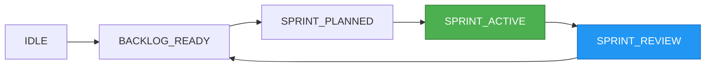

# 🎨 Your AI Command Center - Remember Iron Man's JARVIS? That's what we built

Welcome to the **Agent-Workflow UI Portal** - the Discord-inspired web interface that transforms your command-line orchestration into a visual, interactive experience. If you've ever watched Tony Stark effortlessly manage his tech empire through sleek holographic interfaces, you'll feel right at home here.

## ✨ Quick Start Magic

Launch your personal AI command center in seconds:

```bash
# 🚀 One-command launch (auto-opens browser)
agent-orch ui

# 🎯 Direct to your active project with interface management
agent-orch ui --mode dashboard --project my-webapp --interface-manager

# 🎮 Launch with context management panel
agent-orch ui --context-manager --performance-mode

# 👥 Team collaboration mode
agent-orch ui --team-mode --network-detect

# 🔧 Developer mode with all advanced features
agent-orch ui --dev-mode --debug
```

The portal automatically detects your system, finds the best browser, and creates secure access URLs for all your devices - including that phone in your pocket.

## 🏠 Your Digital Command Center

### Discord-Style Navigation That Actually Works

The interface mirrors Discord's intuitive design but supercharges it for development workflows:

```
┌─────────────────────────────────────────────────────────────────┐
│ 🎯 Agent Workflow                    [🔔 3] [👤 Profile] [⚙️]    │
├─────────────────────────────────────────────────────────────────┤
│ │                                                             │ │
│ │ 🏠 Dashboard                      Active Sprint: 3/5 ✅     │ │
│ │ 💬 Chat                           TDD Cycle: GREEN Phase    │ │
│ │ 📋 Projects                                                 │ │
│ │ 🤖 Agent Interfaces               Context: FANCY Mode      │ │
│ │ 🧠 Context Management             🔄 Auto-Detection ON     │ │
│ │ ⚙️  Configure                     [GIF: Live TDD cycle]    │ │
│ │ 📊 Monitor                                                  │ │
│ │                                   ┌─ Real-time Updates ──┐  │ │
│ │ 🏷️ PROJECTS                       │ 🤖 CodeAgent         │  │ │
│ │ # webapp-frontend                  │ Working on login.js  │  │ │
│ │ # api-backend                      │ ETA: 12 minutes     │  │ │
│ │ # mobile-app                       │                     │  │ │
│ │                                    │ 📈 95% test coverage │  │ │
│ │ 🔗 INTEGRATIONS                    └─────────────────────┘  │ │
│ │ 🎮 Discord Bot                     Interface: Claude Code  │ │
│ │ 🐙 GitHub                          🟢 Connected           │ │
│ └─────────────────────────────────────────────────────────────┘ │
└─────────────────────────────────────────────────────────────────┘
```

**[Animated GIF Placeholder: Dashboard Overview]**
*Shows smooth transitions between project cards, real-time updates flowing in, and the TDD cycle visualization morphing through RED → GREEN → REFACTOR phases*

## 💬 Discord-Style Chat Interface Integration

### Unified Communication Hub

The Agent Workflow portal now features a fully integrated Discord-style chat interface that seamlessly combines with the visual dashboard for the ultimate development experience. Switch between visual project management and conversational AI interaction without missing a beat.

!!! tip "Chat Interface Deep Dive"
    For comprehensive chat functionality details, see the **[Complete Chat Interface Guide](chat-interface.md)** which covers advanced features, commands, shortcuts, and mobile experience.

### Chat + Dashboard: Perfect Harmony

**Dual-Panel Experience**:
```
┌─────────────────────────────────────────────────────────────────┐
│ 🎯 Agent Workflow - Unified Interface    [🔔 3] [👤] [⚙️]       │
├─────────────────────────────────────────────────────────────────┤
│ │ SIDEBAR          │ DASHBOARD PANEL   │ CHAT PANEL           │ │
│ │                  │                   │                      │ │
│ │ 🏠 Dashboard     │ ┌─ Project Cards ─┐│ ┌─ #main-project ──┐ │ │
│ │ 💬 Chat Focus    │ │ 📊 Sprint: 60%  ││ │ 👤 You  /sprint  │ │ │
│ │ 📋 Projects      │ │ ⏱️ 3 days left   ││ │     status       │ │ │
│ │ 🤖 Agents        │ │ 🧪 15/20 tests ✅││ │                  │ │ │
│ │                  │ └─────────────────┘│ │ 🤖 System       │ │ │
│ │ 🏷️ CHANNELS      │ ┌─ Agent Status ──┐│ │ ✅ Sprint 60%    │ │ │
│ │ # main-project   │ │ 🟢 CodeAgent    ││ │ ⏱️ 3 days left   │ │ │
│ │ # testing        │ │ 🟡 QAAgent      ││ │ 🧪 15/20 pass    │ │ │
│ │ # notifications  │ │ 🔴 DataAgent    ││ │ [View Board]     │ │ │
│ │                  │ └─────────────────┘│ └──────────────────┘ │ │
│ │ 🤖 AI AGENTS     │ ┌─ TDD Cycle ─────┐│ ┌─ Input ─────────┐ │ │
│ │ 🟢 CodeAgent     │ │ 🔴 RED Phase    ││ │ Type command...  │ │ │
│ │ 🟢 DesignAgent   │ │ Writing tests   ││ │ /help for help   │ │ │
│ │ 🟡 QAAgent       │ │ ETA: 5 min      ││ └──────────────────┘ │ │
│ └──────────────────┴──│ [View Details]  │┴──────────────────────┘ │
│                        └─────────────────┘                        │
└─────────────────────────────────────────────────────────────────┘
```

**Seamless Context Sharing**:
- **🔄 Real-time Sync**: Dashboard updates instantly reflect in chat messages
- **📊 Visual Commands**: Chat commands automatically update dashboard widgets
- **🎯 Unified State**: Both interfaces share the same real-time state management
- **📱 Responsive Design**: Perfect experience on any screen size

### Enhanced Workflow Integration

**Chat Commands with Visual Feedback**:

When you run commands in chat, the dashboard updates automatically:

```
Chat Panel:                          Dashboard Panel:
┌─────────────────────────────────┐  ┌─────────────────────────────────┐
│ 👤 You          [3:45 PM]       │  │ ┌─ Sprint Board ───────────────┐ │
│ /sprint start                   │  │ │ TO DO  │ PROGRESS │ DONE    │ │
│                                 │  │ ├────────┼──────────┼─────────┤ │
│ 🤖 System                       │  │ │ Story3 │ Story1   │ Story2  │ │
│ ✅ Sprint "Auth System" started │  │ │ Story4 │ Story5   │         │ │
│ 📊 Board updated with 5 stories │  │ └─────────────────────────────┘ │
│ ⏱️ Sprint ends: Jan 25, 2024    │  │                                 │
│                                 │  │ Status: 🟢 SPRINT_ACTIVE        │
│ [View Sprint Board] [Dashboard] │  │ Updated: just now               │
└─────────────────────────────────┘  └─────────────────────────────────┘
```

**Interactive Dashboard Elements in Chat**:

Dashboard widgets can be embedded directly in chat messages:

```
🤖 CodeAgent                                        [4:20 PM]
✅ User authentication module completed!

📊 Live Progress Widget:
┌─ Implementation Status ─────────────────────────────────────┐
│ ✅ Login form component      [100%] 🎯 2h estimated        │
│ ✅ JWT token management      [100%] 🎯 3h estimated        │
│ ⏳ Session persistence       [ 75%] 🎯 1h remaining        │
│ ⏳ Logout flow              [ 25%] 🎯 2h remaining        │
└─────────────────────────────────────────────────────────────┘

🧪 Test Results: 23/25 passing ✅ (92% coverage)
📈 Performance: 1.2s average response time

[🔍 View Code] [📋 Review Tests] [🚀 Deploy] [📊 Full Dashboard]
```

### View Switching & Navigation

**Seamless Interface Switching**:

Switch between chat-focused and dashboard-focused views instantly:

```bash
# Chat-focused mode (chat takes center stage)
agent-orch ui --chat-focus

# Dashboard-focused mode (visual panels prioritized)  
agent-orch ui --dashboard-focus

# Split-screen mode (equal space for both)
agent-orch ui --split-mode

# Adaptive mode (switches based on activity)
agent-orch ui --adaptive-layout
```

**Quick View Shortcuts**:
- **`Ctrl/Cmd + /`**: Toggle to chat focus
- **`Ctrl/Cmd + D`**: Toggle to dashboard focus  
- **`Ctrl/Cmd + =`**: Split view (50/50)
- **`Ctrl/Cmd + Shift + V`**: Adaptive layout toggle

### Cross-Panel Actions

**Dashboard-to-Chat Actions**:
- Click any project card → Opens project channel in chat
- Click agent status → Direct message agent in chat
- Click sprint progress → `/sprint status` command in chat
- Click error notification → Opens debug session in chat

**Chat-to-Dashboard Actions**:
- Send `/dashboard` command → Switches to dashboard view
- Send `/sprint board` → Opens sprint board widget
- Send `/state diagram` → Shows state visualization
- Agent responses automatically update dashboard widgets

### Real-Time Synchronization Examples

**Example 1: Epic Creation Flow**
```
Step 1: Chat Command
👤 You: /epic "Add user authentication system"

Step 2: Automatic Dashboard Update  
📊 Dashboard instantly shows:
- New epic card in projects panel
- Updated project roadmap
- Agent assignment indicators
- Estimated timeline visualization

Step 3: Interactive Approval
🤖 System: Epic analysis complete!
📋 Click [Approve Stories] in chat
→ Dashboard sprint board populates with new stories
→ Agent status updates show assignment
→ TDD cycle indicator shows planning phase
```

**Example 2: Sprint Management**
```
Chat Action:                    Dashboard Response:
/sprint start                 → Sprint board switches to "ACTIVE"
                               → Progress bars animate to show 0%
                               → Timer starts in real-time
                               → Agent status updates to "WORKING"

Agent Progress Updates:        → Live progress bars update
🤖 CodeAgent: "50% complete"   → ETA calculations refresh
                               → Test coverage meters update
                               → Code quality indicators change
```

## 💬 Chat Like a Pro, Code Like a Wizard

### Command Interface with Superpowers

The integrated chat interface isn't just messaging - it's your direct line to AI agents with intelligence baked in:

```
┌─── Message Thread ──────────────────────────────────────────────┐
│ 👤 You                                               [2:30 PM] │
│ /epic "Add real-time notifications to user dashboard"          │
│                                                                 │
│ 🤖 System                                                       │
│ ┌─ Epic Analysis Complete ──────────────────────────────────┐  │
│ │ ✨ Smart Breakdown Generated                               │  │
│ │                                                            │  │
│ │ 📋 Proposed Stories (4):                                   │  │
│ │ • WebSocket connection management                          │  │
│ │ • Real-time notification component                        │  │
│ │ • Backend event subscription system                       │  │
│ │ • User preference controls                                │  │
│ │                                                            │  │
│ │ 🎯 Estimated: 2-3 sprints • Complexity: Medium            │  │
│ │ 🔧 Tech Stack: React, Socket.io, Redis                    │  │
│ │                                                            │  │
│ │ [✅ Approve All] [✏️ Edit Stories] [🔄 Regenerate]         │  │
│ └────────────────────────────────────────────────────────────┘  │
└─────────────────────────────────────────────────────────────────┘
```

**[Animated GIF Placeholder: Smart Command Execution]** 
*Demonstrates typing `/sprint start`, auto-complete suggestions appearing, command execution with streaming results, and visual feedback*

### 🎹 Keyboard Shortcuts for Power Users

> **💡 Pro Tip**: Master these shortcuts to navigate like a seasoned developer

<div class="keyboard-shortcuts-callout">
<h4>🚀 Essential Shortcuts</h4>

| Shortcut | Action | Context |
|----------|--------|---------|
| `Ctrl/Cmd + K` | **Quick Command** | Global command palette |
| `Ctrl/Cmd + /` | **Toggle Chat** | Switch to chat interface |
| `Ctrl/Cmd + D` | **Dashboard** | Jump to project dashboard |
| `Ctrl/Cmd + Shift + S` | **Sprint Board** | Open current sprint |
| `Ctrl/Cmd + .` | **State Inspector** | View current state machine |
| `↑/↓` | **Command History** | Navigate previous commands |
| `Tab` | **Smart Complete** | Auto-complete commands/params |
| `Ctrl/Cmd + Enter` | **Execute Command** | Run current command |
| `Esc` | **Cancel/Close** | Cancel operation or close modal |
| `Ctrl/Cmd + R` | **Refresh Project** | Reload current project data |

<h4>🤖 Interface & Context Shortcuts</h4>

| Shortcut | Action | Description |
|----------|--------|-------------|
| `Ctrl/Cmd + I` | **Interface Panel** | Open agent interface management |
| `Ctrl/Cmd + Shift + I` | **Switch Interface** | Quick interface switcher |
| `Ctrl/Cmd + M` | **Context Mode** | Toggle context management panel |
| `Ctrl/Cmd + Shift + M` | **Switch Mode** | Quick context mode switcher |
| `Ctrl/Cmd + T` | **Test Interface** | Test current interface connection |
| `Ctrl/Cmd + P` | **Performance** | View performance metrics |

<h4>🎯 Chat Shortcuts</h4>

| Shortcut | Action | Description |
|----------|--------|-------------|
| `/` | **Command Mode** | Start typing commands |
| `@agent` | **Mention Agent** | Direct message to specific agent |
| `Ctrl/Cmd + L` | **Clear Chat** | Clear current channel history |
| `Ctrl/Cmd + F` | **Search Messages** | Find in conversation history |
| `Shift + Enter` | **New Line** | Multi-line input without sending |

</div>

## 🎯 Feature Tours

### 🤖 Agent Interface Management - Backend Switching Made Easy

**[Animated GIF Placeholder: Interface Management]**
*Shows switching between Claude Code, Anthropic API, and Mock interfaces with real-time status updates*

Switch between different AI backends seamlessly through an intuitive panel:

```
┌─ Agent Interface Control ──────────────────────────────────────┐
│                                                                │
│ 🟢 Claude Code        [ACTIVE]    ⚡ Ready      [Configure]   │
│    Local CLI with tool restrictions                           │
│    Response Time: 1.2s • Success Rate: 99.1%                 │
│                                                                │
│ 🟡 Anthropic API      [AVAILABLE] 🔑 Key Set   [Switch To]   │
│    Direct API access with latest models                       │
│    Response Time: 0.8s • Rate Limit: 95/100                  │
│                                                                │
│ 🟢 Mock Interface     [AVAILABLE] 🎭 Demo      [Test]        │
│    Simulated responses for testing                            │
│    Perfect for demos and CI/CD pipelines                     │
│                                                                │
│ [Test All Interfaces] [Performance Comparison] [Security]     │
└────────────────────────────────────────────────────────────────┘
```

- **🔄 One-Click Switching**: Change backends instantly with validation
- **🧪 Interface Testing**: Validate connections before switching
- **🔒 Security Management**: Secure API key storage and validation
- **📊 Performance Monitoring**: Real-time metrics and comparison

### 🧠 Context Management - Intelligent Processing Modes

**[Animated GIF Placeholder: Context Mode Switching]**
*Demonstrates switching between FANCY and SIMPLE modes with performance metrics*

Optimize context processing for your current scenario:

```
┌─ Context Management Control ───────────────────────────────────┐
│                                                                │
│ Current Mode: AUTO 🎯                                         │
│ ├─ Detected: FANCY (Full system resources available)          │
│ ├─ Performance: 2.3s prep time • 245MB memory                 │
│ └─ Accuracy: 95% relevant context • 23/150 files              │
│                                                                │
│ ┌─ Quick Mode Switch ─────────────────────────────────────┐   │
│ │ ○ AUTO     Smart detection based on environment        │   │
│ │ ● FANCY    Full-featured (2-10s, high accuracy)        │   │
│ │ ○ SIMPLE   Fast processing (0.1-1s, good accuracy)     │   │
│ └─────────────────────────────────────────────────────────┘   │
│                                                                │
│ ┌─ Performance Comparison ────────────────────────────────┐   │
│ │ FANCY:  █████████░░ 95% accuracy • 2.3s • 245MB       │   │
│ │ SIMPLE: ████████░░░ 82% accuracy • 0.2s • 35MB        │   │
│ └─────────────────────────────────────────────────────────┘   │
│                                                                │
│ [Test Performance] [Configure Thresholds] [View Metrics]      │
└────────────────────────────────────────────────────────────────┘
```

- **⚡ Performance Optimization**: Choose speed vs accuracy based on needs
- **🔍 Auto-Detection**: Intelligent mode selection based on environment
- **📈 Real-Time Metrics**: Monitor preparation time, memory usage, and accuracy
- **🎛️ Custom Thresholds**: Fine-tune switching behavior and performance limits

### 📊 Project Dashboard - Your Mission Control

**[Animated GIF Placeholder: Dashboard Tour]**
*Walkthrough of project cards, health indicators, progress charts, and interactive elements*

Transform chaos into clarity with visual project management:

- **🎛️ Live Status Cards**: Each project shows real-time state, active agents, and progress
- **📈 Smart Metrics**: Code coverage, test success rates, and velocity tracking
- **🚨 Intelligent Alerts**: Visual notifications for blocked tasks, failed tests, or required approvals
- **🔄 One-Click Actions**: Start sprints, approve tasks, or deploy directly from cards

### 💻 Sprint Board - Kanban Meets AI

**[Animated GIF Placeholder: Sprint Board Interaction]**
*Shows drag-and-drop story movement, agent assignments, and real-time updates*

Watch your stories flow through the development pipeline:

```
┌─ TO DO ──────┬─ IN PROGRESS ─┬─ TESTING ────┬─ DONE ─────────┐
│ 📋 Story #4  │ 🔄 Story #2   │ 🧪 Story #1  │ ✅ Story #3   │
│ User Profile │ Login System  │ Registration │ Database      │
│ Management   │               │ Flow         │ Schema        │
│              │ 🤖 CodeAgent  │              │               │
│ Drag & Drop  │ ⏱️ ETA: 30min │ 🎯 95% tests │ ✨ Deployed   │
│ Enabled      │               │ passing      │               │
└──────────────┴───────────────┴──────────────┴───────────────┘
```

### 📡 Real-Time Monitoring & WebSocket Integration

**[Animated GIF Placeholder: Real-Time Dashboard]**
*Shows live updates flowing through WebSocket connections with interface and context changes*

Experience true real-time monitoring with live data streams:

```
┌─ Live System Monitor ──────────────────────────────────────────┐
│                                                                │
│ 🔴 LIVE • Interface: Claude Code • Context: FANCY • 2.3s      │
│                                                                │
│ ┌─ Recent Events ────────────────────────────────────────┐    │
│ │ 14:23:45 🤖 Interface switched: mock → claude_code     │    │
│ │ 14:23:32 🧠 Context mode: auto → fancy (detected)      │    │
│ │ 14:23:15 ⚡ Performance test: 1.8s preparation         │    │
│ │ 14:23:01 🔄 State transition: IDLE → SPRINT_ACTIVE     │    │
│ │ 14:22:48 🧪 CodeAgent: test_user_auth.py (95% pass)    │    │
│ └─────────────────────────────────────────────────────────┘    │
│                                                                │
│ ┌─ Performance Metrics ──────────────────────────────────┐    │
│ │ Response Times:  [████████░░] Avg: 1.2s               │    │
│ │ Memory Usage:    [██████░░░░] 245MB / 8GB              │    │
│ │ Success Rate:    [██████████] 99.1%                    │    │
│ │ Cache Hit Rate:  [████████░░] 78%                      │    │
│ └─────────────────────────────────────────────────────────┘    │
│                                                                │
│ [Export Metrics] [Configure Alerts] [Performance Report]      │
└────────────────────────────────────────────────────────────────┘
```

- **📊 Live Performance Charts**: Real-time graphs of response times and resource usage
- **🔔 Smart Alerts**: Configurable notifications for performance thresholds
- **📈 Historical Analysis**: Track performance trends over time
- **⚡ WebSocket Efficiency**: Sub-100ms update latency for instant feedback

### 🔧 Configuration Made Simple

**[Animated GIF Placeholder: Configuration Interface]**
*Shows intuitive toggles, real-time validation, and guided setup flows*

No more YAML wrestling or environment variable confusion:

- **🎨 Visual Agent Setup**: Toggle agent permissions with interactive matrices
- **🔐 Secure Key Management**: Encrypted storage with rotation capabilities
- **🤖 Discord Integration**: Step-by-step bot setup with live testing
- **⚡ Performance Tuning**: Slider controls for timeouts, concurrency, and resource limits
- **🧠 Context Configuration**: Visual mode selection and threshold adjustment
- **🔄 Interface Management**: Drag-and-drop interface priority and fallback chains

## 🎮 Interactive Elements

### State Machine Visualizer

Click any state to see available transitions and understand your workflow position:



### Live Command Suggestions

The interface learns your patterns and suggests contextual commands:

<div class="command-suggestions">
💡 <strong>Smart Suggestions</strong>

Based on your current state (<code>SPRINT_ACTIVE</code>) and recent activity:

- `</code>/sprint status` - Check current sprint progress
- `/task prioritize` - Reorder backlog items  
- `/approve [ID]` - Approve pending agent tasks
- `/state` - Inspect current workflow state
- `/monitor tdd` - View live TDD cycle status

</div>

## 💡 Power User Tips

<details>
<summary><strong>🔥 Advanced Workflows</strong></summary>

### Multi-Project Orchestration
- Use `Ctrl/Cmd + Shift + P` to switch between projects instantly
- Set up project-specific notification preferences
- Create custom dashboard layouts for different project types

### Agent Coordination
- Monitor agent workloads in real-time via the Monitor tab
- Set up agent-to-agent communication rules
- Configure automatic fallback strategies for failed tasks

### Performance Optimization
- Enable connection pooling for faster WebSocket communication
- Use selective event subscription to reduce bandwidth
- Configure client-side caching for frequently accessed data

</details>

<details>
<summary><strong>🎯 Productivity Hacks</strong></summary>

### Command Automation
- Create custom command aliases for frequently used operations
- Set up command sequences that execute multiple steps
- Use command templates with variable substitution

### Notification Management
- Configure different notification sounds for different event types
- Set up desktop notifications for critical events
- Create notification rules based on project priority

### Collaboration Features
- Share sprint boards with team members via secure links
- Set up real-time collaboration on story refinement
- Use commenting system for asynchronous communication

</details>

## 🌐 Access From Anywhere

### Progressive Web App Features

Install the portal as a native app on any device:

```bash
# Generate mobile-friendly access
agent-orch ui --mobile-optimize --qr-code
```

**[Animated GIF Placeholder: Mobile Interface]**
*Shows responsive design, touch interactions, and offline capabilities*

- **📱 Native App Feel**: Install directly from browser to home screen
- **🔄 Offline Mode**: View cached data when connection drops
- **📳 Push Notifications**: Get alerts even when browser is closed
- **🎙️ Voice Commands**: Speak commands directly to the interface

### Network Discovery & Team Access

The portal automatically discovers the best network configuration:

```bash
Portal accessible at:
┌─ Local Access ─────────────────────────────────────────┐
│ 🏠 http://localhost:8080                               │
│ 🖥️  http://192.168.1.100:8080 (Primary)              │
│ 📱 http://10.0.0.45:8080 (WiFi)                       │
└────────────────────────────────────────────────────────┘

🔒 Secure team access: https://secure-portal.ngrok.io
📱 Mobile QR code: [█████████████████████████]
```

## 🔒 Security & Privacy

### Enterprise-Grade Security

- **🔐 JWT Authentication**: Secure token-based access with configurable expiration
- **🛡️ Role-Based Access**: Fine-grained permissions per user and project
- **🔒 Encrypted Storage**: All sensitive data encrypted at rest
- **🚨 Audit Logging**: Complete activity tracking and security monitoring

### Privacy Controls

- **🏠 Local-First**: All data stays on your machine by default
- **🔕 Opt-In Telemetry**: Choose what metrics to share (if any)
- **🗑️ Data Cleanup**: Automatic cleanup of temporary files and logs
- **🔄 Backup Controls**: Automated backups with retention policies

## 🚀 Launch Modes Deep Dive

### Interactive Mode (Default)
```bash
agent-orch ui
```
- Auto-detects and launches your default browser
- Displays startup information and access URLs
- Provides helpful hints for first-time users

### Headless Mode
```bash
agent-orch ui --headless --port 8080
```
- Runs as background service without browser
- Perfect for server deployments or custom integrations
- Provides API endpoints for external access

### Development Mode
```bash
agent-orch ui --dev-mode
```
- Enables hot-reload for UI development
- Exposes additional debugging endpoints
- Provides detailed error information

### Team Mode
```bash
agent-orch ui --team-mode --network-detect
```
- Automatically configures for team access
- Sets up secure tunneling if needed
- Generates QR codes for easy mobile access

## 🎊 Getting Started Checklist

Ready to transform your development workflow? Here's your 5-minute setup:

- [ ] **Launch the Portal**: Run `agent-orch ui` and bookmark the URL
- [ ] **Register Your First Project**: Use the visual project browser to add your current work
- [ ] **Create Your First Epic**: Use the chat interface to define your next feature
- [ ] **Configure Your Agents**: Set up permissions and performance settings
- [ ] **Start Your First Sprint**: Watch the magic happen in real-time
- [ ] **Install Mobile App**: Add to your phone's home screen for anywhere access
- [ ] **Share with Team**: Generate secure access links for collaboration

## 💬 Need Help?

The portal includes built-in help and contextual guidance:

- **❓ Help Command**: Type `/help` in any chat for contextual assistance
- **🎯 Interactive Tours**: Click the "?" icon for guided feature tours  
- **📚 Documentation**: Built-in docs accessible via the help menu
- **🐛 Issue Reporting**: One-click issue reporting with automatic log collection

---

**Ready to step into the future of AI-assisted development?** Launch your portal now and experience the seamless blend of command-line power and visual elegance that makes managing AI agents feel like piloting the future.

```bash
agent-orch ui --mode dashboard
```

*Welcome to your AI command center. The future of development is here.* ✨