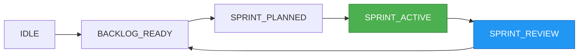

# 🎨 Your AI Command Center - Remember Iron Man's JARVIS? That's what we built

Welcome to the **Agent-Workflow UI Portal** - the Discord-inspired web interface that transforms your command-line orchestration into a visual, interactive experience. If you've ever watched Tony Stark effortlessly manage his tech empire through sleek holographic interfaces, you'll feel right at home here.

## ✨ Quick Start Magic

Launch your personal AI command center in seconds:

```bash
# 🚀 One-command launch (auto-opens browser)
agent-orch ui

# 🎯 Direct to your active project
agent-orch ui --mode dashboard --project my-webapp

# 👥 Team collaboration mode
agent-orch ui --team-mode --network-detect
```

The portal automatically detects your system, finds the best browser, and creates secure access URLs for all your devices - including that phone in your pocket.

## 🏠 Your Digital Command Center

### Discord-Style Navigation That Actually Works

The interface mirrors Discord's intuitive design but supercharges it for development workflows:

```
┌─────────────────────────────────────────────────────────────────┐
│ 🎯 Agent Workflow                    [🔔 3] [👤 Profile] [⚙️]    │
├─────────────────────────────────────────────────────────────────┤
│ │                                                             │ │
│ │ 🏠 Dashboard                      Active Sprint: 3/5 ✅     │ │
│ │ 💬 Chat                           TDD Cycle: GREEN Phase    │ │
│ │ 📋 Projects                                                 │ │
│ │ ⚙️  Configure                     [GIF: Live TDD cycle]    │ │
│ │ 📊 Monitor                                                  │ │
│ │                                   ┌─ Real-time Updates ──┐  │ │
│ │ 🏷️ PROJECTS                       │ 🤖 CodeAgent         │  │ │
│ │ # webapp-frontend                  │ Working on login.js  │  │ │
│ │ # api-backend                      │ ETA: 12 minutes     │  │ │
│ │ # mobile-app                       │                     │  │ │
│ │                                    │ 📈 95% test coverage │  │ │
│ │ 🔗 INTEGRATIONS                    └─────────────────────┘  │ │
│ │ 🎮 Discord Bot                                             │ │
│ │ 🐙 GitHub                                                  │ │
│ └─────────────────────────────────────────────────────────────┘ │
└─────────────────────────────────────────────────────────────────┘
```

**[Animated GIF Placeholder: Dashboard Overview]**
*Shows smooth transitions between project cards, real-time updates flowing in, and the TDD cycle visualization morphing through RED → GREEN → REFACTOR phases*

## 💬 Chat Like a Pro, Code Like a Wizard

### Command Interface with Superpowers

The chat interface isn't just messaging - it's your direct line to AI agents with intelligence baked in:

```
┌─── Message Thread ──────────────────────────────────────────────┐
│ 👤 You                                               [2:30 PM] │
│ /epic "Add real-time notifications to user dashboard"          │
│                                                                 │
│ 🤖 System                                                       │
│ ┌─ Epic Analysis Complete ──────────────────────────────────┐  │
│ │ ✨ Smart Breakdown Generated                               │  │
│ │                                                            │  │
│ │ 📋 Proposed Stories (4):                                   │  │
│ │ • WebSocket connection management                          │  │
│ │ • Real-time notification component                        │  │
│ │ • Backend event subscription system                       │  │
│ │ • User preference controls                                │  │
│ │                                                            │  │
│ │ 🎯 Estimated: 2-3 sprints • Complexity: Medium            │  │
│ │ 🔧 Tech Stack: React, Socket.io, Redis                    │  │
│ │                                                            │  │
│ │ [✅ Approve All] [✏️ Edit Stories] [🔄 Regenerate]         │  │
│ └────────────────────────────────────────────────────────────┘  │
└─────────────────────────────────────────────────────────────────┘
```

**[Animated GIF Placeholder: Smart Command Execution]** 
*Demonstrates typing `/sprint start`, auto-complete suggestions appearing, command execution with streaming results, and visual feedback*

### 🎹 Keyboard Shortcuts for Power Users

> **💡 Pro Tip**: Master these shortcuts to navigate like a seasoned developer

<div class="keyboard-shortcuts-callout">
<h4>🚀 Essential Shortcuts</h4>

| Shortcut | Action | Context |
|----------|--------|---------|
| `Ctrl/Cmd + K` | **Quick Command** | Global command palette |
| `Ctrl/Cmd + /` | **Toggle Chat** | Switch to chat interface |
| `Ctrl/Cmd + D` | **Dashboard** | Jump to project dashboard |
| `Ctrl/Cmd + Shift + S` | **Sprint Board** | Open current sprint |
| `Ctrl/Cmd + .` | **State Inspector** | View current state machine |
| `↑/↓` | **Command History** | Navigate previous commands |
| `Tab` | **Smart Complete** | Auto-complete commands/params |
| `Ctrl/Cmd + Enter` | **Execute Command** | Run current command |
| `Esc` | **Cancel/Close** | Cancel operation or close modal |
| `Ctrl/Cmd + R` | **Refresh Project** | Reload current project data |

<h4>🎯 Chat Shortcuts</h4>

| Shortcut | Action | Description |
|----------|--------|-------------|
| `/` | **Command Mode** | Start typing commands |
| `@agent` | **Mention Agent** | Direct message to specific agent |
| `Ctrl/Cmd + L` | **Clear Chat** | Clear current channel history |
| `Ctrl/Cmd + F` | **Search Messages** | Find in conversation history |
| `Shift + Enter` | **New Line** | Multi-line input without sending |

</div>

## 🎯 Feature Tours

### 📊 Project Dashboard - Your Mission Control

**[Animated GIF Placeholder: Dashboard Tour]**
*Walkthrough of project cards, health indicators, progress charts, and interactive elements*

Transform chaos into clarity with visual project management:

- **🎛️ Live Status Cards**: Each project shows real-time state, active agents, and progress
- **📈 Smart Metrics**: Code coverage, test success rates, and velocity tracking
- **🚨 Intelligent Alerts**: Visual notifications for blocked tasks, failed tests, or required approvals
- **🔄 One-Click Actions**: Start sprints, approve tasks, or deploy directly from cards

### 💻 Sprint Board - Kanban Meets AI

**[Animated GIF Placeholder: Sprint Board Interaction]**
*Shows drag-and-drop story movement, agent assignments, and real-time updates*

Watch your stories flow through the development pipeline:

```
┌─ TO DO ──────┬─ IN PROGRESS ─┬─ TESTING ────┬─ DONE ─────────┐
│ 📋 Story #4  │ 🔄 Story #2   │ 🧪 Story #1  │ ✅ Story #3   │
│ User Profile │ Login System  │ Registration │ Database      │
│ Management   │               │ Flow         │ Schema        │
│              │ 🤖 CodeAgent  │              │               │
│ Drag & Drop  │ ⏱️ ETA: 30min │ 🎯 95% tests │ ✨ Deployed   │
│ Enabled      │               │ passing      │               │
└──────────────┴───────────────┴──────────────┴───────────────┘
```

### 🔧 Configuration Made Simple

**[Animated GIF Placeholder: Configuration Interface]**
*Shows intuitive toggles, real-time validation, and guided setup flows*

No more YAML wrestling or environment variable confusion:

- **🎨 Visual Agent Setup**: Toggle agent permissions with interactive matrices
- **🔐 Secure Key Management**: Encrypted storage with rotation capabilities
- **🤖 Discord Integration**: Step-by-step bot setup with live testing
- **⚡ Performance Tuning**: Slider controls for timeouts, concurrency, and resource limits

## 🎮 Interactive Elements

### State Machine Visualizer

Click any state to see available transitions and understand your workflow position:



### Live Command Suggestions

The interface learns your patterns and suggests contextual commands:

<div class="command-suggestions">
💡 <strong>Smart Suggestions</strong>

Based on your current state (<code>SPRINT_ACTIVE</code>) and recent activity:

- `</code>/sprint status` - Check current sprint progress
- `/task prioritize` - Reorder backlog items  
- `/approve [ID]` - Approve pending agent tasks
- `/state` - Inspect current workflow state
- `/monitor tdd` - View live TDD cycle status

</div>

## 💡 Power User Tips

<details>
<summary><strong>🔥 Advanced Workflows</strong></summary>

### Multi-Project Orchestration
- Use `Ctrl/Cmd + Shift + P` to switch between projects instantly
- Set up project-specific notification preferences
- Create custom dashboard layouts for different project types

### Agent Coordination
- Monitor agent workloads in real-time via the Monitor tab
- Set up agent-to-agent communication rules
- Configure automatic fallback strategies for failed tasks

### Performance Optimization
- Enable connection pooling for faster WebSocket communication
- Use selective event subscription to reduce bandwidth
- Configure client-side caching for frequently accessed data

</details>

<details>
<summary><strong>🎯 Productivity Hacks</strong></summary>

### Command Automation
- Create custom command aliases for frequently used operations
- Set up command sequences that execute multiple steps
- Use command templates with variable substitution

### Notification Management
- Configure different notification sounds for different event types
- Set up desktop notifications for critical events
- Create notification rules based on project priority

### Collaboration Features
- Share sprint boards with team members via secure links
- Set up real-time collaboration on story refinement
- Use commenting system for asynchronous communication

</details>

## 🌐 Access From Anywhere

### Progressive Web App Features

Install the portal as a native app on any device:

```bash
# Generate mobile-friendly access
agent-orch ui --mobile-optimize --qr-code
```

**[Animated GIF Placeholder: Mobile Interface]**
*Shows responsive design, touch interactions, and offline capabilities*

- **📱 Native App Feel**: Install directly from browser to home screen
- **🔄 Offline Mode**: View cached data when connection drops
- **📳 Push Notifications**: Get alerts even when browser is closed
- **🎙️ Voice Commands**: Speak commands directly to the interface

### Network Discovery & Team Access

The portal automatically discovers the best network configuration:

```bash
Portal accessible at:
┌─ Local Access ─────────────────────────────────────────┐
│ 🏠 http://localhost:8080                               │
│ 🖥️  http://192.168.1.100:8080 (Primary)              │
│ 📱 http://10.0.0.45:8080 (WiFi)                       │
└────────────────────────────────────────────────────────┘

🔒 Secure team access: https://secure-portal.ngrok.io
📱 Mobile QR code: [█████████████████████████]
```

## 🔒 Security & Privacy

### Enterprise-Grade Security

- **🔐 JWT Authentication**: Secure token-based access with configurable expiration
- **🛡️ Role-Based Access**: Fine-grained permissions per user and project
- **🔒 Encrypted Storage**: All sensitive data encrypted at rest
- **🚨 Audit Logging**: Complete activity tracking and security monitoring

### Privacy Controls

- **🏠 Local-First**: All data stays on your machine by default
- **🔕 Opt-In Telemetry**: Choose what metrics to share (if any)
- **🗑️ Data Cleanup**: Automatic cleanup of temporary files and logs
- **🔄 Backup Controls**: Automated backups with retention policies

## 🚀 Launch Modes Deep Dive

### Interactive Mode (Default)
```bash
agent-orch ui
```
- Auto-detects and launches your default browser
- Displays startup information and access URLs
- Provides helpful hints for first-time users

### Headless Mode
```bash
agent-orch ui --headless --port 8080
```
- Runs as background service without browser
- Perfect for server deployments or custom integrations
- Provides API endpoints for external access

### Development Mode
```bash
agent-orch ui --dev-mode
```
- Enables hot-reload for UI development
- Exposes additional debugging endpoints
- Provides detailed error information

### Team Mode
```bash
agent-orch ui --team-mode --network-detect
```
- Automatically configures for team access
- Sets up secure tunneling if needed
- Generates QR codes for easy mobile access

## 🎊 Getting Started Checklist

Ready to transform your development workflow? Here's your 5-minute setup:

- [ ] **Launch the Portal**: Run `agent-orch ui` and bookmark the URL
- [ ] **Register Your First Project**: Use the visual project browser to add your current work
- [ ] **Create Your First Epic**: Use the chat interface to define your next feature
- [ ] **Configure Your Agents**: Set up permissions and performance settings
- [ ] **Start Your First Sprint**: Watch the magic happen in real-time
- [ ] **Install Mobile App**: Add to your phone's home screen for anywhere access
- [ ] **Share with Team**: Generate secure access links for collaboration

## 💬 Need Help?

The portal includes built-in help and contextual guidance:

- **❓ Help Command**: Type `/help` in any chat for contextual assistance
- **🎯 Interactive Tours**: Click the "?" icon for guided feature tours  
- **📚 Documentation**: Built-in docs accessible via the help menu
- **🐛 Issue Reporting**: One-click issue reporting with automatic log collection

---

**Ready to step into the future of AI-assisted development?** Launch your portal now and experience the seamless blend of command-line power and visual elegance that makes managing AI agents feel like piloting the future.

```bash
agent-orch ui --mode dashboard
```

*Welcome to your AI command center. The future of development is here.* ✨