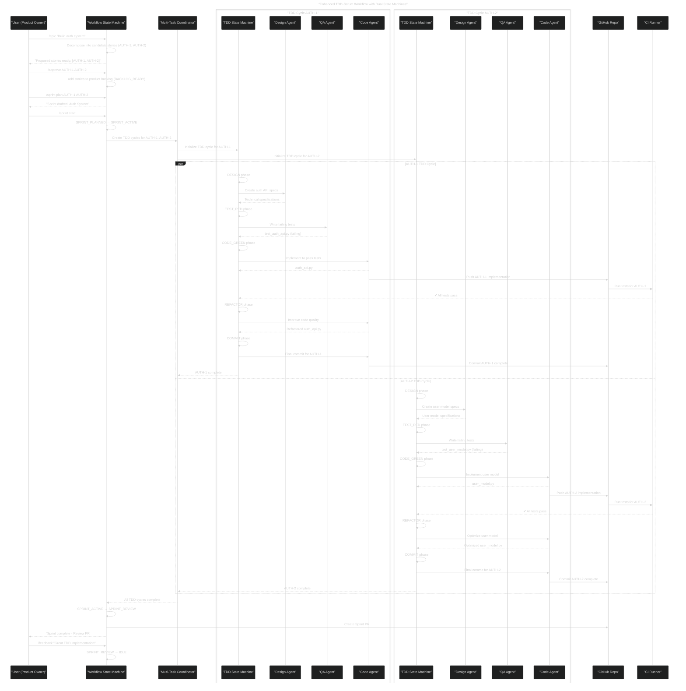
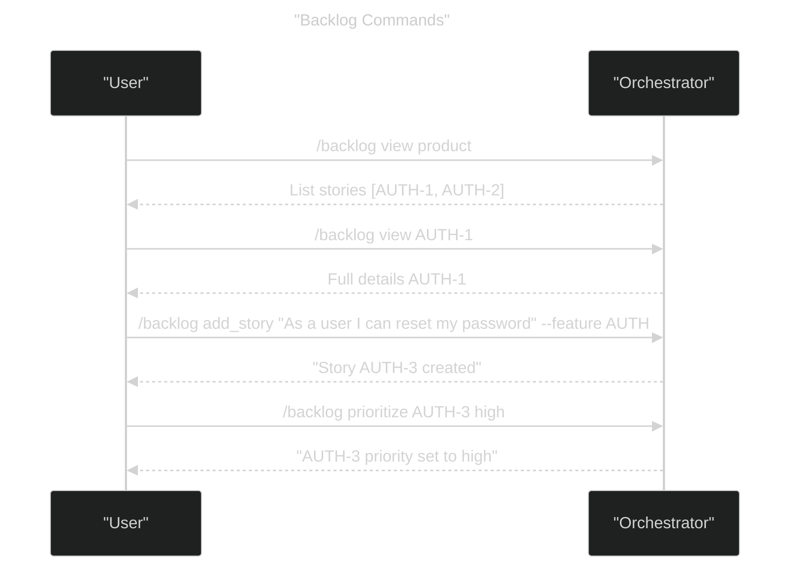
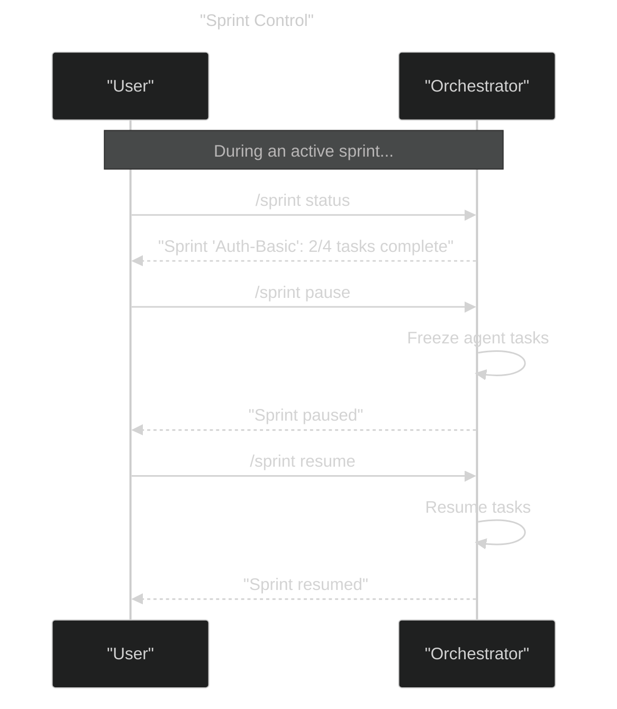
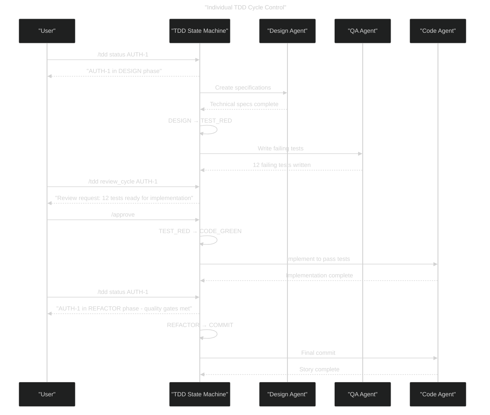
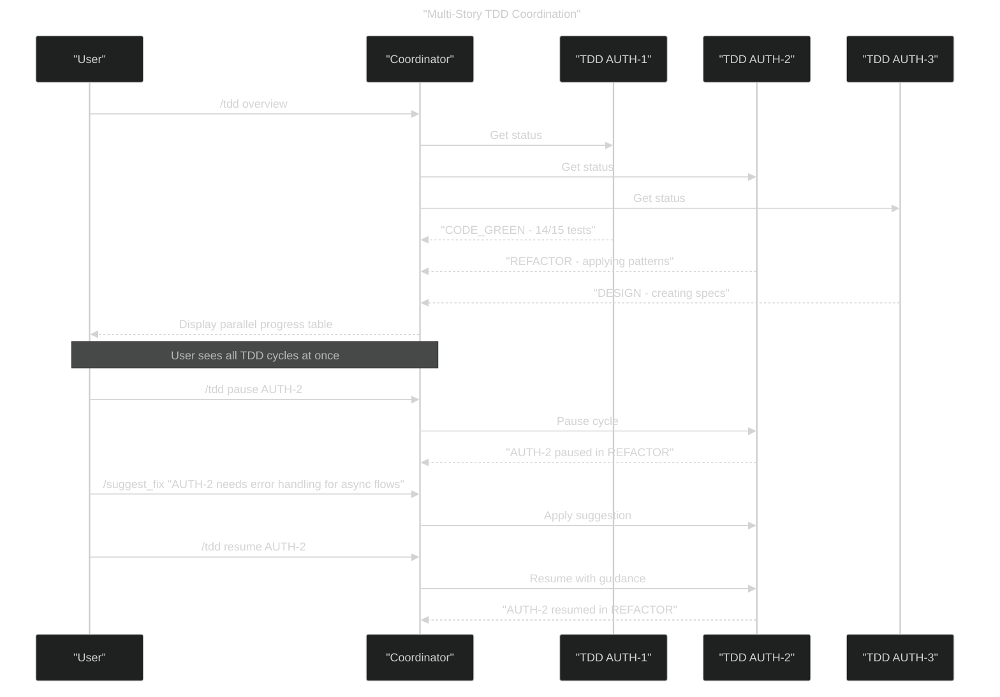
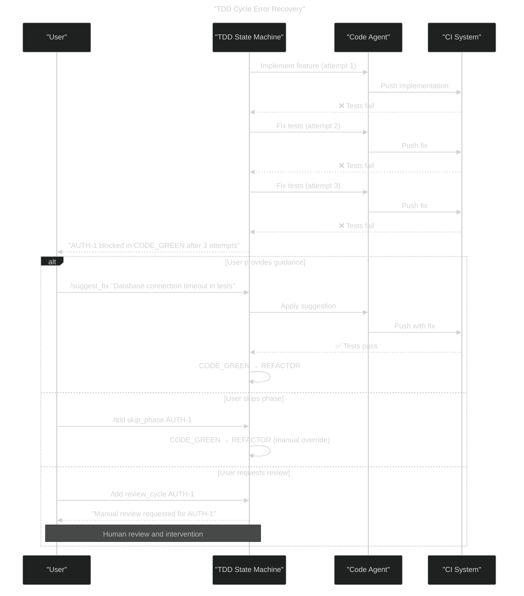
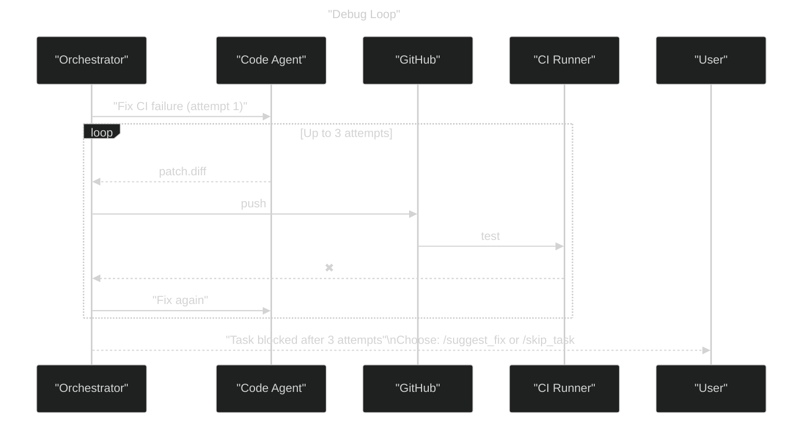

# AI Agent TDD-Scrum Workflows – Dual State Machine (v4)

This file documents the core interaction patterns between the Product Owner (single user) and the AI-powered dual state machine system with integrated TDD workflows.

---

## 1. Enhanced TDD-Scrum Workflow

---

## 2. Backlog Management Flow

---

## 3. Sprint Control Commands

---

## 4. TDD Cycle Management

---

## 5. Parallel TDD Monitoring

---

## 6. TDD Error Handling and Recovery

---

## 7. Debug & Rework Loop (Condensed)

