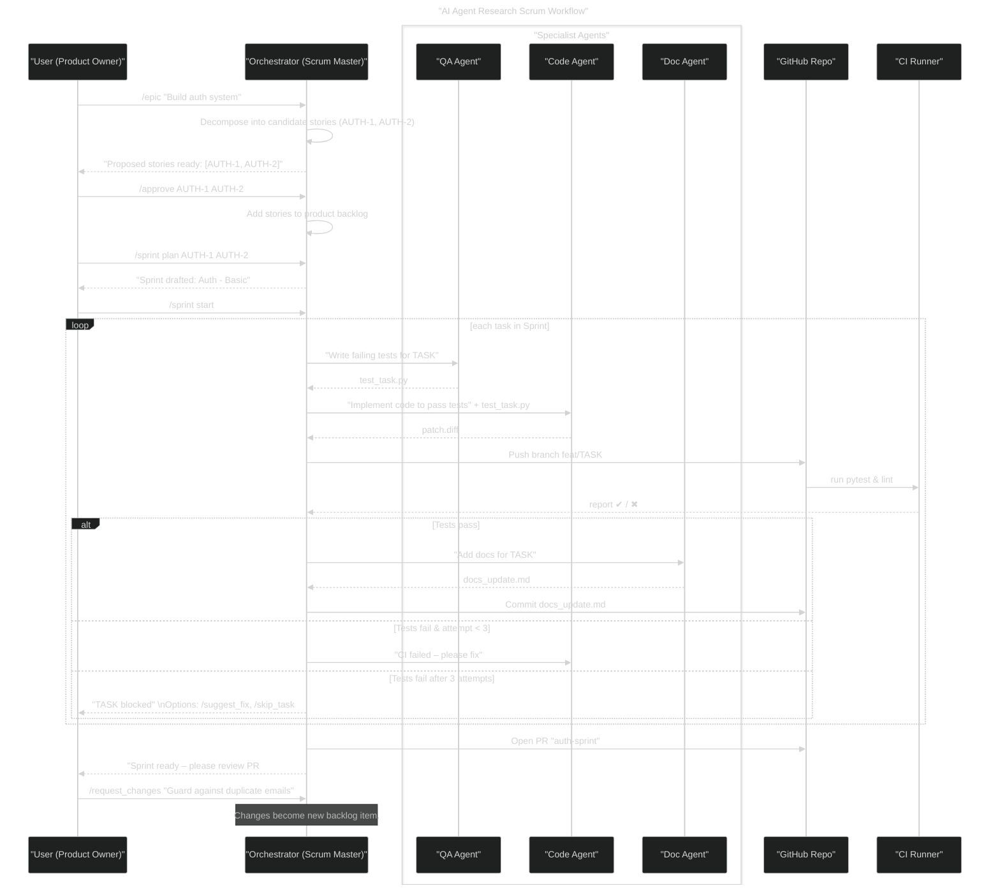
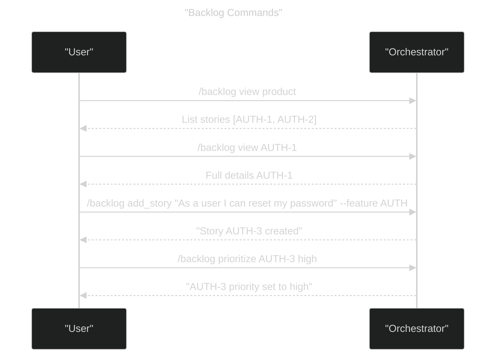
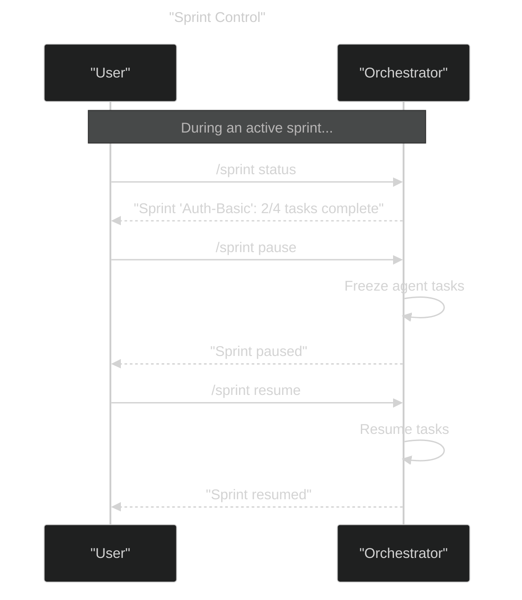
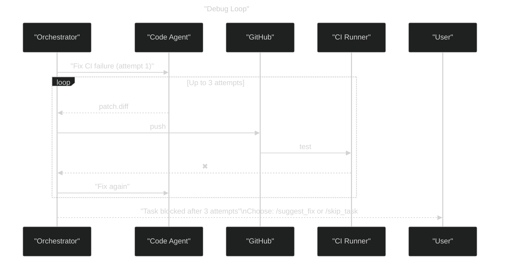

# AI Agent Scrum Workflows – Research Mode (v3)

This file documents the core interaction patterns between the Product Owner (single user) and the AI-powered Orchestrator + specialist agents.

---

## 1. Main Workflow: Lightweight Scrum Cycle

---

## 2. Backlog Management Flow

---

## 3. Sprint Control Commands

---

## 4. Debug & Rework Loop (Condensed)

