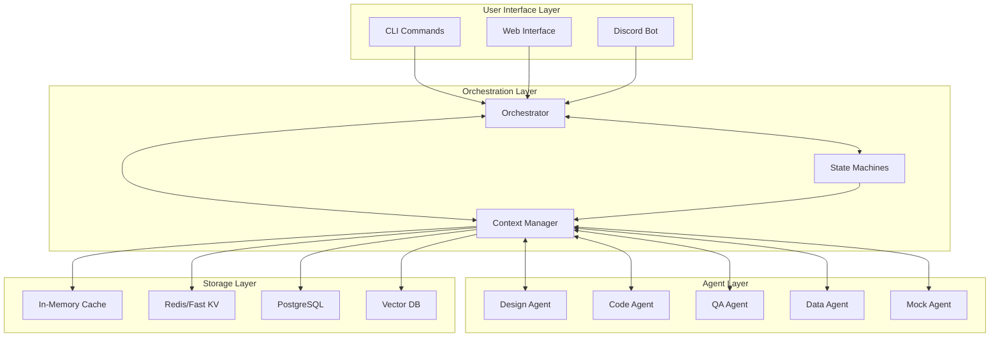
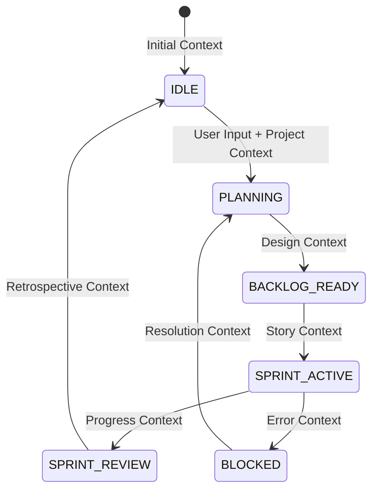

# Context Dependency Map for Agent-Workflow

## System Architecture Overview



## Context Flow Dependencies

### 1. Context Manager (Central Hub)
**Owner**: Core System Component
**Responsibilities**:
- Routes context between all agents
- Enforces context boundaries
- Manages context lifecycle
- Optimizes token usage

**Dependencies**:
```yaml
inputs:
  - user_commands: "From UI Layer"
  - agent_outputs: "From all agents"
  - state_changes: "From State Machines"
  - storage_data: "From persistence layer"

outputs:
  - filtered_context: "To specific agents"
  - state_context: "To State Machines"
  - ui_context: "To interfaces"
  - storage_commands: "To persistence"
```

### 2. State Machine Dependencies
**Owner**: Orchestrator
**Context Flow**:



### 3. Agent Context Dependencies

#### Design Agent
```yaml
requires:
  - epic_description: "From user/orchestrator"
  - project_constraints: "From project config"
  - historical_patterns: "From Vector DB"
  - current_architecture: "From DB"

produces:
  - technical_specifications
  - api_contracts
  - data_models
  - acceptance_criteria
  - architecture_diagrams

stores:
  - design_decisions: "To DB"
  - design_patterns: "To Vector DB"
```

#### Code Agent
```yaml
requires:
  - technical_specifications: "From Design Agent"
  - test_requirements: "From QA Agent"
  - code_standards: "From project config"
  - existing_code: "From file system"

produces:
  - implementation_files
  - refactoring_proposals
  - code_metrics
  - documentation

stores:
  - code_patterns: "To Vector DB"
  - implementation_history: "To DB"
```

#### QA Agent
```yaml
requires:
  - specifications: "From Design Agent"
  - code_changes: "From Code Agent"
  - test_history: "From DB"
  - coverage_requirements: "From config"

produces:
  - test_suites
  - coverage_reports
  - bug_reports
  - quality_metrics

stores:
  - test_patterns: "To Vector DB"
  - quality_baselines: "To DB"
```

#### Data Agent
```yaml
requires:
  - all_agent_outputs: "From Context Manager"
  - system_metrics: "From monitoring"
  - historical_data: "From DB"

produces:
  - progress_dashboards
  - velocity_reports
  - bottleneck_analysis
  - predictive_insights

stores:
  - metric_history: "To DB"
  - analysis_patterns: "To Vector DB"
```

### 4. Storage Layer Dependencies

#### In-Memory Cache (Redis)
```yaml
purpose: "Hot context for active operations"
ttl: "1 hour"
data:
  - current_state_positions
  - active_agent_contexts
  - recent_messages
  - session_data
```

#### Key-Value Store (Redis Persistent)
```yaml
purpose: "Working context for current sprint"
ttl: "30 days"
data:
  - sprint_context
  - story_contexts
  - agent_conversation_history
  - workflow_checkpoints
```

#### Relational Database (PostgreSQL)
```yaml
purpose: "Structured historical data"
retention: "Indefinite"
schema:
  projects:
    - id, name, config, created_at
  epics:
    - id, project_id, description, status
  stories:
    - id, epic_id, specification, implementation
  agent_actions:
    - id, agent_type, action, context, timestamp
  state_transitions:
    - id, from_state, to_state, context, timestamp
```

#### Vector Database (Pinecone/Weaviate)
```yaml
purpose: "Semantic search and pattern learning"
retention: "Indefinite"
data:
  - successful_patterns
  - design_decisions
  - code_implementations
  - test_strategies
  - cross_project_insights
```

## Context Lifecycle

### 1. Context Creation
```
User Input → Orchestrator → Context Manager → Initial Context
```

### 2. Context Enhancement
```
Initial Context → State Machine → Required Context Fields → Agent Assignment
```

### 3. Context Transformation
```
Agent Input Context → Agent Processing → Agent Output Context → Context Manager
```

### 4. Context Persistence
```
Context Manager → Filter/Prune → Storage Layer → Indexed Storage
```

### 5. Context Retrieval
```
New Request → Context Manager → Storage Query → Relevant Context → Agent
```

## Security and Boundaries

### Project Isolation
```python
class ProjectContextBoundary:
    def filter_context(self, context, project_id):
        # Only return context belonging to project
        return {k: v for k, v in context.items() 
                if v.get('project_id') == project_id}
```

### Agent Boundaries
```python
class AgentContextBoundary:
    allowed_fields = {
        'DesignAgent': ['requirements', 'constraints', 'architecture'],
        'CodeAgent': ['specifications', 'tests', 'code_files'],
        'QAAgent': ['specifications', 'code', 'test_history'],
        'DataAgent': ['*'],  # Read all, write none
    }
```

### Sensitive Data Handling
```python
class SensitiveDataFilter:
    sensitive_patterns = [
        'api_key', 'password', 'token', 'secret',
        'credential', 'private_key', 'auth'
    ]
    
    def clean_context(self, context):
        # Remove or mask sensitive data
        pass
```

## Performance Optimization

### Token Budget Management
```yaml
context_limits:
  design_agent: 
    max_tokens: 32000
    reserved_for_output: 4000
  code_agent:
    max_tokens: 64000
    reserved_for_output: 8000
  qa_agent:
    max_tokens: 32000
    reserved_for_output: 4000
```

### Context Pruning Strategy
```python
class ContextPruner:
    strategies = {
        'temporal': 'Remove context older than N days',
        'relevance': 'Remove context with low usage score',
        'size': 'Truncate large contexts to summaries',
        'redundancy': 'Deduplicate similar contexts'
    }
```

## Monitoring and Observability

### Context Metrics
```yaml
metrics:
  - context_size_bytes
  - context_tokens_used
  - context_cache_hit_rate
  - context_retrieval_latency
  - context_transformation_time
  - agent_context_usage_rate
```

### Context Tracing
```python
class ContextTracer:
    def trace_context_flow(self, context_id):
        # Track context through entire lifecycle
        # Log: creation → transformation → storage → retrieval
        pass
```

## Implementation Priority

### Phase 1: Core Context Infrastructure
1. Context Manager implementation
2. Basic storage layer (Redis + PostgreSQL)
3. Simple context boundaries
4. Basic monitoring

### Phase 2: Agent Integration
1. Agent context interfaces
2. Context transformation logic
3. Agent-specific boundaries
4. Context flow validation

### Phase 3: Advanced Features
1. Vector database integration
2. Pattern learning system
3. Context pruning optimization
4. Advanced security filters

### Phase 4: Intelligence Layer
1. Context prediction
2. Automatic pruning
3. Cross-project learning
4. Emergence detection

This dependency map provides a clear view of how context flows through the system and who is responsible for each aspect of context management.