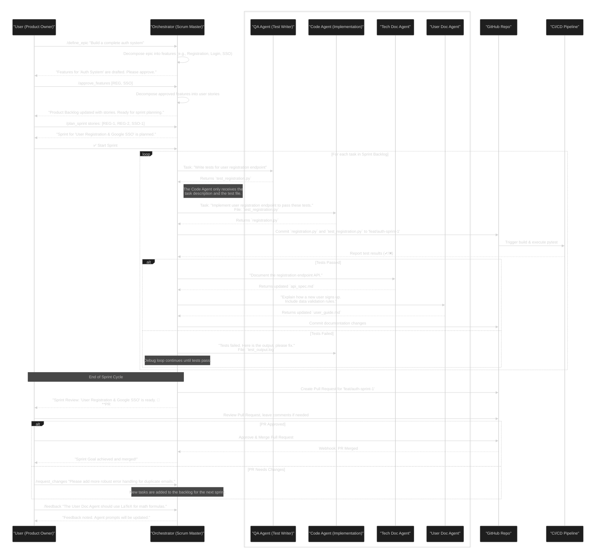
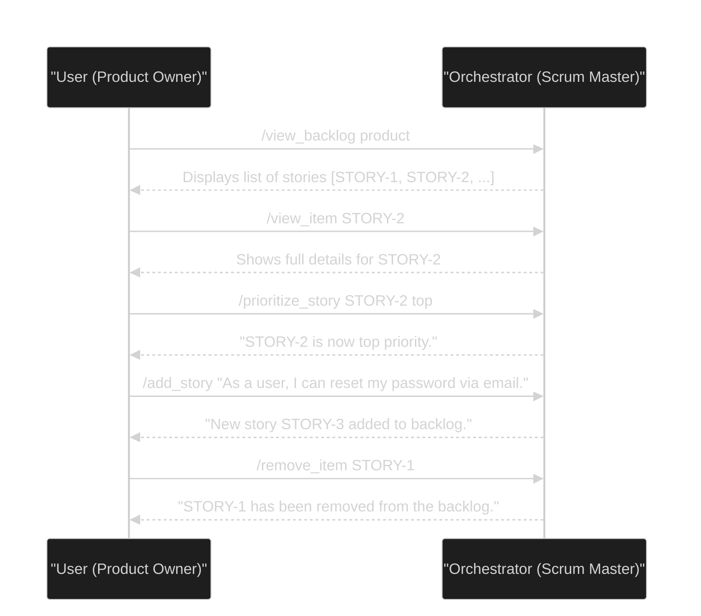
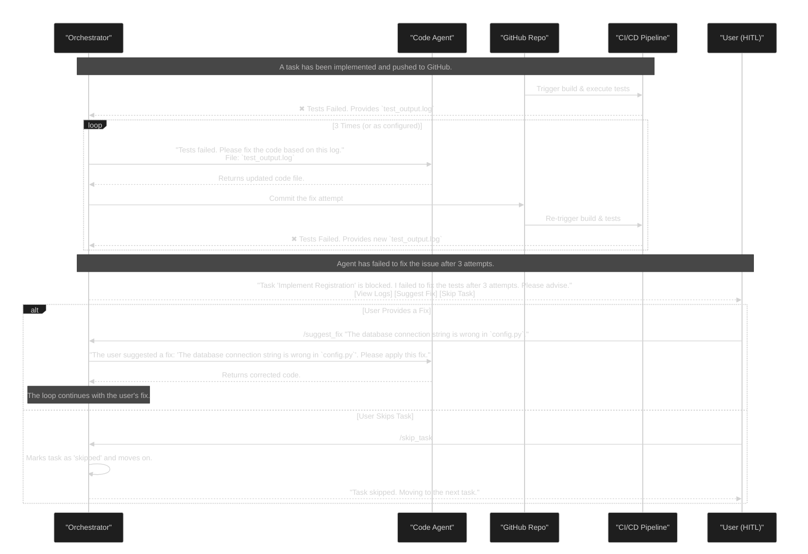
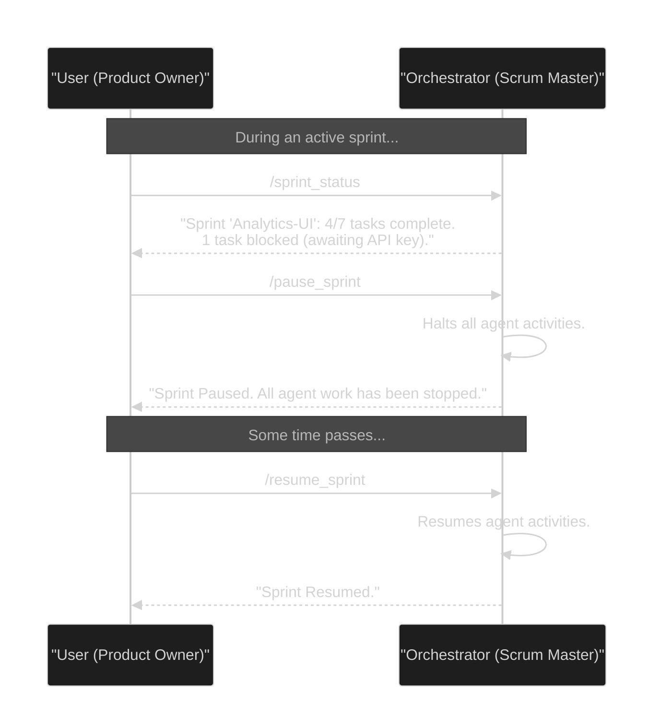

# AI Agent Scrum Workflows

This document contains a set of sequence diagrams illustrating the various workflows within the AI Agent TDD-Scrum system.

---

## 1. Main Workflow: AI Agent TDD-Scrum (v2)

This diagram shows the primary "happy path" for a full sprint cycle, from planning to review.

---

## 2. Ancillary Workflow: Backlog Management

This diagram illustrates how the User (Product Owner) grooms the product backlog.

---

## 3. Ancillary Workflow: Debug & Rework Loop

This diagram details the process when a task fails CI tests.

---

## 4. Ancillary Workflow: Sprint Control & Monitoring

This diagram illustrates how the User can check on and manage an active sprint.

