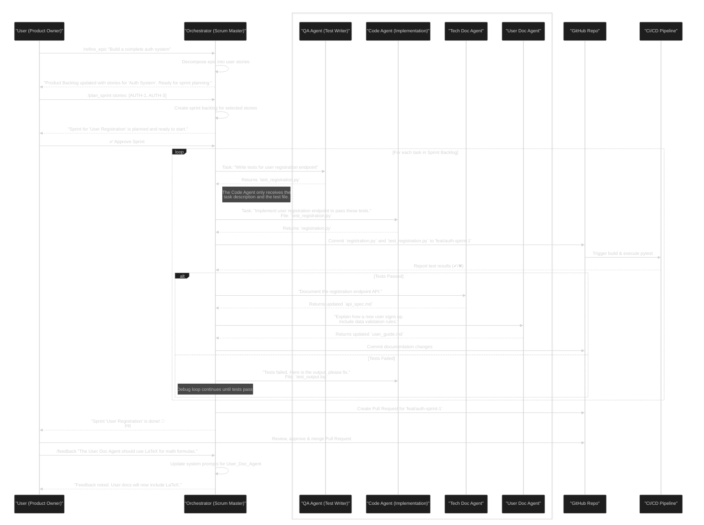

```mermaid
%%{init: {'theme': 'dark', 'themeVariables': { 'primaryColor': '#42a5f5', 'mainBkg': '#1e1e1e', 'textColor': '#ffffff'}}}%%
sequenceDiagram
    title "AI Agent TDD-Scrum" Workflow

    participant U as "User (Product Owner)"
    participant BOT as "Orchestrator (Scrum Master)"
    box "Specialist Agent Team"
        participant QA_Agent as "QA Agent (Test Writer)"
        participant Code_Agent as "Code Agent (Implementation)"
        participant Tech_Doc_Agent as "Tech Doc Agent"
        participant User_Doc_Agent as "User Doc Agent"
    end
    participant GH as "GitHub Repo"
    participant CI as "CI/CD Pipeline"

    %% == 1. Product Backlog Refinement (Epic -> Stories) ==
    U->>BOT: /refine_epic "Build a complete auth system"
    BOT->>BOT: Decompose epic into user stories
    BOT-->>U: "Product Backlog updated with stories for 'Auth System'. Ready for sprint planning."

    %% == 2. Sprint Planning ==
    U->>BOT: /plan_sprint stories: [AUTH-1, AUTH-3]
    BOT->>BOT: Create sprint backlog for selected stories
    BOT-->>U: "Sprint for 'User Registration' is planned and ready to start."
    U->>BOT: ✅ Approve Sprint

    %% == 3. Sprint Execution (TDD Task Loop) ==
    loop For each task in Sprint Backlog
        BOT->>QA_Agent: Task: "Write tests for user registration endpoint"
        QA_Agent-->>BOT: Returns `test_registration.py`
        
        note right of BOT: The Code Agent only receives the<br/>task description and the test file.
        BOT->>Code_Agent: Task: "Implement user registration endpoint to pass these tests."<br/>File: `test_registration.py`
        Code_Agent-->>BOT: Returns `registration.py`
        
        BOT->>GH: Commit `registration.py` and `test_registration.py` to 'feat/auth-sprint-1'
        GH->>CI: Trigger build & execute pytest
        CI-->>BOT: Report test results (✔/✖)
        
        alt Tests Passed
            BOT->>Tech_Doc_Agent: "Document the registration endpoint API."
            Tech_Doc_Agent-->>BOT: Returns updated `api_spec.md`
            
            BOT->>User_Doc_Agent: "Explain how a new user signs up.<br/>Include data validation rules."
            User_Doc_Agent-->>BOT: Returns updated `user_guide.md`
            
            BOT->>GH: Commit documentation changes
        else Tests Failed
            BOT->>Code_Agent: "Tests failed. Here is the output, please fix."<br/>File: `test_output.log`
            note over BOT: Debug loop continues until tests pass.
        end
    end

    %% == 4. Sprint Review ==
    BOT->>GH: Create Pull Request for 'feat/auth-sprint-1'
    BOT-->>U: "Sprint 'User Registration' is done! 🎉<br/>PR #125 is ready for your review."
    U->>GH: Review, approve & merge Pull Request

    %% == 5. Sprint Retrospective ==
    U->>BOT: /feedback "The User Doc Agent should use LaTeX for math formulas."
    BOT->>BOT: Update system prompts for User_Doc_Agent
    BOT-->>U: "Feedback noted. User docs will now include LaTeX."
```