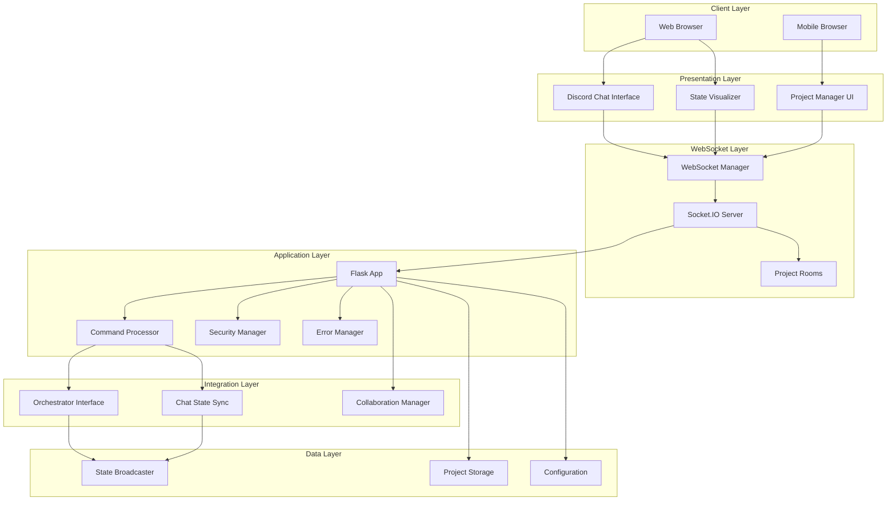
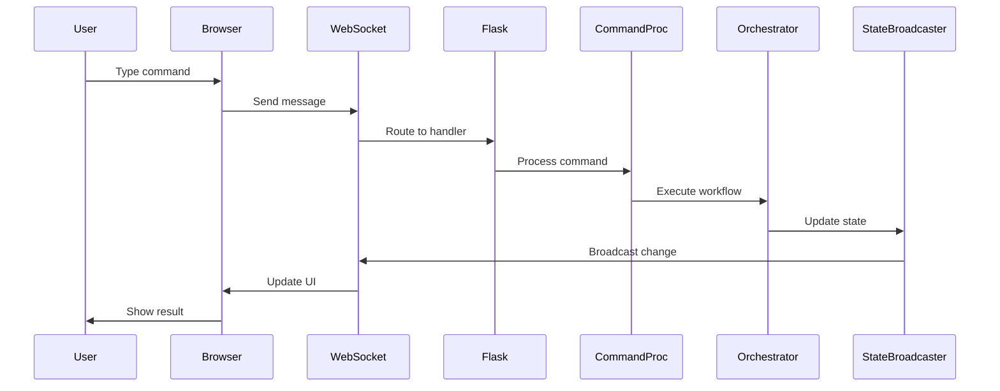

# Engineering Architecture Documentation
## AI Agent Workflow Visualizer

### Table of Contents
1. [Executive Summary](#executive-summary)
2. [System Architecture Overview](#system-architecture-overview)
3. [Core Design Principles](#core-design-principles)
4. [Architectural Decision Records](#architectural-decision-records)
5. [Technical Architecture](#technical-architecture)
6. [Component Architecture](#component-architecture)
7. [Integration Architecture](#integration-architecture)
8. [Security Architecture](#security-architecture)
9. [Performance Architecture](#performance-architecture)
10. [Maintenance & Extension](#maintenance--extension)

---

## Executive Summary

The AI Agent Workflow Visualizer is a sophisticated web-based real-time monitoring and control system for AI agent orchestration workflows. Built with Flask/SocketIO and modern JavaScript, it provides a Discord-style interface for human-in-the-loop (HITL) interaction with AI agents executing Test-Driven Development (TDD) and Scrum workflows.

### Key Capabilities
- **Real-time State Visualization**: Live Mermaid diagrams showing workflow and TDD state transitions
- **Multi-Project Support**: Complete project isolation with concurrent workflow management
- **Discord-Style Chat**: Familiar interface for command execution and agent interaction
- **WebSocket Architecture**: Bidirectional real-time communication with state broadcasting
- **Security-First Design**: Project isolation, API key management, and permission controls
- **Performance Optimized**: CSS/JS consolidation, efficient WebSocket management, and caching

### Architecture Highlights
- **Dual Architecture Pattern**: Supports both modern Python packaging and legacy library structure
- **Microservice-Ready**: Loosely coupled components with clear API boundaries
- **Event-Driven Design**: WebSocket-based real-time state synchronization
- **Progressive Enhancement**: Graceful degradation when optional components unavailable
- **Nuclear CSS Fixes**: Aggressive layout enforcement to ensure critical UI elements remain visible

---

## System Architecture Overview

### High-Level Architecture



### System Context

The visualizer operates within a larger AI agent orchestration ecosystem:

1. **Upstream Dependencies**:
   - State Machine (workflow transitions)
   - State Broadcaster (real-time updates)
   - Orchestrator (command execution)
   - Agent Interfaces (AI integration)

2. **Downstream Consumers**:
   - Discord Bot (alternate interface)
   - Monitoring Systems (Prometheus metrics)
   - CI/CD Pipelines (deployment automation)
   - Development Tools (debugging/analysis)

---

## Core Design Principles

### 1. Progressive Enhancement
- **Graceful Degradation**: System remains functional when optional components unavailable
- **Feature Detection**: Runtime capability checking with fallbacks
- **Modular Loading**: Components load independently without breaking core functionality

### 2. Real-Time First
- **WebSocket Primary**: All state updates via WebSocket for instant synchronization
- **Event-Driven Updates**: No polling; all changes pushed via events
- **Optimistic UI**: Immediate visual feedback with eventual consistency

### 3. Project Isolation
- **Complete Separation**: Chat history, state, and sessions isolated per project
- **WebSocket Rooms**: Project-specific communication channels
- **Security Boundaries**: No cross-project data leakage

### 4. Nuclear Layout Enforcement
- **Critical UI Protection**: Aggressive CSS to ensure state diagrams always visible
- **Layout Phases**: Sequential enforcement to overcome conflicting styles
- **Visual Confirmation**: Built-in indicators for layout state

### 5. Consolidation Over Duplication
- **Shared Utilities**: Common DOM operations in centralized modules
- **Unified Components**: Single WebSocket manager, error handler, etc.
- **CSS Variables**: Centralized design tokens for consistency

---

## Architectural Decision Records

### ADR-001: WebSocket-Based Architecture
**Status**: Accepted  
**Context**: Need real-time state updates across multiple browser clients  
**Decision**: Use Socket.IO with Redis adapter for scalable WebSocket management  
**Consequences**: 
- ✅ Instant state synchronization
- ✅ Scales horizontally with Redis
- ⚠️ Requires sticky sessions or Redis for multi-instance
- ❌ More complex than REST polling

### ADR-002: Discord-Style Interface
**Status**: Accepted  
**Context**: Users familiar with Discord bot commands  
**Decision**: Implement Discord-like chat interface with slash commands  
**Consequences**:
- ✅ Familiar UX for developers
- ✅ Rich command autocomplete
- ✅ Natural conversation flow
- ⚠️ More complex than simple forms

### ADR-003: Multi-Project Architecture
**Status**: Accepted  
**Context**: Need to manage multiple AI workflows simultaneously  
**Decision**: Implement project isolation with WebSocket rooms  
**Consequences**:
- ✅ Complete project separation
- ✅ Concurrent workflow execution
- ⚠️ Increased memory usage
- ⚠️ Complex session management

### ADR-004: Nuclear CSS Fixes
**Status**: Accepted  
**Context**: Critical UI elements (state diagrams) hidden by conflicting styles  
**Decision**: Implement aggressive CSS with !important and specific selectors  
**Consequences**:
- ✅ Guarantees visibility of critical elements
- ✅ Survives third-party CSS conflicts
- ❌ Harder to override for customization
- ⚠️ Performance impact from forced reflows

### ADR-005: JavaScript Consolidation
**Status**: Accepted  
**Context**: 15+ JS files with duplicate functionality (568KB total)  
**Decision**: Consolidate into shared utilities reducing to 12 files (428KB)  
**Consequences**:
- ✅ 24.6% code reduction
- ✅ Easier maintenance
- ✅ Consistent behavior
- ⚠️ Larger individual file sizes

### ADR-006: Error Management System
**Status**: Accepted  
**Context**: Distributed error handling across components  
**Decision**: Centralized error management with recovery strategies  
**Consequences**:
- ✅ Consistent error handling
- ✅ Automatic recovery attempts
- ✅ User-friendly notifications
- ⚠️ Additional abstraction layer

---

## Technical Architecture

### Frontend Architecture

#### Module Organization
```
static/
├── js/
│   ├── core/
│   │   ├── websocket-manager.js    # Unified WebSocket management
│   │   ├── dom-utils.js            # Shared DOM operations
│   │   └── error-manager.js        # Centralized error handling
│   ├── components/
│   │   ├── discord-chat.js         # Discord chat implementation
│   │   ├── chat-components.js      # Reusable chat UI components
│   │   └── project-manager.js      # Project switching UI
│   ├── features/
│   │   ├── visualizer.js           # State diagram visualization
│   │   ├── mobile-enhancements.js  # Mobile-specific features
│   │   └── accessibility.js        # A11y enhancements
│   └── app-core.js                 # Application initialization
├── css/
│   ├── variables.css               # Design tokens
│   ├── discord-chat.css            # Chat styling
│   ├── conflict-resolver.css       # Authority resolution
│   └── nuclear-layout-fix.css      # Critical layout enforcement
```

#### Loading Strategy
1. **Critical CSS**: Inline nuclear fixes for immediate layout
2. **Core Scripts**: WebSocket manager and DOM utils load first
3. **Feature Scripts**: Chat, visualizer load after core
4. **Progressive Enhancement**: Features activate as dependencies load

### Backend Architecture

#### Component Hierarchy
```
app.py                              # Flask application entry
├── Security Layer
│   ├── security.py                 # API validation, sanitization
│   └── permissions.py              # Access control
├── Command Processing
│   ├── command_processor.py        # Discord command handling
│   └── command_patterns.py         # Command parsing
├── State Management
│   ├── lib/chat_state_sync.py     # Chat-state synchronization
│   └── lib/collaboration_mgr.py   # Multi-user coordination
├── Error Handling
│   └── lib/error_manager.py       # Centralized error handling
└── Integration Points
    ├── orchestrator.py             # Workflow orchestration
    ├── state_broadcaster.py        # Real-time state updates
    └── agent_interfaces.py         # AI agent integration
```

#### Request Flow
1. **HTTP Request** → Flask routes → Response
2. **WebSocket Connection** → Socket.IO → Room management
3. **Chat Command** → Command processor → Orchestrator → State update
4. **State Change** → Broadcaster → WebSocket broadcast → UI update

### Data Flow Architecture



---

## Component Architecture

### 1. WebSocket Manager (`websocket-manager.js`)

**Purpose**: Centralized WebSocket connection management  
**Key Features**:
- Single connection for entire application
- Automatic reconnection with exponential backoff
- Event routing to multiple listeners
- Message queuing for offline scenarios
- Project room management

**Design Patterns**:
- Singleton pattern for connection instance
- Observer pattern for event distribution
- Strategy pattern for reconnection logic

### 2. Discord Chat (`discord-chat.js`)

**Purpose**: Discord-style chat interface with command support  
**Key Features**:
- Slash command autocomplete
- Message history with persistence
- Typing indicators
- Project-specific isolation
- Keyboard shortcuts

**Design Patterns**:
- MVC pattern for chat management
- Command pattern for message handling
- Facade pattern for public API

### 3. Project Manager (`project-manager.js`)

**Purpose**: Multi-project navigation and context switching  
**Key Features**:
- Tab-based project switching
- Mobile-responsive dropdown
- Project status indicators
- Keyboard navigation
- Context preservation

**Design Patterns**:
- State pattern for project context
- Mediator pattern for component coordination

### 4. State Visualizer (`visualizer.js`)

**Purpose**: Real-time workflow state visualization  
**Key Features**:
- Mermaid diagram rendering
- Live state transitions
- TDD cycle visualization
- Auto-layout optimization
- Nuclear layout enforcement

**Design Patterns**:
- Observer pattern for state updates
- Decorator pattern for diagram enhancement

### 5. Error Manager (`error-manager.js`)

**Purpose**: Centralized error handling and recovery  
**Key Features**:
- Error categorization
- Automatic recovery strategies
- User-friendly notifications
- Error analytics
- Stack trace management

**Design Patterns**:
- Chain of Responsibility for error handling
- Strategy pattern for recovery
- Template Method for error processing

---

## Integration Architecture

### 1. Orchestrator Integration

**Interface**: Command-based API with async execution  
**Protocol**: JSON-RPC style commands  
**Key Methods**:
- `process_command(cmd, args)` - Execute workflow commands
- `get_state()` - Retrieve current workflow state
- `get_pending_tasks()` - List tasks awaiting approval

**Integration Pattern**:
```python
# Loose coupling via command processor
if ORCHESTRATOR_AVAILABLE:
    orchestrator = Orchestrator()
    result = await orchestrator.process_command(command)
else:
    result = mock_orchestrator.process_command(command)
```

### 2. State Broadcaster Integration

**Interface**: WebSocket-based event stream  
**Protocol**: JSON events with state deltas  
**Key Events**:
- `workflow_transition` - Workflow state changes
- `tdd_transition` - TDD cycle updates
- `agent_status` - Agent activity updates

**Integration Pattern**:
```python
# Event-driven state synchronization
async def connect_to_broadcaster():
    async with websockets.connect(broadcaster_url) as ws:
        async for message in ws:
            state_update = json.loads(message)
            await broadcast_to_clients(state_update)
```

### 3. Agent Interface Integration

**Interface**: Configurable AI agent backends  
**Supported Types**:
- Claude Code CLI
- Anthropic API
- Mock agents for testing

**Configuration**:
```json
{
  "configs": {
    "claude_code": {
      "interface_type": "claude_code",
      "enabled": true,
      "model": "claude-3-sonnet-20240229",
      "max_tokens": 4000
    }
  }
}
```

### 4. Multi-Project Coordination

**Architecture**: Federated project management  
**Key Components**:
- Project registry with metadata
- Resource allocation per project
- Cross-project intelligence (optional)
- Dependency management

**Isolation Boundaries**:
1. **Data Isolation**: Separate storage per project
2. **Process Isolation**: Independent orchestrator instances
3. **Network Isolation**: Project-specific WebSocket rooms
4. **Session Isolation**: User sessions scoped to projects

---

## Security Architecture

### 1. API Security

**Authentication**:
- API key validation for AI services
- Session-based auth for web interface
- Optional SSO integration

**Authorization**:
- Role-based access control (RBAC)
- Project-level permissions
- Command-level restrictions

### 2. Input Validation

**Sanitization Layers**:
1. **Client-side**: Basic input validation
2. **WebSocket**: Message format validation
3. **Command Processor**: Command syntax validation
4. **Backend**: Business logic validation

**Security Controls**:
```python
# Multi-layer validation example
def validate_command(command: str) -> ValidationResult:
    # Layer 1: Format validation
    if not command.startswith('/'):
        return ValidationResult(False, "Commands must start with /")
    
    # Layer 2: Injection prevention
    sanitized = sanitize_command(command)
    
    # Layer 3: Permission check
    if not user_has_permission(sanitized):
        return ValidationResult(False, "Insufficient permissions")
    
    return ValidationResult(True, sanitized)
```

### 3. Project Isolation Security

**Enforcement Points**:
1. **WebSocket Rooms**: Automatic room assignment based on project
2. **Data Access**: Project ID required for all data operations
3. **Command Scope**: Commands execute only in current project context
4. **State Isolation**: No cross-project state leakage

### 4. Security Monitoring

**Audit Logging**:
- All commands logged with user/project context
- Failed authentication attempts tracked
- Permission violations recorded
- API usage monitoring

---

## Performance Architecture

### 1. CSS Optimization Strategy

**Nuclear Layout Consolidation**:
- **Before**: 13 layout phases, 219 lines
- **After**: 5 essential phases, 155 lines
- **Result**: 65% reduction in layout calculations

**CSS Variable System**:
- 47 hardcoded values → 47 CSS custom properties
- Enables instant theme switching
- Reduces parsing overhead

### 2. JavaScript Performance

**Code Consolidation Results**:
- **Before**: 15 files, 568KB total
- **After**: 12 files, 428KB total  
- **Improvement**: 24.6% reduction

**Loading Optimization**:
1. Async script loading
2. Module preloading for critical paths
3. Lazy loading for non-critical features

### 3. WebSocket Optimization

**Connection Management**:
- Single WebSocket connection per client
- Automatic reconnection with backoff
- Message batching for bulk updates
- Binary protocol for large payloads

**Scaling Strategy**:
```javascript
// Redis adapter for horizontal scaling
const redisAdapter = require('socket.io-redis');
io.adapter(redisAdapter({ 
    host: 'localhost', 
    port: 6379 
}));
```

### 4. Caching Architecture

**Client-Side Caching**:
- LocalStorage for chat history
- SessionStorage for UI state
- Service Worker for offline support

**Server-Side Caching**:
- Redis for session management
- In-memory cache for project metadata
- CDN for static assets

---

## Maintenance & Extension

### 1. Adding New Features

**Extension Points**:
1. **Command System**: Add patterns to `command_processor.py`
2. **UI Components**: Create in `static/js/components/`
3. **API Endpoints**: Extend `app.py` routes
4. **WebSocket Events**: Add handlers to `websocket-manager.js`

**Example: Adding a New Command**
```python
# In command_processor.py
self.command_patterns['/analyze'] = {
    'pattern': r'^/analyze\s+(.+)$',
    'handler': self._handle_analyze_command,
    'description': 'Analyze code or data',
    'usage': '/analyze <target>'
}

async def _handle_analyze_command(self, args, user_id, project_name):
    target = args[0]
    # Implementation here
    return {
        'type': 'bot',
        'message': f'Analysis of {target} complete',
        'data': analysis_results
    }
```

### 2. Testing Strategies

**Test Architecture**:
```
tests/
├── unit/
│   ├── test_websocket_manager.js
│   ├── test_command_processor.py
│   └── test_security.py
├── integration/
│   ├── test_multi_project_backend.py
│   ├── test_project_switching.py
│   └── test_chat_isolation.py
└── e2e/
    ├── test_user_workflows.py
    └── test_responsive_design.py
```

**Testing Patterns**:
1. **Unit Tests**: Mock all dependencies
2. **Integration Tests**: Test component interactions
3. **E2E Tests**: Full user workflow validation

### 3. Debugging & Troubleshooting

**Debug Infrastructure**:
1. **Client Debugging**:
   ```javascript
   // Enable debug mode
   localStorage.setItem('debug', 'websocket:*,chat:*');
   ```

2. **Server Debugging**:
   ```python
   # Enable debug logging
   app.config['DEBUG'] = True
   logging.getLogger().setLevel(logging.DEBUG)
   ```

3. **WebSocket Debugging**:
   ```javascript
   // Monitor WebSocket traffic
   window.wsDebug = true;
   ```

### 4. Performance Monitoring

**Key Metrics**:
1. **WebSocket Latency**: Message round-trip time
2. **Command Processing**: Time from input to response
3. **UI Responsiveness**: Frame rate during updates
4. **Memory Usage**: Heap size over time

**Monitoring Tools**:
```javascript
// Performance observer
const observer = new PerformanceObserver((list) => {
    for (const entry of list.getEntries()) {
        console.log(`${entry.name}: ${entry.duration}ms`);
    }
});
observer.observe({ entryTypes: ['measure'] });
```

### 5. Common Patterns & Best Practices

**Error Handling Pattern**:
```javascript
try {
    await riskyOperation();
} catch (error) {
    const handled = ErrorManager.handleError(error, {
        component: 'ComponentName',
        operation: 'operationName',
        recovery: 'retry'
    });
    
    if (!handled.successful) {
        // Manual recovery needed
    }
}
```

**State Update Pattern**:
```javascript
// Always use WebSocket manager for state updates
wsManager.emit('update_state', {
    project: currentProject,
    state: newState,
    timestamp: Date.now()
});
```

**Component Communication**:
```javascript
// Use events for loose coupling
document.dispatchEvent(new CustomEvent('project-switched', {
    detail: { 
        oldProject, 
        newProject 
    }
}));
```

---

## Conclusion

The AI Agent Workflow Visualizer represents a sophisticated integration of modern web technologies to create a real-time, multi-project monitoring and control system. The architecture prioritizes:

1. **Real-time Performance**: WebSocket-first design with efficient state synchronization
2. **Developer Experience**: Familiar Discord-style interface with powerful commands
3. **Maintainability**: Consolidated codebase with clear separation of concerns
4. **Security**: Multi-layer validation with project isolation
5. **Extensibility**: Clear extension points for new features

The system's nuclear CSS fixes and aggressive consolidation efforts demonstrate a pragmatic approach to solving real-world UI challenges while maintaining code quality. The architecture supports both current requirements and future scaling needs, making it a robust foundation for AI agent orchestration workflows.