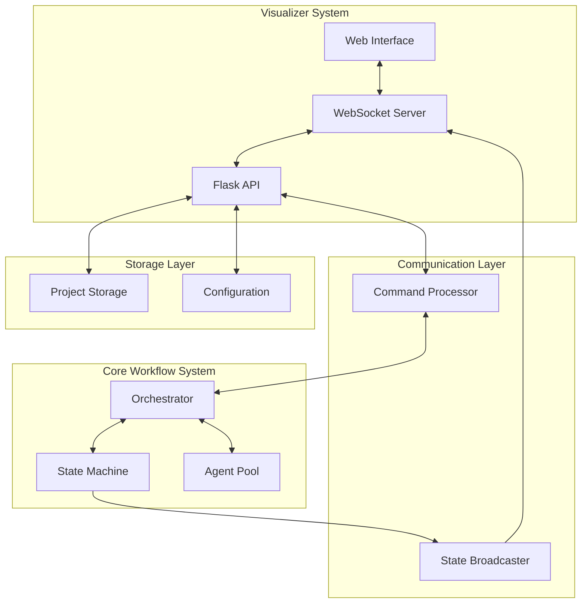

# Integration Guide
## AI Agent Workflow Visualizer

This guide explains how the visualizer integrates with the main AI Agent Workflow system and how to extend these integrations for custom implementations.

---

## Table of Contents

1. [System Integration Overview](#system-integration-overview)
2. [Core Integration Points](#core-integration-points)
3. [State Machine Integration](#state-machine-integration)
4. [Orchestrator Integration](#orchestrator-integration)
5. [Agent Interface Integration](#agent-interface-integration)
6. [State Broadcaster Integration](#state-broadcaster-integration)
7. [Multi-Project Integration](#multi-project-integration)
8. [Discord Bot Coordination](#discord-bot-coordination)
9. [Data Persistence Integration](#data-persistence-integration)
10. [Extension Points](#extension-points)

---

## System Integration Overview

The visualizer acts as a real-time monitoring and control interface for the AI Agent Workflow system. It integrates with multiple components to provide a unified view of the orchestration process.

### Integration Architecture



### Key Integration Principles

1. **Loose Coupling**: Components communicate through well-defined interfaces
2. **Progressive Enhancement**: System works with partial integrations
3. **Event-Driven**: State changes propagate through events
4. **Fail-Safe**: Graceful degradation when components unavailable

---

## Core Integration Points

### 1. Import Strategy

The visualizer uses a progressive import strategy with fallbacks:

```python
# app.py - Progressive enhancement pattern
try:
    from orchestrator import Orchestrator
    ORCHESTRATOR_AVAILABLE = True
except ImportError:
    logger.warning("Orchestrator not available - using mock")
    ORCHESTRATOR_AVAILABLE = False

try:
    from state_broadcaster import broadcaster
    STATE_BROADCASTER_AVAILABLE = True
except ImportError:
    logger.warning("State broadcaster not available")
    STATE_BROADCASTER_AVAILABLE = False
```

### 2. Path Configuration

The system adds necessary paths for imports:

```python
# Add lib directory to path
lib_path = Path(__file__).parent.parent.parent / "lib"
sys.path.insert(0, str(lib_path))

# Add scripts directory for orchestrator
scripts_path = Path(__file__).parent.parent.parent / "scripts"
sys.path.insert(0, str(scripts_path))
```

### 3. Configuration Loading

Shared configuration across systems:

```python
# Load shared orchestration config
config_path = Path(__file__).parent / "orch-config.yaml"
with open(config_path, 'r') as f:
    orch_config = yaml.safe_load(f)

# Projects from shared config
projects = orch_config.get('projects', {})
```

---

## State Machine Integration

The visualizer integrates with the workflow state machine to track and visualize state transitions.

### State Machine Interface

```python
# lib/state_machine.py interface
class StateMachine:
    def __init__(self):
        self.current_state = State.IDLE
        self.transition_history = []
    
    def validate_command(self, command: str) -> CommandResult:
        """Validate if command is allowed in current state"""
        pass
    
    def transition(self, new_state: State) -> bool:
        """Attempt state transition"""
        pass
    
    def get_available_commands(self) -> List[str]:
        """Get commands available in current state"""
        pass
```

### Visualizer Integration

```python
# command_processor.py
class CommandProcessor:
    def __init__(self):
        if STATE_MACHINE_AVAILABLE:
            self.state_machine = StateMachine()
        
    async def validate_command(self, command: str) -> bool:
        """Validate command against state machine"""
        if self.state_machine:
            result = self.state_machine.validate_command(command)
            if not result.success:
                raise CommandError(result.error_message)
        return True
    
    def get_available_commands(self) -> List[str]:
        """Get current valid commands"""
        if self.state_machine:
            return self.state_machine.get_available_commands()
        return self._get_all_commands()  # Fallback
```

### State Visualization

```javascript
// visualizer.js - Render state diagram
class StateVisualizer {
    updateWorkflowState(state) {
        const mermaidCode = this.generateStateDiagram(state);
        mermaid.render('workflow-diagram', mermaidCode);
    }
    
    generateStateDiagram(state) {
        return `
            graph TD
                ${this.generateStateNodes(state)}
                ${this.generateTransitions(state)}
                ${this.highlightCurrentState(state.current)}
        `;
    }
}
```

---

## Orchestrator Integration

The orchestrator is the central coordination engine that the visualizer communicates with for command execution.

### Orchestrator Interface

```python
# scripts/orchestrator.py interface
class Orchestrator:
    def __init__(self, config_path: str = None):
        self.config = self.load_config(config_path)
        self.state_machine = StateMachine()
        self.agent_pool = AgentPool()
    
    async def process_command(self, command: str, **kwargs) -> Dict:
        """Process a workflow command"""
        pass
    
    def get_current_state(self) -> Dict:
        """Get current orchestration state"""
        pass
    
    def get_pending_tasks(self) -> List[Dict]:
        """Get tasks awaiting approval"""
        pass
```

### Command Processing Integration

```python
# command_processor.py
class CommandProcessor:
    async def process_command(self, command: str, user_id: str, project_name: str):
        """Process command through orchestrator"""
        if ORCHESTRATOR_AVAILABLE and self.orchestrator:
            try:
                # Prepare command context
                context = {
                    'user_id': user_id,
                    'project_name': project_name,
                    'timestamp': datetime.now().isoformat()
                }
                
                # Execute through orchestrator
                result = await self.orchestrator.process_command(
                    command,
                    **context
                )
                
                # Format response
                return self._format_orchestrator_response(result)
                
            except Exception as e:
                logger.error(f"Orchestrator error: {e}")
                return self._create_error_response(str(e))
        else:
            # Fallback to mock processing
            return self._mock_process_command(command)
```

### Real-time State Sync

```python
# app.py - Periodic state sync
async def sync_orchestrator_state():
    """Sync state with orchestrator"""
    while True:
        try:
            if ORCHESTRATOR_AVAILABLE and orchestrator:
                state = orchestrator.get_current_state()
                
                # Broadcast to all clients
                await socketio.emit('state_update', {
                    'state': state,
                    'timestamp': datetime.now().isoformat()
                }, room='all')
                
            await asyncio.sleep(1)  # Sync every second
        except Exception as e:
            logger.error(f"State sync error: {e}")
            await asyncio.sleep(5)  # Back off on error
```

---

## Agent Interface Integration

The visualizer can display agent status and configuration through the agent interface system.

### Agent Interface Manager

```python
# lib/agent_interfaces.py
class InterfaceManager:
    def __init__(self):
        self.configs = self.load_configs()
        self.active_interface = None
    
    def get_available_interfaces(self) -> List[InterfaceType]:
        """Get list of configured interfaces"""
        pass
    
    def activate_interface(self, interface_type: InterfaceType) -> bool:
        """Activate a specific interface"""
        pass
    
    def get_interface_status(self) -> Dict:
        """Get status of all interfaces"""
        pass
```

### Visualizer Integration

```python
# app.py - Agent interface endpoints
@app.route('/api/agent-interfaces')
def get_agent_interfaces():
    """Get available agent interfaces"""
    if interface_manager:
        return jsonify({
            'interfaces': interface_manager.get_available_interfaces(),
            'active': interface_manager.active_interface,
            'status': interface_manager.get_interface_status()
        })
    return jsonify({'error': 'Interface manager not available'}), 503

@app.route('/api/agent-interfaces/<interface_type>', methods=['POST'])
def activate_interface(interface_type):
    """Activate an agent interface"""
    if interface_manager:
        success = interface_manager.activate_interface(interface_type)
        return jsonify({'success': success})
    return jsonify({'error': 'Interface manager not available'}), 503
```

### UI Display

```javascript
// agent-status.js
class AgentStatusDisplay {
    async loadInterfaces() {
        const response = await fetch('/api/agent-interfaces');
        const data = await response.json();
        
        this.displayInterfaces(data.interfaces);
        this.highlightActive(data.active);
        this.updateStatus(data.status);
    }
    
    displayInterfaces(interfaces) {
        const container = document.getElementById('agent-interfaces');
        
        interfaces.forEach(iface => {
            const card = this.createInterfaceCard(iface);
            container.appendChild(card);
        });
    }
}
```

---

## State Broadcaster Integration

The state broadcaster provides real-time state updates via WebSocket.

### Broadcaster Interface

```python
# lib/state_broadcaster.py
class StateBroadcaster:
    def __init__(self, port: int = 5001):
        self.port = port
        self.clients = set()
        self.current_state = {}
    
    async def broadcast(self, event_type: str, data: Dict):
        """Broadcast event to all connected clients"""
        pass
    
    async def get_current_state(self) -> Dict:
        """Get current broadcasted state"""
        pass
```

### WebSocket Bridge

```python
# app.py - Connect to state broadcaster
async def connect_to_broadcaster():
    """Bridge between state broadcaster and web clients"""
    broadcaster_url = "ws://localhost:5001"
    
    async with websockets.connect(broadcaster_url) as websocket:
        logger.info("Connected to state broadcaster")
        
        try:
            async for message in websocket:
                data = json.loads(message)
                
                # Forward to web clients
                await socketio.emit(data['event_type'], data['data'], room='all')
                
                # Update local state
                if data['event_type'] == 'state_update':
                    current_state.update(data['data'])
                    
        except websockets.exceptions.ConnectionClosed:
            logger.warning("Lost connection to broadcaster")
            await asyncio.sleep(5)
            # Reconnect logic
```

### Client-Side Handling

```javascript
// websocket-manager.js
class WebSocketManager {
    setupBroadcasterEvents() {
        // State updates from broadcaster
        this.on('workflow_transition', (data) => {
            console.log('Workflow transition:', data);
            this.updateWorkflowDisplay(data);
        });
        
        this.on('tdd_transition', (data) => {
            console.log('TDD transition:', data);
            this.updateTDDDisplay(data);
        });
        
        this.on('agent_status', (data) => {
            console.log('Agent status:', data);
            this.updateAgentStatus(data);
        });
    }
}
```

---

## Multi-Project Integration

The visualizer supports multiple concurrent projects through isolation and context switching.

### Project Manager Integration

```python
# lib/multi_project_config.py
class MultiProjectConfigManager:
    def __init__(self, config_path: str):
        self.projects = {}
        self.load_projects(config_path)
    
    def get_project(self, project_name: str) -> ProjectConfig:
        """Get project configuration"""
        pass
    
    def list_projects(self) -> List[ProjectInfo]:
        """List all projects"""
        pass
    
    def switch_project(self, user_id: str, project_name: str):
        """Switch user's active project"""
        pass
```

### Session Management

```python
# app.py - Project-aware sessions
@app.before_request
def ensure_project_context():
    """Ensure request has project context"""
    if 'project_name' not in session:
        # Set default project
        session['project_name'] = 'default'
    
    # Validate project exists
    if MULTI_PROJECT_AVAILABLE:
        project = project_manager.get_project(session['project_name'])
        if not project:
            session['project_name'] = 'default'

@socketio.on('switch_project')
def handle_project_switch(data):
    """Handle project switching"""
    old_project = session.get('project_name')
    new_project = data['project_name']
    
    # Leave old project room
    if old_project:
        leave_room(f'project_{old_project}')
    
    # Join new project room
    join_room(f'project_{new_project}')
    session['project_name'] = new_project
    
    # Send project state
    emit('project_switched', {
        'old_project': old_project,
        'new_project': new_project,
        'state': get_project_state(new_project)
    })
```

### Project Isolation

```javascript
// project-manager.js
class ProjectManager {
    async switchProject(projectId) {
        // Save current project state
        this.saveProjectState(this.currentProject);
        
        // Switch context
        this.currentProject = projectId;
        
        // Notify server
        wsManager.emit('switch_project', {
            project_name: projectId
        });
        
        // Update UI
        await this.loadProjectState(projectId);
        
        // Notify other components
        document.dispatchEvent(new CustomEvent('project-switched', {
            detail: { projectId }
        }));
    }
}
```

---

## Discord Bot Coordination

The visualizer can coordinate with the Discord bot for unified command handling.

### Shared Command Processing

```python
# lib/discord_bot.py interface
class DiscordBot:
    def __init__(self, command_processor):
        self.command_processor = command_processor
    
    async def process_message(self, message: DiscordMessage) -> str:
        """Process Discord message"""
        pass
```

### Unified Command Handler

```python
# command_processor.py - Shared between web and Discord
class UnifiedCommandProcessor:
    """Shared command processing for web and Discord"""
    
    async def process(self, command: str, context: CommandContext) -> CommandResult:
        """Process command from any source"""
        # Validate command
        validation = await self.validate_command(command, context)
        if not validation.success:
            return validation
        
        # Route to appropriate handler
        handler = self.get_handler(command)
        if not handler:
            return CommandResult(success=False, error="Unknown command")
        
        # Execute with context
        try:
            result = await handler(command, context)
            
            # Log for audit
            await self.log_command(command, context, result)
            
            return result
            
        except Exception as e:
            logger.error(f"Command execution error: {e}")
            return CommandResult(success=False, error=str(e))
```

### Event Synchronization

```python
# app.py - Sync with Discord events
@socketio.on('discord_event')
def handle_discord_event(data):
    """Handle events from Discord bot"""
    event_type = data.get('type')
    
    if event_type == 'command_executed':
        # Broadcast to web users
        emit('discord_command', {
            'user': data['user'],
            'command': data['command'],
            'result': data['result']
        }, room=f"project_{data['project_name']}", broadcast=True)
    
    elif event_type == 'user_joined':
        # Update presence
        update_user_presence(data['user'], data['project_name'])
```

---

## Data Persistence Integration

The visualizer integrates with the project storage system for persistent data.

### Storage Interface

```python
# lib/project_storage.py
class ProjectStorage:
    def __init__(self, base_path: str):
        self.base_path = Path(base_path)
    
    def save_project_state(self, project_name: str, state: Dict):
        """Save project state to disk"""
        pass
    
    def load_project_state(self, project_name: str) -> Dict:
        """Load project state from disk"""
        pass
    
    def list_project_files(self, project_name: str) -> List[str]:
        """List files in project directory"""
        pass
```

### Visualizer Storage Integration

```python
# app.py - Storage endpoints
@app.route('/api/projects/<project_name>/files')
def get_project_files(project_name):
    """Get project file list"""
    if not validate_project_access(project_name):
        abort(403)
    
    try:
        files = project_storage.list_project_files(project_name)
        return jsonify({'files': files})
    except Exception as e:
        logger.error(f"Error listing files: {e}")
        return jsonify({'error': str(e)}), 500

@app.route('/api/projects/<project_name>/state', methods=['POST'])
def save_project_state(project_name):
    """Save project state"""
    if not validate_project_access(project_name):
        abort(403)
    
    try:
        state = request.get_json()
        project_storage.save_project_state(project_name, state)
        return jsonify({'success': True})
    except Exception as e:
        logger.error(f"Error saving state: {e}")
        return jsonify({'error': str(e)}), 500
```

### Auto-Save Integration

```javascript
// auto-save.js
class AutoSave {
    constructor(projectManager) {
        this.projectManager = projectManager;
        this.saveInterval = 30000; // 30 seconds
        this.pendingChanges = false;
        
        this.startAutoSave();
    }
    
    startAutoSave() {
        setInterval(async () => {
            if (this.pendingChanges) {
                await this.save();
            }
        }, this.saveInterval);
        
        // Save on page unload
        window.addEventListener('beforeunload', (e) => {
            if (this.pendingChanges) {
                e.preventDefault();
                e.returnValue = '';
                this.save();
            }
        });
    }
    
    async save() {
        const state = this.projectManager.getCurrentState();
        
        try {
            await fetch(`/api/projects/${state.projectName}/state`, {
                method: 'POST',
                headers: { 'Content-Type': 'application/json' },
                body: JSON.stringify(state)
            });
            
            this.pendingChanges = false;
            this.showSaveIndicator('saved');
            
        } catch (error) {
            console.error('Auto-save failed:', error);
            this.showSaveIndicator('error');
        }
    }
}
```

---

## Extension Points

The visualizer provides multiple extension points for customization.

### 1. Custom Commands

Add new commands to the command processor:

```python
# custom_commands.py
from command_processor import CommandProcessor

class CustomCommandProcessor(CommandProcessor):
    def __init__(self):
        super().__init__()
        self._register_custom_commands()
    
    def _register_custom_commands(self):
        self.command_patterns['/analyze'] = {
            'pattern': r'^/analyze\s+(\w+)\s+"([^"]+)"$',
            'handler': self._handle_analyze_command,
            'description': 'Analyze code or data',
            'usage': '/analyze <type> "<target>"'
        }
    
    async def _handle_analyze_command(self, args, user_id, project_name):
        analysis_type = args[0]
        target = args[1]
        
        # Custom analysis logic
        result = await self.perform_analysis(analysis_type, target)
        
        return {
            'type': 'bot',
            'message': f'Analysis complete',
            'metadata': {'result': result}
        }
```

### 2. Custom Visualizations

Add new visualization types:

```javascript
// custom-viz.js
class CustomVisualizer extends StateVisualizer {
    constructor() {
        super();
        this.registerCustomVisualizations();
    }
    
    registerCustomVisualizations() {
        this.visualizations.set('dependency-graph', this.renderDependencyGraph);
        this.visualizations.set('performance-chart', this.renderPerformanceChart);
    }
    
    renderDependencyGraph(data) {
        const mermaidCode = `
            graph LR
                ${this.generateDependencyNodes(data)}
                ${this.generateDependencyEdges(data)}
        `;
        
        return this.renderMermaid('dependency-graph', mermaidCode);
    }
}
```

### 3. Custom Integrations

Add new system integrations:

```python
# custom_integration.py
class JiraIntegration:
    def __init__(self, config):
        self.jira_client = JiraClient(config)
        self.setup_handlers()
    
    def setup_handlers(self):
        # Register with command processor
        command_processor.register_integration('jira', self)
        
        # Register webhook endpoint
        app.route('/webhooks/jira', methods=['POST'])(self.handle_webhook)
    
    async def create_issue_from_story(self, story_data):
        """Create Jira issue from workflow story"""
        issue = {
            'project': self.config['project_key'],
            'summary': story_data['title'],
            'description': story_data['description'],
            'issuetype': {'name': 'Story'}
        }
        
        return await self.jira_client.create_issue(issue)
    
    async def handle_webhook(self, request):
        """Handle Jira webhook events"""
        event = request.json
        
        if event['webhookEvent'] == 'jira:issue_updated':
            # Sync back to workflow
            await self.sync_issue_to_workflow(event['issue'])
        
        return jsonify({'success': True})
```

### 4. Custom UI Components

Add new UI components:

```javascript
// custom-component.js
class MetricsPanel extends UIComponent {
    constructor(container) {
        super(container);
        this.metrics = {};
    }
    
    async loadData() {
        const response = await fetch('/api/metrics');
        this.metrics = await response.json();
    }
    
    render() {
        this.container.innerHTML = `
            <div class="metrics-panel">
                <h3>Project Metrics</h3>
                ${this.renderMetrics()}
            </div>
        `;
    }
    
    renderMetrics() {
        return Object.entries(this.metrics).map(([key, value]) => `
            <div class="metric">
                <span class="metric-label">${key}</span>
                <span class="metric-value">${value}</span>
            </div>
        `).join('');
    }
    
    subscribeToUpdates() {
        wsManager.on('metrics_update', (data) => {
            this.metrics = data;
            this.render();
        });
    }
}

// Register component
ComponentRegistry.register('metrics-panel', MetricsPanel);
```

---

## Best Practices for Integration

### 1. Error Handling

Always handle integration failures gracefully:

```python
def safe_integration(func):
    """Decorator for safe integration calls"""
    @wraps(func)
    async def wrapper(*args, **kwargs):
        try:
            return await func(*args, **kwargs)
        except IntegrationError as e:
            logger.error(f"Integration error in {func.__name__}: {e}")
            return {'error': str(e), 'fallback': True}
        except Exception as e:
            logger.exception(f"Unexpected error in {func.__name__}")
            return {'error': 'Integration unavailable', 'fallback': True}
    return wrapper
```

### 2. Feature Detection

Check for feature availability:

```javascript
class FeatureDetector {
    static async checkFeatures() {
        const features = {
            orchestrator: await this.checkEndpoint('/api/orchestrator/status'),
            multiProject: await this.checkEndpoint('/api/projects'),
            aiIntegration: await this.checkEndpoint('/api/agent-interfaces'),
            collaboration: await this.checkEndpoint('/api/collaboration/status')
        };
        
        return features;
    }
    
    static async checkEndpoint(endpoint) {
        try {
            const response = await fetch(endpoint);
            return response.ok;
        } catch {
            return false;
        }
    }
}
```

### 3. Configuration Validation

Validate integration configurations:

```python
from jsonschema import validate, ValidationError

INTEGRATION_SCHEMA = {
    "type": "object",
    "properties": {
        "enabled": {"type": "boolean"},
        "endpoint": {"type": "string", "format": "uri"},
        "auth": {
            "type": "object",
            "properties": {
                "type": {"enum": ["api_key", "oauth", "basic"]},
                "credentials": {"type": "object"}
            }
        }
    },
    "required": ["enabled", "endpoint"]
}

def validate_integration_config(config):
    try:
        validate(config, INTEGRATION_SCHEMA)
        return True, None
    except ValidationError as e:
        return False, str(e)
```

### 4. Monitoring Integration Health

Monitor integration status:

```python
class IntegrationMonitor:
    def __init__(self):
        self.integrations = {}
        self.health_checks = {}
    
    async def check_health(self):
        """Periodic health check of all integrations"""
        results = {}
        
        for name, integration in self.integrations.items():
            try:
                health = await integration.health_check()
                results[name] = {
                    'status': 'healthy' if health else 'unhealthy',
                    'last_check': datetime.now().isoformat()
                }
            except Exception as e:
                results[name] = {
                    'status': 'error',
                    'error': str(e),
                    'last_check': datetime.now().isoformat()
                }
        
        self.health_checks = results
        return results
```

---

This integration guide provides comprehensive information on how the AI Agent Workflow Visualizer connects with the broader system. Use these patterns and examples to build robust integrations that enhance the workflow orchestration experience.